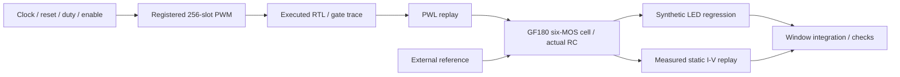

# Open MicroLED Driver ASIC

An independent, open teaching and research platform for digital, mixed-signal, transistor and physical ASIC design, starting with one pixel.

从 **1 Pixel** 开始，当前研究版本为 **v0.2（2026-10-04）**：实际执行的 registered PWM 驱动 GF180MCU 六 MOS current sink；模拟 cell 已完成 layout、严格 LVS、DRC、GDS 与 RC 抽取。检阅后引入了可追溯的真实 LED 静态 I–V，依据失配结果把两只镜像管从 10/2 改为 **20/4 µm**，并重做电路、版图和验证。

## 先读当前研究报告

- [11 页当前研究报告 PDF](docs/research/research-report.pdf) / [HTML](docs/research/research-report.html) / [可检查的文字源](docs/research/research-report.md)：整体架构 → 六 MOS → LED 数据 → headroom → 尺寸选择 → reference / power → PWM → physical checks → 动态边界。
- [研究资料入口](docs/research/README.md)：完整 source、assumptions、条件、许可、脚本和证据的索引。
- [v0.2 预设研究指标](docs/specifications/single-pixel-v0.2.md)：100 µA±5%、最低码面积误差±2%，各项验证范围分开定义。

[教学 PPT](docs/teaching/open-microled-single-pixel-teaching-v2.pptx)、[初版讲义](docs/teaching/open-microled-single-pixel-report.pdf)和[2026-10-03 检阅](docs/review/README.md)保留为历史快照。旧版尺寸、组合 PWM 和 synthetic LED 结论以当时输入为准；当前进展优先阅读 v0.2。

## 当前实现与主要结果



1 MHz clock，每 slot 1 µs、每帧 256 µs，PWM 3906.25 Hz。`duty=0` 全关，`256` 全开，257–511 clamp 为 256；输入在 frame boundary 更新。电路为 simple 1:1 mirror、bias pass、gate clamp 与 CMOS inverter。该耦合路径为 digital→analog feed-forward，没有 analog→RTL feedback。

| 研究或实现 | 实际结果与条件 |
| --- | --- |
| 真实 LED 数据 | Lin 2026 / Zenodo 20034288，20 µm yellow InGaN on diamond；100 µA 插值 Vf=3.767910 V；100 点、101 OP 重放检查；温度与动态参数未报告 |
| 真实静态负载 + actual RC | 148 DC，其中135点网格；MOS固定27°C、LED曲线温度未知；98.175–100.984 µA，135/135在±5%内 |
| 名义真实静态负载 | IOUT=99.788467 µA；LED rail + analog-control/reference rail=828.942349 µW，尚不含数字及实际reference generator功耗 |
| Actual 20/4 reference / PVT | synthetic LED、1080 deterministic点；99.280257–102.075649 µA |
| Actual 20/4 mismatch | 五组各256；最差条件103.213571 µA、σ0.432865 µA、0/256超限；旧10/2相同种子为4/256，均为条件模型样本，非制造良率 |
| 最低码 / synthetic model | 3条件×2步长，6 transient；最大面积误差0.768297%，在±2%内 |
| 真实静态模型动态探针 | 假设C=0.2/2/20pF，10 transient；20pF最低码18.45%导电电荷位于未测延拓区，明确不具备真实dynamic qualification |
| Analog layout | 95×37.66 µm、3577.7 µm²；Magic DRC0、严格Netgen LVS、GDS roundtrip、7/7 nets、59R/43C、36 paired transient+3 calibration |
| Analog macro views | GDS / MAG / LVS SPICE / RC SPICE / 实际导出LEF，七个公开接口 |
| Digital logic / mapping | 518 frames / 133159 checks；95 mapped cells、19 FF；functional gate traces与RTL一致 |
| Digital physical / independent DRC | 实际检查与最终条件见[physical report](docs/digital/physical.md)，与模拟cell及RTL结果分别记录 |

功耗、current accuracy、PWM area 和 pre/post-layout delta 是不同指标。平均 branch current 是 **electrical brightness proxy**；没有 optical power、EQE、luminance 或 silicon measurement。Reference 的误差行为模型用于预算，尚未实现片上 reference generator。真实 I–V 不含 C–V、低电流/reverse、I–V(T) 与光学模型。

## 快速复现

基本仿真在 Mac arm64、Icarus Verilog 13.0、ngspice 47 和锁定 Python dependencies 下执行：

```sh
brew install ngspice icarus-verilog uv
make setup
make test
make sim
```

`make sim` 保存 raw events、netlists、solver waveforms 与日志到 `build/phase1/`；`make evidence` 仅在检查成功后更新 compact evidence。原始模型子集由 [analog lock](analog/models/pdk-lock.json)固定，它不是完整 physical PDK。

实际模拟 layout 需要 [full-PDK/tool 安装](docs/layout/README.md)与[layout lock](layout/pdk-lock.json)：

```sh
build/layout/venv/bin/python scripts/layout/run_layout.py --publish-evidence
build/layout/venv/bin/python scripts/layout/export_macro.py
.venv/bin/python scripts/led/fit_lin2026.py
.venv/bin/python scripts/led/probe_boundaries.py
build/layout/venv/bin/python scripts/characterization/run_actual_mirror.py
build/layout/venv/bin/python scripts/characterization/measured_load.py
```

数字 mapping、physical flow 和独立KLayout分别见[digital](docs/digital/README.md)、[physical](docs/digital/physical.md)。基本回归保留 synthetic LED，不让静态数据模型代替未测 charge dynamics。更改 model/parameters 时需要 DC calibration 与 coupled regression。

## 如何核查证据

| 入口 | 对应内容 |
| --- | --- |
| [phase1](evidence/phase1/summary.json) | registered RTL + pre-layout transistor / synthetic LED regression |
| [analog physical](evidence/layout/summary.json) | 严格physical checks与配对PEX回归，含所用deck限制 |
| [real static LED](evidence/led-fit/lin2026-yellow20-fit.json) / [coupled](evidence/characterization/measured-load-summary.json) | 实测来源、插值与实际RC静态/假设动态检查 |
| [actual mirror](evidence/characterization/actual-w20-l4-summary.json) | reference/PVT、同种子MC、最低码与独立复算 |
| [digital mapping](evidence/digital/summary.json) | 标准单元映射、仿真模型边界与source hashes |
| [current evidence index](evidence/research/current-manifest.json) | 当前文件hash、历史输入关联与报告验证 |

旧run的input hash保留原样。教学排版、数字config、可选trace logging等变化与当前源码的关系单独核查，不伪造旧source hashes。历史审阅manifest描述旧快照，不能当作当前source inventory。

GitHub Actions模板保存在[CI instructions](docs/ci/README.md)，尚未启用：原OAuth token缺少workflow scope。实际结果以公开run证据为准。

## 下一步

继续单像素：数字/模拟macro共同top、真实LED动态与温漂、可实现reference、供电/启动和总功耗。完成接口与预算后，再定义4×4的独立协议、register map、pixel memory、shared reference与power distribution。当前没有已完成的串行通信或完整芯片；pads/ESD、density/fill、provider acceptance、silicon与optical measurement仍属后续。[Roadmap](docs/roadmap.md)给出退出条件。

ASIC与FPGA optical-link项目保持独立仓库，不能以另一项目的仿真替代本项目验证。只采用公开来源、公开PDK和独立设计；[原始brief](docs/project-brief.md)保留长期目标。

原创代码采用[MIT](LICENSE)。数值LED dataset为CC BY4.0，论文本身为CC BY-NC-ND4.0；独立重绘数值曲线保留署名。第三方PDK、标准单元与工具遵循各自license和notices；数字GDS中的标准单元保留[Apache license与来源声明](evidence/physical/NOTICE.md)。
