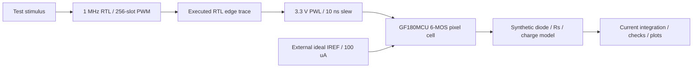
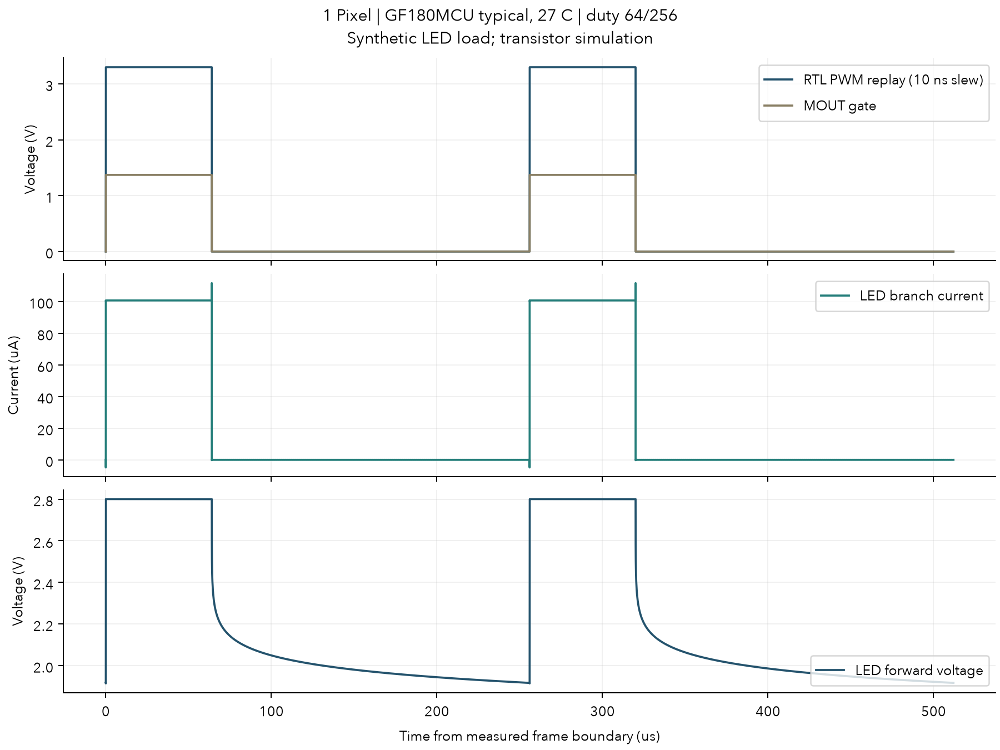
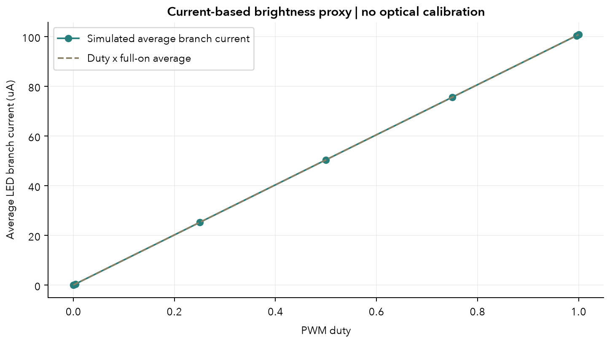
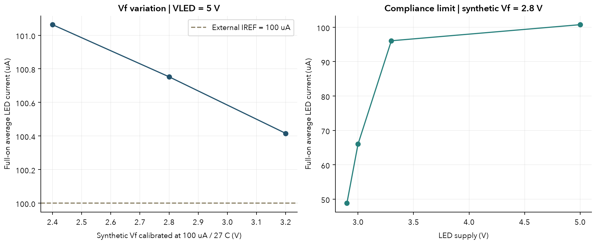

# Open MicroLED Driver ASIC

An independently designed, open research platform for learning digital, mixed-signal, transistor and physical ASIC design, starting with one pixel.

这是一个从 **1 Pixel** 开始的学习与研究项目。已跑通 **Verilog PWM → MOS gate control → current mirror → synthetic MicroLED electrical load**，并完成这个六 MOS 模拟 cell 的真实版图、GDS、Magic DRC、Netgen LVS、RC 抽取与版图后配对仿真。当前证据覆盖单像素模拟 cell；数字 physical integration、完整芯片与实际光输出仍在后续阶段。

## 先读教学资料

按“整体架构 → PWM 逻辑 → 六个 MOS 与器件选型 → 模型与仿真 → 单像素版图”的顺序学习：

- [28 页 PowerPoint](docs/teaching/open-microled-single-pixel-teaching-v2.pptx)：图解、可编辑图表、详细讲者备注。
- [中文技术讲义 PDF](docs/teaching/open-microled-single-pixel-report.pdf) / [HTML](docs/teaching/report.html)：逐步解释、连接表、参数账本、结果和公开来源。
- [教学内容与练习](docs/teaching/content-plan.md) / [结构化页面内容](docs/teaching/lesson.json)：完整公开教学设定。
- [版图复现与证据范围](docs/layout/README.md)：从 schematic、版图到 RC 仿真的实际路径。

## 当前可运行路径



这里的 PWL 来自实际 RTL 执行。模拟电路使用公开 GF180MCU BSIM MOS models；并非 Python 直接生成理想电流。耦合方向为 digital → analog，没有 analog → RTL feedback。MicroLED 参数未经真实器件拟合，平均电流只作为 brightness proxy。

**选择：** GF180MCU 公开 6 V MOS，simple NMOS current mirror，MOS bias-pass / gate-clamp 加 transistor CMOS inverter，共 6 个 MOS。LED supply 为 5 V，logic control 为 3.3 V；reference current 目前由外部理想源提供。PDK 和 baseline 的比较依据见 [PDK / tools](docs/research/pdk-and-tools.md) 与 [driver evidence](docs/research/driver-evidence.md)。

## 快速复现

本机验证环境：Mac arm64、Python 3.12.13、Icarus Verilog 13.0、ngspice 47。需要 Homebrew 和 uv；首次 setup 下载约 1.4 MB 的公开 model 子集并校验 SHA256。

```sh
brew install ngspice icarus-verilog uv
make setup
make test
make sim
```

`make sim` 将每次 RTL / SPICE run 的 netlist、event CSV、solver waveform、日志、metrics 和图保存到 `build/phase1/`。`make evidence` 在检查全部通过后更新版本控制中的精简证据。Python dependencies 由 `uv.lock` 固定；PDK 模型固定到 [pdk-lock.json](analog/models/pdk-lock.json)。完整环境说明见 [environment](docs/environment.md)。

## 第一阶段结果

2026-10-03 本地运行：**7 个 bridge tests、518 个 RTL frame / 133,159 次检查、19 个耦合 transistor runs + 3 个独立 LED DC calibration runs、19 项 analog 检查通过**。RTL 覆盖所有 0…256 duty 与可表示的越界值；nominal SPICE 检查 7 个 duty 点，另外覆盖 disable、Vf、供电余量、少量 corner / temperature 和 timestep convergence。各项条件和分母保存在 [summary.json](evidence/phase1/summary.json)。

以下都是仿真结果：典型 corner、27 °C、IREF=100 μA、合成 Vf=2.8 V @100 μA、1 MHz clock / 3.90625 kHz PWM；平均值在预热两帧后的四个完整 frame 上按时间积分。

| Duty | 平均 LED branch current |
|---|---:|
| 0 / 256 | 约 3.61 pA |
| 1 / 256 | 0.39494 μA |
| 64 / 256 | 25.32414 μA |
| 128 / 256 | 50.64903 μA |
| 192 / 256 | 75.97392 μA |
| 256 / 256 | 101.29959 μA |

在 5 V supply 下，synthetic Vf=2.4 / 2.8 / 3.2 V 时 full-on current 为约 101.79 / 101.30 / 100.73 μA。把 supply 降到 2.9 V，电流降到约 49.39 μA，显示 simple mirror 失去 headroom。模型能解释这些机制，但数值不代表某个实际 MicroLED 或制造后的芯片。







见 [design](docs/design.md) 了解系统与逐器件连接；[verification](docs/verification.md) 记录检查标准、branch current 中的 charge 项、原始数据与图的区别，以及发现并修正的 diode IS 下限问题。

GitHub Actions 配置保存在 [CI template](docs/ci/phase1.yml)，目前尚未启用或在 Linux 上验证：创建仓库时使用的 OAuth token 缺少 `workflow` scope，GitHub 拒绝带 workflow 的推送。已验证结果来自上面的 Mac 环境；启用步骤见 [CI instructions](docs/ci/README.md)。

## 仓库结构

```text
rtl/                 one-pixel PWM source
sim/rtl/             exhaustive self-checking RTL testbench
analog/driver/       independent transistor pixel cell
analog/models/       synthetic LED and immutable public-model manifest
scripts/             model acquisition, RTL/SPICE orchestration, plots
tests/               timing, integration and bridge checks
evidence/phase1/     compact pre-layout results and source hashes
evidence/layout/     GDS, extracted netlists and physical/RC evidence
layout/              editable Magic layout and full-PDK schematic
docs/teaching/       teaching PowerPoint, PDF, HTML and lesson content
docs/research/       public sources, comparisons and evidence boundaries
docs/               design, environment, verification, roadmap, original brief
build/              ignored raw run outputs, regenerated locally
.cache/             ignored original PDK model files and their license
```

## 下一步与边界

当前已完成 **standalone 六 MOS 模拟 cell** 的 Magic DRC=0、Netgen LVS 唯一匹配、GDS 回读检查与 7/7 nets RC 抽取；抽取网表含 59 个 R、43 个 C。采用锁定完整 PDK 对 schematic 和 RC layout 配对仿真：17 个条件各运行两版，另加 RC 版两次细时间步，共 36 次 transient、3 次独立 LED 校准、19 项配对/收敛 guards 全部通过。典型全开电流从 101.29959 降至 101.23651 µA（约 −0.0623%），25% duty 的 RC 结果为 25.30824 µA。详见 [物理证据](evidence/layout/summary.json) 和 [版图说明](docs/layout/README.md)。

这些结果只属于所选 Magic / Netgen 开放规则与这个模拟 cell。独立 KLayout foundry-deck 复核、数字 synthesis / timing / routing、数字模拟集成、pads / ESD、完整 PVT / mismatch、silicon / optical measurement 与 tape-out signoff 尚未完成。先读懂并复现单像素，再逐步定义 4×4 的数据、通信和供电分布；阶段退出条件见 [roadmap](docs/roadmap.md)。

ASIC 与 FPGA optical-link 项目保持独立仓库。未来接口由两个项目共同定义；当前未实现 serial protocol / register map。只使用公开资料、公开 PDK 和独立设计，不使用企业内部文档或 proprietary circuit / RTL。原始目标保存在 [project brief](docs/project-brief.md)。

项目原创代码采用 [MIT License](LICENSE)。第三方工具与下载的 GF180MCU 模型保留各自 license；论文、专利与 datasheet 以来源引用，不把其公开可读性当作复用许可。
