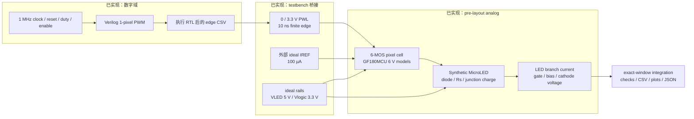
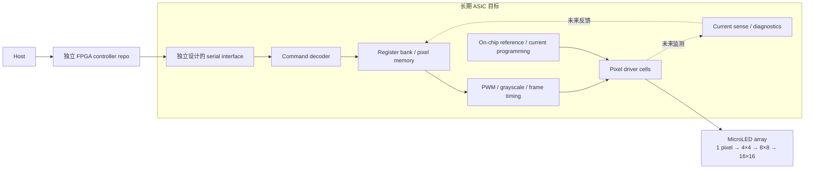

# Phase 1：从 RTL PWM 到 1-Pixel LED Current

本阶段已经建立一条可重复执行的驱动链：**真实 RTL 输出 → 电压波形桥接 → PDK transistor-level driver → synthetic MicroLED 电气负载 → 波形与电流积分**。它是 pre-layout、feed-forward coupled simulation；模拟结果没有反馈改变 RTL 状态。这里的“完整链路”指数字控制确实驱动了模拟电路，不表示已实现 feedback control 或双向 mixed-signal co-simulation。

设计参数以仓库代码为主来源：[`pixel_driver.spice`](../analog/driver/pixel_driver.spice)、[`microled.spice`](../analog/models/microled.spice)、[`pixel_pwm.v`](../rtl/pixel_pwm.v) 和 [`run_phase1.py`](../scripts/run_phase1.py)。当前运行证据见 [`summary.json`](../evidence/phase1/summary.json)，具体条件、检查及工具版本从该文件读取，不由此文档另行维护通过数量。模型适用条件、计算复核和后续研究门槛见 [全面检阅](review/README.md)。

## 本阶段的系统



图中的箭头表达功能依赖，电气 netlist 的电流路径为 `VLED → VSENSE → LED anode → LED cathode → MOUT → ground`。RTL edge timestamp 被保留；桥接在每个 timestamp 开始 10 ns ramp，表示数字输出电压的 testbench 抽象。此 ideal PWL voltage source 具有理想驱动能力，不是已实现的数字输出级；实际 standard-cell buffer、level shifter、IO pad、输出阻抗和电源 impedance 尚未进入该模型。

### 长期概念，尚未实现



Phase 1 没有 serial receiver、command decoder、register map、pixel memory、current DAC 或阵列扫描。后续协议由本项目独立定义；“SPI-like”可描述电气或时序习惯，不意味着复用任何商业 driver 的交易格式或 register map。FPGA 与 ASIC 保持独立仓库，未来再根据两端需要共同定义接口。

## 1-Pixel 电路：逐器件解释

[`pixel_driver.spice`](../analog/driver/pixel_driver.spice) 使用原始 GF180MCU model 名 `nmos_6p0`、`pmos_6p0`，共六个 MOS。W/L 单位按原始模型以米表达，例如 `10u` 为 10 µm；不要与某些 open_pdks wrapper 的 µm 参数约定混用。模型 commit 和 SHA-256 由 [`pdk-lock.json`](../analog/models/pdk-lock.json) 固定。

| Instance | W / L | 连接与功能 |
|---|---|---|
| `XREF` | 10 µm / 2 µm | drain 与 gate 都接 `bias`，source / bulk 接 ground；diode-connected reference device 将外部 IREF 转成 VGS |
| `XOUT` | 10 µm / 2 µm | drain 接 `led_k`，gate 接 `gate`，source / bulk 接 ground；输出 current sink，与 XREF 构成 nominal 1:1 mirror |
| `XPASS` | 2 µm / 1 µm | gate 由 `pwm` 控制；PWM 高时在 `bias` 与输出 `gate` 之间建立通路 |
| `XCLAMP` | 2 µm / 1 µm | gate 由 `pwm_b` 控制；PWM 低时把输出 `gate` 接到 ground，释放 gate charge |
| `XINV_N` | 2 µm / 1 µm | CMOS inverter 的 NMOS，PWM 高时将 `pwm_b` 拉低 |
| `XINV_P` | 4 µm / 1 µm | CMOS inverter 的 PMOS，source / bulk 接 `vlogic`；PWM 低时将 `pwm_b` 拉到 3.3 V |

`IREF vlogic bias DC 100u` 是 **外部 ideal current source**，由 runner 写入 testbench；不能将其描述成已完成的片上精密电流 reference。默认 `VLED=5 V`、`Vlogic=3.3 V`，ground 也是 ideal。使用 6 V MOS model 不表示已有 6 V digital standard-cell flow，也不代表任意器件端电压和未来 pad 条件均已验证。

PWM off 只关闭 LED 输出支路，当前 IREF 支路仍持续取用 100 µA；按 3.3 V logic rail 计，reference 支路的供电功率仍为 **330 µW**，尚未计入其他支路或数字动态功耗。因此低 LED off current 不等于低 standby power。当前 transient 从 ngspice 求得的正常 DC operating point 开始，电源和 IREF 已按理想源施加；这不验证真实 power sequencing、供电斜率、掉电或上电过程中 reference / gate 的状态。

PWM 高时，XINV_N 导通、XCLAMP 关断、XPASS 传递 bias，XOUT 导通。PWM 低时，XINV_P 导通、XPASS 关断、XCLAMP 把 gate 拉低，XOUT 关断。只放 XPASS 而没有 clamp 会把输出 gate 留成 charge-storage node，不能保证整个 off interval 内保持关断。

Gate selection 不在 LED 电流路径中串联额外 PWM MOS，因此保留 headroom。它仍会有 inverter delay、短暂 switch overlap、reference droop、charge injection 和 Cgd/Cgs coupling；边沿波形中的 gate、bias、`pwm_b` 与 branch current 应一起检查。实际 pass-transistor 的 bias 传递能力也依赖 `Vlogic - Vbias`、threshold 和 body effect，不能把理想 PWM high 当成完整传递任意 bias 的保证。

### 电流为什么不严格等于 IREF

Simple mirror 是低复杂度 baseline。在匹配器件、饱和区、忽略 channel-length modulation 的近似下，相同 W/L 产生相近电流；真实 PDK model 会反映输出和 reference 的 VDS 不相等等效应。这里没有 cascode、feedback amplifier 或 calibration loop，`IREF=100 µA` 不表示输出一定正好 100 µA。

LED Vf 提高会降低 XOUT 的 VDS：

```text
VDS,out = VLED - Vf(actual current)
```

VDS 足够时，current mirror 对 Vf 变化较不敏感；失去 saturation margin 后，电流会下降。本阶段既保留 5 V 的 Vf sweep，也保留 2.9 / 3.0 / 3.3 V LED supply cases。**2.9 V 是刻意的 headroom negative control**：要求电流明显下降，说明仿真能够暴露 compliance 限制，而不是只挑足够 headroom 的结果。

降低电流时 LED 的实际 Vf 也跟着改变；“synthetic Vf=2.8 V”表示在规定 reference current 上的锚定值，不能在低供电案例中把 LED 当成永远固定 2.8 V 的 voltage source。结果里的 `on_led_vf_v` 和 `on_vds_v` 给出实际工作点。

## Synthetic MicroLED 电气模型

[`microled.spice`](../analog/models/microled.spice) 使用 SPICE diode 模型。它包含 exponential I-V、串联电阻、junction charge 和 transit-time 假设；**没有拟合真实 MicroLED，也没有定义颜色、尺寸、current density 或 optical efficiency**。

| 参数 | 值 / 主来源 | 含义与限制 |
|---|---|---|
| `N` | 3 | synthetic ideality factor；教育和数值建模假设，不是器件物理提取结果 |
| `RS` | 50 Ω | 电气串联压降；没有独立 package / bond / array routing 参数 |
| `CJO` | 2 pF | 零偏置 junction-capacitance 参数；不能称 forward-bias capacitance 恒为 2 pF |
| `VJ`, `M` | 2.5 V、0.33 | junction-capacitance 模型参数 |
| `TT` | 1 ns | SPICE charge-storage / transit-time 参数，不是已验证的光学 rise time |
| `EG` | 2.6 eV | 温度方程的 synthetic 参数；未验证实际材料或颜色 |
| `TNOM` | 27 °C | diode nominal-temperature 定义 |
| `IS` | runner 的 `led_is(vf)` | 为目标 Vf 计算，每个 synthetic variant 可不同 |

在 27 °C、100 µA 上，用以下关系锚定 Vf：

```text
VT = (k/q) × 300.15 K
IS = 100 µA / expm1[(Vf_target - 100 µA × 50 Ω) / (3 × VT)]
```

默认 target Vf 为 2.8 V，另外设置 2.4 V 和 3.2 V。`calibrate_led()` 先用 **独立 100 µA DC source、无需 mirror 的 testbench**，检查 simulator 实际解出的 Vf 是否与目标一致；0.1 mV 是这一数值校准的容差。该检查能发现模型解析、极小 IS 或数值限制导致的意外结果；它不是对实物样品的 calibration。

之后在完整 driver 中检查 full-on 的实际 Vf，避免仅凭输入标签推断 LED 工作点。27 °C 的单点校准没有验证完整 I-V、reverse leakage、breakdown、自热、aging 或温度响应；0 °C / 85 °C cases 是这组 synthetic 参数下的观察，不能当成真实 MicroLED 的温度预测。

## PWM 时序与测量定义

[`pixel_pwm.v`](../rtl/pixel_pwm.v) 的 8-bit counter 每帧覆盖 256 个 clock slot。`duty[8:0]` 表示高电平 slot 数，合法值 0–256，因此有 **257 个有效 duty 状态**；增加第九位是为了表示 exact full-on，不是 9-bit 灰阶。257–511 饱和到 256。

| 请求 | 结果 |
|---|---|
| `duty=0` | exact off |
| `duty=1` | 一帧 1 个高电平 slot |
| `duty=64 / 128 / 192` | duty 25% / 50% / 75% |
| `duty=255` | 255/256，保留 1 个 off slot |
| `duty=256` | exact full-on；不会在 frame boundary 人为产生 low pulse |
| `enable=0` | 在下一个 frame boundary 提交整帧 off |

默认 clock 是 1 MHz，frame period 为 256 µs，PWM frequency 为 3906.25 Hz。`duty`、`enable` 只在 frame boundary 锁存；输入帧中变化不截断当前脉冲。`rst` 为高有效同步 reset，下一 rising edge 将输出清零；释放后的第一个 rising edge 从 slot 0 开始完整新帧。输入属于同一个 clock domain，尚未实现异步 interface 的 CDC / handshake。完整时序说明在 [`pwm.md`](pwm.md)。

PWM 目前由 counter 的组合比较器直接输出。物理实现中 counter 多个 bit 的 clock-to-Q 和布线延迟可能不同，组合比较器存在短暂 glitch 的结构性风险；这是尚待 gate-level / timing / analog-load 验证的问题，并非已在当前 RTL 仿真中观测到的失败。现有理想 event replay 不包含这类物理延迟。

RTL testbench 实际执行后导出 `time_ns,pwm` event CSV。第一条已知输出来自 500 ns 的 reset low；桥接将该已知 low 向前延伸到 SPICE 的 0 ns，是明确的 startup assumption。之后每个切换时刻来自 RTL，Python 不另算一套理想 PWM 替代它。10 ns PWL slew 只描述桥接电压，不是数字 cell timing 的测量。

第一帧从 2500 ns 开始。跳过两帧后，测量区间严格取 **514.5–1538.5 µs，四个完整 frame**：

```text
Iavg = integral(Ibranch(t), t_start, t_end) / (t_end - t_start)
```

Runner 对 adaptive timestep 数据在边界插值，再做 trapezoidal integration；不能对样本直接取算术平均。它同时核对 testbench 报告的 frame timing 和测量窗口，避免版本变化后测量只覆盖半帧或 startup。默认 maximum timestep 为 200 ns；最小非零 duty 和 25% duty 另外与 20 ns 比较 **average-current convergence**。这不能推广为所有边沿峰值、全部角点或 PEX 都已收敛。

## Branch current 与 optical brightness

电流通过 zero-volt `VSENSE` 的 branch current 读取。它含 diode 的 conduction 与 charge/displacement 成分；有限边沿可能出现短暂 overshoot 或负电流。`peak_branch_current_uA` 和 `minimum_branch_current_uA` 是电气量，不是光强峰值。当前 runner 没有把 conduction current 从 total branch current 单独分解。

独立数值检阅支持当前 frame 平均电流的计算与稳定性，但发现小纹波随积分方法、容差和步长改变；尚不能把 peak / ripple 解释成已收敛的物理指标，也不能据此推出 bandwidth。约 3.6 pA 的 nominal off current 同样明显依赖 GMIN，应仅保留为指定数值设置下的结果；真实器件 leakage 仍未确认，详见 [数值检阅](review/numeric-audit.md)。

`on_plateau_current_uA` 使用窗口内的 on-state 样本，并排除每个 PWM edge 后 100 ns 后取 median；它帮助解释 pulse amplitude，但不能把 plateau 值代替整个 frame 积分。公开波形 CSV 的 uniform sample view 是插值后的 derived view；边沿 CSV 保留 solver 数据，完整原始输出和 testbench 保留在重新生成的 build 目录。

平均 branch current 目前仅作为 **electrical brightness proxy**。在固定 pulse amplitude、充分 settle、off leakage 很小、光电效率近似不变时，才预期相对亮度随 duty 近似线性。项目没有 optical power / EQE / spectrum / photometric measurement，因此不能把图中的电流称为真实 luminance、cd/m²、optical efficiency 或 gamma calibration。

PWM linearity check 对照的是 `measured duty × measured full-on average`，**不是** `duty × ideal 100 µA`。它证明本模型条件下的调制关系，不证明 reference accuracy。Vf regulation 和 off-current thresholds 是本阶段教育性验收标准；精确判据见 runner 与 summary，不是商业精度规格。

同理，pre/post-layout 电流变化很小，不能代替对 100 µA 目标的绝对误差检查；reference 偏差、输出 VDS、模型和 mismatch 都需要分别评估。当前 paired transient 同时包含 diffusion area / perimeter 参数变化与 wire RC 的影响，不能将全部差异归为布线寄生；评估纯 wire RC 时应先对齐两套网表的 diffusion geometry。

## 证据与尚未完成的步骤

[`evidence/phase1/summary.json`](../evidence/phase1/summary.json) 是当前 compact evidence 入口，记录 host、工具版本、PDK lock、LED 校准、case conditions、检查和结果；[`source-hashes.json`](../evidence/phase1/source-hashes.json) 将运行证据关联到源文件。结果可以结合 [`waveforms.png`](../evidence/phase1/waveforms.png)、[`duty-current.png`](../evidence/phase1/duty-current.png) 和 [`vf-current.png`](../evidence/phase1/vf-current.png) 解释。修改源文件后应重新执行验证并生成匹配证据。

本页上述 baseline 证据是 **RTL + pre-layout PDK transistor simulation**。新的 standalone analog physical 结果另见 [版图说明](layout/README.md)。FF / SS 和 0 °C / 85 °C 是少量 pilot cases；没有建立 process × supply × temperature × duty × Vf 的完整组合，`sw_stat_global=0`、`sw_stat_mismatch=0` 也明确关闭了统计变化。不能将这些结果称为 full PVT sign-off、Monte Carlo、matching 或 yield 证明。

这个六 MOS cell 现在已有独立 analog layout、GDS、Magic DRC、Netgen LVS、RC extraction 与 paired post-layout simulation，具体范围和结果见 [physical summary](../evidence/layout/summary.json)。完整 PDK 对两种网表配对使用，避免把旧 model subset 与新抽取结果混算。数字 standard-cell physical integration、pad ring、ESD、package、真实 MicroLED 测量仍未完成。先学习并复现这个单像素，再逐步扩展 4×4。真正双向反馈联仿需引入 current sense / comparator → RTL 状态改变 → 后续 PWM 改变；PWL edge replay 本身没有建立这项反馈。

公开调研和 baseline trade-offs 另见 [`driver-evidence.md`](research/driver-evidence.md)；PDK 与工具选择另见 [`pdk-and-tools.md`](research/pdk-and-tools.md)。
