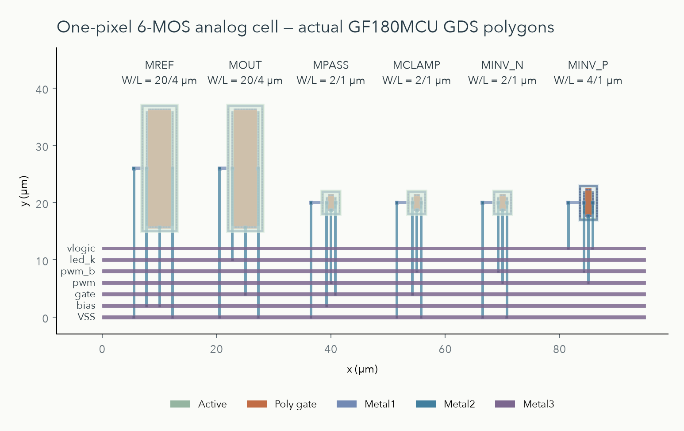

# 单像素版图：从六个 MOS 到可检查的 GDS

更新日期：2026-10-03（Asia/Tokyo）。这一节对应教学项目的**同一个 1-Pixel analog cell**。它已经生成真实 transistor layout 与 GDS，并完成本文列出的本地检查；数字 PWM 仍是 RTL simulation。两者尚未在芯片版图内集成。

本次器件物理前提、数据计算与检查流程的独立检阅见 [审阅总览](../review/README.md)。其中发现的 LVS property 判定漏洞已修复，完整版图流程已重新运行；当前阶段仍是公开工具与模型下的单像素验证。



## 1. 先理解这张图

原理图回答“哪几个器件相连”；layout 则回答“这些器件的扩散区、gate、接触孔和金属实际放在哪里”。上图由本次生成的 GDS polygons 绘制，不是概念效果图。横纵坐标单位为 µm；GDS database unit 是 0.001 µm。实际几何 bounding box 为 **95.00 × 26.66 µm**，含全部 routing 和 ties。这是单个教学 cell 的几何范围，不是芯片面积，也不包含 pad ring。

从左向右是 MREF、MOUT、MPASS、MCLAMP、MINV_N、MINV_P。长条的两个 mirror MOS 保持相同 **W/L=10/2 µm** 与方向。其余三个 NMOS 为 2/1 µm，inverter PMOS 为 4/1 µm，与第一阶段一致。每个器件有独立 guard ring 与 well/substrate tie；NMOS bulk 接 VSS，PMOS bulk 接 vlogic。M1 用于局部 contacts/ties，M2 把各端子向下引出，M3 的七条总线对应 VSS、bias、gate、pwm、pwm_b、led_k、vlogic。

M2 与 M3 相交不自动导通；有 Via2 的位置才连接。MOS gate 的 poly 通过 contact→M1→Via1→M2 接入控制总线。版图故意保留较大间距，便于逐器件检查与教学阅读；不是最小面积方案。mirror 采用相邻、等尺寸、同方向放置，没有使用 common-centroid、dummy devices 或已验证的 mismatch 优化。器件对称不等于已证明电流匹配或 yield。

## 2. 这次实际检查了什么

| 步骤 | 实际结果 | 对应证据 |
| --- | --- | --- |
| Magic geometry DRC | `drc(full)`，错误数 0 | [magic-generate.log](../../evidence/layout/magic-generate.log) |
| Netgen LVS | 6 MOS / 7 nets / 7 pins；唯一匹配且没有 property errors；连接与 deck 检查的 W/L 等属性通过 | [netgen-lvs.log](../../evidence/layout/netgen-lvs.log) |
| GDS 写出后回读 | 回读 GDS 重新 DRC，错误数 0；重新 LVS 唯一匹配 | [magic-roundtrip.log](../../evidence/layout/magic-roundtrip.log)、[roundtrip LVS](../../evidence/layout/netgen-roundtrip-lvs.log) |
| Magic RC extraction | 7/7 nets 完成；6 MOS、59 resistors、43 capacitors | [magic-pex.log](../../evidence/layout/magic-pex.log)、[RC SPICE](../../evidence/layout/pixel_driver_rc.spice) |
| Paired post-layout regression | 17 条件 × schematic/RC 两版本 + 2 次细步长检查；36 transient runs；另 3 次独立 LED DC calibration；19 guards 通过 | [summary.json](../../evidence/layout/summary.json)、[regression.log](../../evidence/layout/postlayout-regression.log) |

DRC 是“几何是否符合当前 deck 的规则”，LVS 是“抽取出的器件与连线是否等于指定 schematic”，PEX 是“把实际连线的 parasitic R/C 加回仿真”。三项各解决一个不同问题。GDS 回读检查用于发现写出/导入后改变连接或几何的情况；不能把这些检查合称为 foundry signoff。

LVS runner 现在要求唯一的成功 final result，并拒绝 property errors。审阅中的真实负对照将 MOUT 的 W 从 10 µm 改为 20 µm，Netgen 仍返回 exit 0，并在“连接唯一匹配”之后报告 property errors；仅检查退出码或匹配句会误判。原始版图尺寸与连接正确，修复后的检查已正确拒绝该负对照。锁定 Netgen deck 对 W/L 采用 1% tolerance，允许对称 MOS 的 D/S 交换，并忽略 AD/AS/PD/PS、SA/SB/SD 等属性；因此 LVS 成功不证明 junction geometry、局部版图环境或寄生参数相同。见 [真实对照](../../evidence/review/mos-lvs-controls.json) 和 [修复后检查](../../evidence/review/lvs-guard-checks.json)。

Magic `drc(full)` 是锁定公开 PDK 所提供的 Magic 规则集合；这里的 `full` 是该工具的 style 名称，不表示所有 foundry signoff 规则覆盖。没有取得 foundry acceptance，没有完成独立 KLayout DRC deck 的成功报告；density/fill、antenna、ESD、IO/pads、IR-drop、电迁移、封装与顶层集成均不在这次完成范围内。RC 是 Magic 当前名义 `ngspice()` extraction style 的结果，没有建立 RC corner qualification 或与 silicon 测量的校准。

## 3. 加入实际 RC 后有什么变化

为避免混用模型，本次比较的两侧都采用同一个锁定完整 `gf180mcuD` PDK。左侧是相同 W/L 的 schematic，右侧是其实际 layout 的 extracted RC。第一阶段较早的 model subset 被保留；没有把它替换后继续当作原来的证据。

两侧同时存在 diffusion geometry 和 wiring RC 的差异：schematic 的 AD/AS/PD/PS 默认 0，抽取网表包含真实 diffusion 面积与周长。因此配对 transient 的差值不能全部归因于连线 RC。独立审阅补做了“真实 diffusion geometry、但无 wiring RC”的中间 DC 对照，nominal full-on 仍为 101.299594 µA；它支持下表 nominal DC 变化主要来自 wiring resistance，但不把这一归因扩展到边沿或所有条件。

| 条件 | 同一完整 PDK 的 schematic | 实际 layout RC | 变化 |
| --- | ---: | ---: | ---: |
| 5 V / 27 °C / IREF=100 µA / full-on | 101.299594 µA | 101.236512 µA | −0.06227% |
| 同上 / duty=64/256（25%） | 25.324137 µA | 25.308244 µA | −0.06276% |

完整列表在 `summary.json`。17 个条件包括 duty=0、1、64、128、192、255、256，disabled，synthetic Vf=2.4/3.2 V，supply=2.9/3.0/3.3 V，FF/SS，0/85 °C。每次先运行真实 RTL trace，重放 10 ns 电压 edges，再积分 **514.5–1538.5 µs 的 4 个 PWM frames**。正常最大时间步为 200 ns，duty=1 与 64 另用 50 ns 复核。

Paired current guard 是 `max(|I_schematic|×1%, 1 nA)`；细步长 guard 是 `max(|I_RC|×0.2%, 1 nA)`。这些是当前教学回归的工程 guard，不是工艺、LED 产品或精度保证。平均 branch current 仍只是 electrical brightness proxy。LED 的 diode/R/C/TT 参数依然是 synthetic，没有 optical、热、老化或实测拟合证据。外部 ideal IREF 与供电、3.3 V PWM 电压波形仍由 testbench 提供。

尤其要区分“版图前后变化小于 1%”和“相对于 100 µA 目标的电流误差小于 1%”：当前 nominal extracted RC 为 101.236512 µA，已经偏离目标约 +1.24%。后续精度和功耗预算必须以目标值及明确条件验收。

## 4. 模型名与单位怎样衔接

- 第一阶段 original model subset：`nmos_6p0` / `pmos_6p0`，commit 在 `analog/models/pdk-lock.json`。
- 本次完整 PDK 的 Magic/LVS/ngspice 名：`nfet_06v0` / `pfet_06v0`。完整 PDK build 与 primitive revision 在 [layout/pdk-lock.json](../../layout/pdk-lock.json)，二者不能当作同一份文件。
- 本次 schematic 与 extracted SPICE 使用 SI 尺寸：`w=10u l=2u` 表示 10 µm / 2 µm。Magic PCell 输入 `w 10 l 2` 使用 µm。不要把其他包装器的“无后缀数字代表 µm”假设加到这套网表。
- RC SPICE 的 `R` 数字单位为 Ω；`f` 后缀的 `C` 数字为 fF，MOS `ad/as` 为 m²，`pd/ps` 为 m。GDS 坐标由 database unit 换算成 µm。
- 从原来 global ground `0` 到 cell 显式 pin `VSS` 是接口整理，testbench 仍把 VSS 接 `0`，器件连线不变。对称 MOS 的 D/S 可在 LVS 中合法交换。
- RC summary 的 `on_cathode_to_global_ground_v` 是外部 `led_k` pin 对全局 ground 的电压，含 wiring drop；不能把它叫作内部 MOS VDS。当前 RC 输出 MOS 的内部两个端点是 `led_k.t0` / `VSS.t6`，原配对 transient 没有记录其实际 VDS。后续独立审阅的 nominal DC 解补得内部 VDS=2.195460 V、以较低电位端为 NMOS source 的 VGS=1.382167 V，详见 [MOS 审阅](../review/mos-pdk-audit.md)。`gate_v` 仍对应外部 monitor pin，内部 RC gate 是另一节点。

## 5. 工具、PDK 与复现

已验证主机是 **macOS 27.0.1 / arm64**。Magic 8.3.684、Netgen 1.5.324 从官方 source commits 构建到 `build/layout/tools/install`；Tcl/Tk 8.6.18；ngspice 47。Ciel 3.0.0 获取的完整 GF180MCU build 为 **`54435919abffb937387ec956209f9cf5fd2dfbee`**，选择依据是此次读取的 LibreLane 官方 `pdk_hashes.yaml`。本次没有运行 LibreLane，也没有 digital synthesis/placement/routing。

首次安装（已完成第一阶段的 Icarus/ngspice 环境，已有 Homebrew、uv、Xcode/可用 SDK）：

```bash
bash scripts/layout/bootstrap_macos.sh
```

脚本编译 pinned Magic/Netgen，安装锁定 Python dependencies，再下载完整 PDK。PDK 占用约 3.8 GiB；实际安装日志保存在 `build/layout/logs/`。本机默认 CommandLineTools 的 macOS 27 SDK 曾导致 linker 无法识别 `arm64e.x1`（configure exit 77）；已用 Xcode 的 **MacOSX26.5.sdk** 成功构建。脚本默认通过 `xcodebuild` 选 SDK，可用 `LAYOUT_SDKROOT` 显式指定。这只修正该次构建的 SDK 路径，不改变系统默认工具设置。

从 fresh run directory 生成、检查、抽取、重跑电气回归并保存成功 evidence：

```bash
build/layout/venv/bin/python scripts/layout/run_layout.py --publish-evidence
```

每次 raw outputs 保存到新的 `build/layout/pixel-*` 目录，避免复用旧 netlist 或 waveform 掩盖失败。成功 compact evidence 更新到 `evidence/layout/`。GDS 内含生成时间，重跑后的 binary SHA 可能不同；检查结果、器件连接、尺寸与版图几何才是复现比较的主要对象。本次输出 SHA、source SHA 和 raw run locator 均在 `summary.json`。

## 6. KLayout 状态与下一步

Python KLayout 0.30.12 已实际读取 GDS、核对 bounding box 与 layer list，并生成上图。另通过 Homebrew 安装了官方 arm64 native KLayout 0.30.12 到 `/Applications/KLayout`，但其 CLI 启动停在 `_dyld_start`，最终终止 exit 143；macOS `spctl` assessment 给出 `rejected`，包有 quarantine 与 ad-hoc signature。诊断保存在 `build/layout/logs/klayout-startup-sample.txt`、`klayout-spctl.log` 和 `klayout-install.log`。没有移除 OS 安全属性，没有产生独立 KLayout rule-deck 通过结果。安装成功和 Python reader 成功不等于 native DRC 可运行。

下一步继续保持单像素范围，按 [审阅总览](../review/README.md) 的优先级推进：先确定真实 LED 的可追溯数据与 model card，写明电流精度、总功耗、headroom 和最短脉冲的预算；再加入非理想 reference、mismatch 和交叉 PVT 条件，检查启动与电源顺序。达到电气指标后，才做 matching/routing 优化和独立 physical checks，并继续数字 PWM 的 physical implementation 与 macro integration。单像素满足这些门槛后再扩到 4×4。通信、register map、像素数据缓冲与扫描方案属于后续阵列阶段，目前没有实现。

## 7. 公开来源与实现范围

本项目 layout/generator 为独立实现，使用公开 GF180MCU Magic PCell 与匹配 deck，不复制商业设计。完整 PDK 的第三方 notices 留在下载目录，仓库只保存锁定 metadata、独立源文件与本项目成功 evidence。

- [Ciel 官方安装与 PDK version 管理](https://github.com/fossi-foundation/ciel)
- [LibreLane 官方 PDK hashes](https://github.com/librelane/librelane/blob/main/librelane/pdk_hashes.yaml)
- [Magic 官方 macOS 构建说明](https://github.com/RTimothyEdwards/magic/blob/4f53bb3091d1e4a9b2009a58f157a8a4331d4c84/INSTALL_MacOS.md)
- [Magic 官方 extraction / extresist 说明与 source](https://github.com/RTimothyEdwards/magic/tree/4f53bb3091d1e4a9b2009a58f157a8a4331d4c84/doc/html)
- [Netgen 官方 source / LVS](https://github.com/RTimothyEdwards/netgen/tree/3cb047bd6b55ae09c8eefeb479b4fe746cfdb948)
- [Open PDKs pinned source](https://github.com/fossi-foundation/open-pdks/tree/54435919abffb937387ec956209f9cf5fd2dfbee)
- [GF180MCU primitive pinned source](https://github.com/fossi-foundation/globalfoundries-pdk-libs-gf180mcu_fd_pr/tree/41918f5a2356b9fb49a897ecc4fb4716b0ab1041)
- [KLayout 官方 macOS 包](https://www.klayout.de/build.html)
