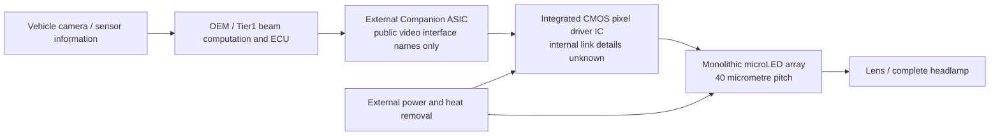

# EVIYOS 量产头灯产品：公开功能、接口层级与研究平台差距

核查日期：2026-10-06。主对标为 ams OSRAM EVIYOS；Volkswagen Touareg 与 Porsche Cayenne 仅用于确认装车状态和防止混淆不同技术路线。本文属于 **公开产品研究**，没有运行商业器件、访问受限文档或取得供应商设计支持。机器可检索 claim ledger 见 [`headlamp-sources.json`](../../../evidence/automotive/headlamp-sources.json)。

**判断：EVIYOS 最值得学习的是“frame 数据 → 本地像素控制 → current driver → LED/CMOS 集成 → 光学/热/诊断”的系统分工。当前平台应先补齐单像素可测电流与失效控制，再做独立 frame interface；40 µm pitch 和数万像素不是下一版的合理退出条件。** 商业量产、AEC qualification、未知内部电路均不能由我们的局部 DRC/LVS/PEX 结果替代。

## 1. 产品名称与销售状态必须分开

| 对象 | 层级 | 官方公开内容 | 日期与状态 | 能支持什么／不能支持什么 |
| --- | --- | --- | --- | --- |
| EVIYOS 2.0 / HD25 gen1，KEW GBBMD1U | LED/IC hybrid 光源，需 Companion ASIC | 320 columns × 80 lines，25,600 pixels；40 µm pitch | 2023-07 量产公告；当前网页 **Not for new design**，Q65113A5388 为 Not planned for new design | 已商业化的第一代；不能当作当前优先新设计料号 |
| HD25 gen1，KEW GBCLD1U | 同家族的 1:3 光源选项 | 240 columns × 80 lines，19,200 可用 pixels；相同 40 µm pitch | 当前网页 **Discontinued** | 与 25,600 版本须按有效像素区分；不能假设所有320列均已测试 |
| HD25 gen2，KEW GBBMD2U | LED/IC hybrid 光源，需 Companion ASIC | 25,600 pixels；40 µm pitch；网页封装 22.0 × 17.5 × 1.4 mm | 2024-10-14 发布改进版；2025-10-31 Product Information；当前网页 **Full production** | 当前公开量产目录产品；不能把其规格倒填到2023装车器件 |
| KEW GBXXD1U Companion ASIC | 外置 digital ASIC，product set part 2 | HD25 必需，专为此组合设计；网页列 Q65113A4103 与 Q65113A7604 | Q65113A4103 仍可订货/发运；Q65113A7604 为 Full production | 不是独立通用 LED driver，也不等于光源内部的 pixel driver IC |
| Marelli h-Digi microLED | optics + electronics 的 Tier1 projection module | EVIYOS 2.0 光源、专用 lens 与 Marelli electronic control | 2023-07-19 公告已 series production | 模组量产证据；不是一个单片 ASIC |
| 2023 Volkswagen Touareg IQ.Light HD | OEM 完整 headlamp 系统 | 每侧 central HD module 19,200 pixels；另有16-pixel bi-matrix module | 2023-05-24 车型发布；2023-05-25 开始预售 | 车灯功能进入整车销售；19,216/侧与38,432/车包含额外16 pixels，不是单个EVIYOS阵列规格 |
| 2023 Porsche Cayenne HD-Matrix / HELLA SSL\|HD | 另一 OEM/Tier1 headlamp 系统 | 每HD芯片16,384 pixels；2芯片/灯，32,768/灯，65,536/车 | HELLA 2023-07-18：Cayenne 可选配且series production | 独立量产路线；**不支持其为 EVIYOS 的关联** |

来源：EVIYOS [2023量产公告](https://ams-osram.com/news/press-releases/ams-osram-eviyos-2.0-led)、[gen1 Product Information，pp.2–3](https://look.ams-osram.com/m/635ee3453a471790/original/KEW-GBBMD1U.pdf)、[gen1 25k当前目录](https://ams-osram.com/products/leds/white-leds/osram-eviyos-hd-25-gen1-kew-gbbmd1u)、[gen1 19k当前目录](https://ams-osram.com/products/leds/white-leds/osram-eviyos-hd-25-gen1-kew-gbcld1u)、[gen2当前目录](https://ams-osram.com/products/leds/white-leds/osram-eviyos-hd-25-gen2-kew-gbbmd2u)、[Companion当前目录](https://ams-osram.com/products/drivers/led-drivers/osram-eviyos-hd-25-kew-gbxxd1u-companion)；[Marelli量产公告](https://www.marelli.com/en/news/marelli-launches-h-digi-microled.html)、[Volkswagen像素分工](https://www.volkswagen-newsroom.com/en/the-new-touareg-world-premiere-16049/the-new-iqlight-hd-matrix-headlights-16052)、[Volkswagen预售公告](https://www.volkswagen-newsroom.com/en/press-releases/new-technologies-more-comfort-volkswagen-presents-the-new-touareg-16064)、[HELLA量产公告](https://www.hella.com/hella-com/en/press/Technology-Products-18-07-2023-21092.html)。

EVIYOS 2.0 与 HD25 gen1 的对应有直接原文依据：gen1 Product Information p.3 的 Figure 1 使用 EVIYOS 2.0 名称；不能仅凭相似规格认定同一产品。ams OSRAM [2024-10-14路线图说明](https://ams-osram.com/news/blog/launch-of-new-version-of-eviyos-multipixel-led)明确 Touareg/Tiguan 的 Marelli headlamp 首次采用 EVIYOS，19,200 pixels/灯。它证明供应链关联，未确认某一台车的订货code、firmware或后续换代。此次官方检索确立的当前车灯新品为 **HD25 gen2**，没有确立另一个可指定订货的“HD50/HD100/3.0”车灯产品。

## 2. 真实层级与公开接口边界

上图为根据公开说明独立绘制的功能关系图，箭头不表示已知 electrical pinout 或商业协议。LED emitter 是 monolithic microLED array；与硅上的 driver IC 做异质集成。**Monolithic 修饰 LED array，不意味着 LED、CMOS pixel driver 与 Companion 是一颗单片芯片。** [官方产品开发说明](https://ams-osram.com/innovation/how-ingenuity-and-expertise-led-to-the-development-of-our-multi-pixel-led)说明光源package包含完整集成的 driver IC；[2026官方技术说明](https://ams-osram.com/innovation/microleds-from-headlamps-to-the-data-center)进一步明确 microLED array 与 CMOS driver chip 同封装。这并未公开 pixel transistor schematic。

| 控制对象 | 已公开到什么程度 | 保持 unknown 的内容 | 对独立开发的含义 |
| --- | --- | --- | --- |
| 图像/像素输入 → Companion | gen1 p.3列 **UART、RGB8、SPI/CSI video option**；gen2 p.3列 **UART、RGB8、SPI video interface option** | 每接口具体功能划分、clock/bandwidth、CSI的具体standard/lanes、电压、pinout、packet/register、校验与同步规则 | 可自行设计 serial receiver / frame buffer；不能把这几种名称写成已获得可兼容protocol |
| Companion → 集成 driver | 确认外置digital ASIC与光源内部driver分工 | link format、寻址、链路数量、buffering、clock architecture、memory placement | 项目自定义pixel command和commit规则，并标记自定义 |
| 每pixel驱动 | individually controllable；开发者公开解释电流源位于pixel下方 | current sink/source极性、MOS数量/W/L、DAC结构、PWM位数/频率、scan方式、local SRAM/FF、compliance与精度 | 不能称本平台6-MOS mirror是商业backplane的重现 |
| Host MCU / GPU / FPGA / ECU | Marelli公告确认其电子控制；车辆依赖camera与scene information | 具体MCU型号、CPU/GPU、firmware、算法、scheduler、ECU电源BOM | 用离线pattern或自有FPGA做host即可；供应商ECU算法不属于公开可复刻范围 |
| 明暗/校正 | gen1/gen2 public PI的luminance表注明 **after brightness correction** | correction table、测量/写入流程、gain范围、温度/老化闭环 | 确认有校正后的报价条件；不能推出其校正memory、算法或register |

上述接口依据只到 public Product Information 的 p.3：[gen1](https://look.ams-osram.com/m/635ee3453a471790/original/KEW-GBBMD1U.pdf)、[gen2](https://look.ams-osram.com/asset/b9a583a0-b1d7-4a08-8a3e-184f6eb4f558/KEW-GBBMD2U.pdf)。其中 **RGB8 是接口名称，不能据此断言 emitter 是 RGB 或 pixel 灰阶为8 bit**；该产品目录 emission 为 white。未取得完整ASIC electrical datasheet，不能以命名猜 pinout、register或时序。

公开资料能支持的芯片架构深度止于 **封装层级与功能block分工**：Companion接收视频选项、hybrid内部driver独立控制pixel、pixel下方local current source的概念、校正后brightness报价条件、package级diagnostic入口。Frame memory是否在Companion或driver、per-pixel PWM/DAC的partition、current calibration数据是否逐pixel存储、temperature sensing与power limiting闭环是否以及如何实现，均未由这些资料确立。可以把这些功能作为本平台独立设计的需求问题，不能把“通常应有的block”画成已知EVIYOS内部结构。

## 3. 灰阶、frame rate、电流与功率：哪些可比较

| 指标 | EVIYOS 可支持范围 | 不可推导的结论 |
| --- | --- | --- |
| gray depth / PWM carrier / image frame rate | 本轮官方PI、产品页、量产公告未披露可绑定gen1/gen2 SKU的数值，记 **unknown** | 不把RGB8等同8-bit PWM；不把video option等同60 fps；不把3–12 Gbit/s除像素数算frame rate |
| luminance | gen1 PI p.3：75–100 MNits；gen2 PI p.3：75–110 MNits；均以表中1.97 mA、room temperature、after brightness correction为条件 | 该摘录不足以构建全阵列power/current预算，未确认每pixel/total的计量边界；也不是路面illuminance |
| gen2改进 | 2024-10-14官方blog称 gen1 typical85 MNits变成gen2 minimum85 MNits，并减少stray light、改进Companion供应链 | 与2025 PI的75–110范围不可静默合并；最低brightness需要绑定bin/version和测试条件重新确认 |
| 功率/内部数据吞吐背景 | Deutscher Zukunftspreis 2024开发者访谈给出其headlamp module平均19 W、峰值40 W，以及25,600 pixels底层3–12 Gbit/s数据流背景 | 没有精确SKU、pattern、window、supply、thermal条件；不是ASIC静态/动态power spec，也不是external SPI/UART bandwidth或芯片framerate |
| 本平台 | 1 MHz / 256 slots → 256 µs PWM周期、3906.25 Hz PWM carrier；257有效duty状态；100 µA external ideal reference | 它是PWM carrier，不能直接与OEM beam update或未知video frame比较；电流均值只是electrical brightness proxy |

条件来自 [gen1 PI，p.3](https://look.ams-osram.com/m/635ee3453a471790/original/KEW-GBBMD1U.pdf)、[gen2 PI，p.3](https://look.ams-osram.com/asset/b9a583a0-b1d7-4a08-8a3e-184f6eb4f558/KEW-GBBMD2U.pdf)、[gen2改进说明](https://ams-osram.com/news/blog/launch-of-new-version-of-eviyos-multipixel-led)、[官方奖项开发者访谈，功率/数据率问题](https://www.deutscher-zukunftspreis.de/de/team-1-2024)；本平台数值来自 [`design.md`](../../design.md) 与 [`electrical-v0.4.md`](../../specifications/electrical-v0.4.md)，没有新增仿真。

Porsche 可作为独立系统指标参考，但不能借给 EVIYOS：Porsche [2023 Cayenne press kit，p.15](https://newsroom.porsche.com/dam/jcr:ac5f3c6c-3e92-40ab-8b3e-c0b4ac23c055/20230424_Pressemappe_Porsche_Cayenne_2023_en_neu.pdf.PDF)给出 **1,024 dimming steps** 与 **每16 ms重新计算配光**。后者约62.5次计算/s是数学换算，仍不证明microLED PWM frequency或严格video refresh。HELLA公告确认每灯一个ECU，并使用 **GMSL** interfaces；它是该车灯系统的数据链路，不能归为EVIYOS Companion接口。Porsche像素数分母见 [Christophorus 02/2023](https://newsroom.porsche.com/christophorus/en/2023/407/technique-cayenne-headlights.html)。

## 4. 供电、热、诊断与安全的公开边界

gen1/gen2 PI p.2公开 LED/IC hybrid的 **Tj -40–150 °C** 与 Companion的 **Tj -40–125 °C**；这是产品温度范围声明，不是thermal resistance或本平台已验证范围。gen1 PI在光源 AEC-Q102 attachment003 后仍有 **planned**，因此不能以这份2023文件宣布该光源当时已经完成qualification；gen2 2025 PI列光源 AEC-Q102 attachment003、Companion AEC-Q100，没有给出原始qualification report和test matrix。[gen1 PI](https://look.ams-osram.com/m/635ee3453a471790/original/KEW-GBBMD1U.pdf)、[gen2 PI](https://look.ams-osram.com/asset/b9a583a0-b1d7-4a08-8a3e-184f6eb4f558/KEW-GBBMD2U.pdf)。

| 项目 | 公开内容 | 本轮没有建立的内容 |
| --- | --- | --- |
| rail / reference / startup | package有power terminals；仅点亮需要的pixel是省电原理 | commercial supply voltage/current limits、rail sequencing、UVLO/OVP、reference generator、DC/DC BOM、load dump、standby power、inrush |
| thermal path | LED-to-CMOS-to-package的集成有热机械挑战；Fraunhofer访谈明确µAFS项目的热/高电流互连需求 | 当前gen2的Rth、thermal model、cooler、bonding stack尺寸、package寿命及每种pattern降额曲线 |
| diagnostics | 官方package示意标注communications/diagnostic interface | gen1/gen2 open/short判据、诊断覆盖/周期、fault register、ADC/sensor精度、fault reaction、test injection、ASIL分解 |
| functional safety | ADB防眩与road projection功能、AEC family名称 | ISO26262 safety manual、ASIL等级、FMEDA、fault tolerant time、safety case、road homologation与地区enabled functions |
| silicon / process | CMOS driver chip与microLED异质集成成立 | matching commercial SKU的CMOS node/foundry、MOSmodel、PDK、mask/GDS、RTL、transistor schematic、工艺配方 |

互连背景来源：[Fraunhofer IZM 2025开发者访谈](https://blog.izm.fraunhofer.de/digital-light/)的µAFS章节、[Deutscher Zukunftspreis 2024访谈](https://www.deutscher-zukunftspreis.de/de/team-1-2024)、[ams OSRAM集成说明](https://ams-osram.com/innovation/how-ingenuity-and-expertise-led-to-the-development-of-our-multi-pixel-led)。Fraunhofer的1,024 pixels/125 µm、AuSn工艺与40 W热损耗描述是 **早期µAFS研究**，不能直接转成HD25 gen2生产工艺、热额定或pixel规格。前述表中unknown意为“在本轮检索与保存的官方资料中未披露”，不宣称供应商从未向任何人公开。

## 5. 官方文档自身的三个未闭合问题

1. **Companion datasheet link内容不匹配。** Companion网页提供的 [`KEW-GBXXD1U.pdf`](https://look.ams-osram.com/m/12bd81331846856e/original/KEW-GBXXD1U.pdf)实际下载为 KEW GBBMD2U、2024-07-26的4页 preliminary LED Product Information，而非带pinout/register的独立ASIC datasheet。已视觉核对p.2。只按内部标题和页日期归档，不能用URL文件名猜内容。
2. **gen2 brightness与bin不一致。** 2024blog的minimum85、2025PI的75–110范围，以及网页 ENES 与PDF EMES的完整type拼写不一致；二者都列 Q65113A6747。原文条件留在ledger，不能先裁定哪个失效，也不把差异拟合成统一规格。
3. **PI内部页日期与文字存在历史痕迹。** gen1 p.2为2023-10-11，p.3为2023-07-18；p.2写320 rows/80 lines，p.3明确320 columns/80 lines，本文采用p.3方向。gen2 p.2列25,600/19,200两种区块，p.3与网页只明确25,600、1:4 ordering option。19,200 gen2可用配置、测试区域与code须向厂家确认，不能继承gen1“不测试外侧40列”的说明。

这些是资料质量观察，不是器件缺陷。网页列的文档不是完整electrical specification。完整供应商资料、评估板与订货资格仍需正式design-in流程；本次没有提交联系、注册、购买或下载受限资料。

## 6. 与当前单像素平台的具体差距与优先路径

本平台的既有v0.4只覆盖 actual buffer + 6-MOS pixel 的 selected signal-path联合PEX、部分envelope和外部rail/reference假设。没有因本文调研而升级为完整power-grid extraction、商业backplane、silicon或optical证据。依据 [`design.md`](../../design.md)、[`joint-pex-v0.4.md`](../../specifications/joint-pex-v0.4.md)、[`electrical-v0.4.md`](../../specifications/electrical-v0.4.md)。

| 维度 | 当前平台状态 | 商业参考带来的工程问题 | 应先得到的独立证据 |
| --- | --- | --- | --- |
| current driver | simple100 µA mirror、external ideal reference | compliance、matching、calibration、真实minimum-code charge | 真实reference与可追溯LED I–V/charge/温度；同条件DC与coupled regression |
| frame path | 单像素duty/enable直接输入，无serial/CDC/memory | frame接收与输出生效需一致；坏包/中断更新不能产生partial pattern | 保持一pixel的独立packet、shadow/active state、CRC/timeout与frame commit；声明项目自定义protocol |
| emergency control | enable在frame boundary生效，无POR/供电监测 | safety blank不能把正常frame semantics当立即关断 | 优先单pixel POR/enable domain与独立blank；上电/掉电/欠压/clock stall fault cases，分别测延迟与branch current |
| calibration/diagnostics | 无ADC、sensor、open/short detector | 正常PWM与真实fault feedback不同 | 单pixel current sense/comparator路径与注入开路/短路负对照；使fault改变后续控制状态，而非只重放刺激 |
| packaging/thermal | 分离macro，未知bond、pad/ESD/package/真实PG | 40 µm pitch要求pixel circuits、contact、thermal与routing一起成立 | 先可探测pad/IO与真实bench单pixel；测supply/current/温升；后续4×4再审共享reference/IRdrop |
| optical | average current只是proxy | 白光conversion、stray light、pixel contrast与lens决定实际配光 | 可追溯样品的photometric/optical测量；不由电流线性宣称cd/m²或道路合规 |

建议顺序为：**单像素供电/reference/blank边界 → 单像素自定义frame接收与最小fault闭环 → 单像素实物可测路径 → 满足现有exit gates后4×4**。把frame memory、shared reference和power distribution视为后续真实成本，而不是仅复制16份PWM。若未来要选用EVIYOS评估器件，先确认最新版公开electrical资料、可购买product set与合法eval支持；与本平台独立实现分开记录。

## 7. 原始资料保存与复现边界

三份官方PDF与所需渲染页保留在git-ignored `build/automotive/`，SHA-256在ledger记录。PDF显示 **© All rights reserved**；它们是本地私有只读来源证据，不是项目开源资产，**不得加入public Git或把第三方图复制为项目图**。公开仓库只保存自行撰写的摘要、条件、链接、原始hash与claim定位。源网页随时间可更新，所以“Full production / Discontinued”是2026-10-06快照，不是长期采购保证。

复现范围仅为公开可描述的功能：独立frame接口、PWM/current driver、错误帧处理、blank与fault检测。没有商业protocol compatibility、原理图/RTL/版图重建、性能等价或车规量产承诺。此次没有修改v0.4来源/证据，也没有commit/push。
