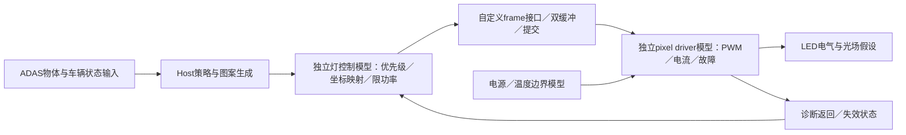

# 晶合光电「画芯」系列：产品边界、控制架构与可复现范围

核查日期：2026-10-06。研究对象为**上海晶合光电科技有限公司**，不是晶能光电，也不是晶合集成／晶合半导体。公司身份由 [IFAL 官方对邓亮的采访](https://www.ifal-forum.com/nd.jsp?fromColId=2&id=1197)及[上海大学校友企业介绍](https://jgzx.shu.edu.cn/info/1131/14318.htm)交叉确认。本文的「画芯」是 MicroLED 数字光源产品名；「画擎」在不同年份报道中分别指投影模组、光机系统或控制器，不能仅凭中文品牌名认定它们是同一个硬件版本。

**判断：画芯适合作为国内高像素车灯的产品研究目标，当前公开资料足以建立功能层对标；尚不足以复刻它的 CMOS backplane、ASIC、驱动协议或可靠性实现。** 本次未取得原厂完整 datasheet、pinout、register map、application note、SDK 授权文件或晶体管模型。二手规格保留为待核线索，不能转成已经验证的设计条件。

证据索引：[huaxin-sources.json](../../../evidence/automotive/huaxin-sources.json)。原始 PDF 与可视页仅保留于 ignored `build/automotive/huaxin/`；本文没有复制未清权厂商图。

## 1. 一手资料能确认什么

| 一手来源与定位 | 窄结论 | 不支持的结论 |
| --- | --- | --- |
| [IFAL 2025 厂商采访](https://www.ifal-forum.com/nd.jsp?fromColId=2&id=1197)，「国产车规级 Micro-LED 光源开发进展」回答；会议日期 2025-06-25～27，页面发布日期未确认 | 邓亮说明 4 万像素、CMOS 设计与封装研发方向，并把 2025 年内量产样片作为目标；存在客户打样活动的厂商陈述 | 4 万像素成品参数、样片验收、认证完成、整车量产、实际良率 |
| [上海大学官方介绍](https://jgzx.shu.edu.cn/info/1131/14318.htm)，「校友企业简介」及合作段落；发布日期未确认 | 存在数字车灯芯片联合实验室；校方描述 MicroLED 芯片与先进封测能力 | 「国内首条／国际先进」不能替代可检查的工艺、产量或对比报告；没有指明画芯各型号的规格 |
| [乾照 2026 半年报](https://disc.static.szse.cn/disc/disk03/finalpage/2026-08-24/6c91b020-cacf-4c2d-ad96-798be34e283d.PDF)，2026-08-24，PDF 第 11 页／印刷第 7 页，LED 业务／Micro LED | 合作方确认与晶合战略合作；报告称其 ADB 芯片业务存在样品交付、可靠性测试与量产爬坡 | ADB 段落没有点名画芯，不能把乾照全部样品或量产归到画芯一号，更不能把其他显示芯片的量产归到车灯 |
| [上海大学采购意向](https://bidding.shu.edu.cn/sy/xtgg_detail.jsp?gglx2bh=CGYX&wid=202609290030180184)，2026-09-30，「数字车灯芯片8英寸晶圆流片服务」 | 校方计划采购 150 nm、8 英寸流片服务，要求 12 张整晶圆及测试结果 | 公示未关联画芯型号；不是已完成流片，也不证明画芯采用 150 nm 或某代工厂 |

### 原文未读回的合作转述

2026-05-29 的[署名来源“乾照”的新浪／市场资讯转载副本](https://finance.sina.com.cn/wm/2026-05-29/doc-inhzqccq0925862.shtml)在「产业链协同」段落称画芯一号处于量产冲刺阶段，并描述晶合的 CMOS 驱动、封装、模组和控制器能力方向。[原文定位](https://mp.weixin.qq.com/s/PQQsXS0Is8XmUisk1r88Ag)此次返回访问验证页，未读回正文，也未完成原始发布者校验，因此这些产品陈述属于**待原文确认的转述**，不计入上表的一手证据。乾照半年报独立确认的是战略合作关系，不能替代对画芯具体产品阶段的验证；合作协议也不等于交付或实际 BOM。证据索引将其单列为 `JH-S4`。

## 2. 产品矩阵：可追踪线索，尚待原厂确认

以下数值来自 [2026 ALE 新品发布媒体报道](https://finance.sina.com.cn/tech/roll/2026-03-27/doc-inhsmtiq5229790.shtml)，**不是原厂 datasheet 的保证值**。不能在规格文件中直接使用。报道显示规划日期，不以今天已过该日期推定实际交付。

| 名称 | 报道的定位／数据 | 截至核查日的证据状态 |
| --- | --- | --- |
| 画芯™一号 | 40,000 pixels；40 µm pitch；≥2,500 lm @ 50 W；光效 >50 lm/W | 厂商／展会陈述经媒体转述。50 W 是哪一级输入、光通量测于光源还是光机出口、温度、点亮比例、白光转换、积分方法、保证范围未公开 |
| 画芯™二号 | >100,000 pixels，面向更复杂路面投影；原计划 2026 Q3 面世 | 未取得最终型号资料或按期推出的原厂记录；不是已证实的 DLP 等效替代 |
| 画芯™三号 | 面向远近光主光源；≥3,500 lm @ 50 W，报道称已点亮；原计划 2026 Q2 推出 | 点亮陈述与计划；像素布局、规格和推出状态未获一手确认 |
| 画擎一号 | [ALE 联合发布媒体记录](https://m.gasgoo.com/news/70451636.html)称双 MicroLED 光机、视频生成、拼接、总输出 ≥200 W | 控制器陈述经转述；不能当芯片功耗，也不能从“多信号传输”推断 CAN-FD／LVDS／SPI 的具体组合。2025 的同名投影模组与 2026 控制器需版本映射 |

2026-09-28 的[最新 LEDinside 报道](https://www.ledinside.cn/news/20260928-62681.html)转述：晶合于 9 月 24 日宣布画芯一号在 BACL 见证下完成 AEC-Q102 可靠性验证，并使用数模混合与异质堆叠架构。**本次未取得原厂公告原文、报告编号、样品／批次／试验分母、适用型号及结论页，因此只记“可靠性完成的公司公告被报道”，不记“独立确认通过”，也不把它升级为 ASIL、整灯认证、量产上车或长期道路测量。** 3 月报道的 Q2 认证计划应作为历史计划保留，不能继续当当前状态。

宣传中的“已量产指标最高”“量产冲刺”“产线已建成”“年产能规划”属于不同陈述。它们不能合并成“画芯已经稳定批量装车”。既有普通 LED 模组的车型与累计装车数字，也不能移作画芯的量产分母。本次没有核实到画芯具体车款、年款、灯具版本和采购料号之间的官方对应关系。

## 3. 将光源芯片、驱动与 ECU 分开

下图是**本项目独立提出的功能模型**，用来安排仿真边界；不是画芯商业内部 block diagram。

| 层 | 要解决的问题 | 画芯公开边界 |
| --- | --- | --- |
| 整车／ADAS | 哪个物体不能被照射，车辆转向、速度、姿态；输入延迟与合法状态 | 具体 OEM 信息链和接口未披露。光源不会自己完成环境感知 |
| 灯 ECU／控制器 | 合成光型与投影、坐标校正、帧管理、功能优先级、异常降级、功率调度 | 画擎功能报道提供方向；真实 MCU／SoC、软件责任分配与安全路径未知 |
| Power stage | 电池侧保护、DC-DC、LED rail、逻辑 rail、热控制 | 画芯供电范围、ripple、inrush、动态 rail 算法及 all-on envelope 未披露 |
| ASIC／backplane | 本地像素驱动、电流与 PWM、地址与缓存、检测／读回 | CMOS 能力方向可确认；晶体管级拓扑、memory、扫描方式、PWM 分辨率／频率与诊断粒度未知 |
| Light engine／optics | MicroLED、转换层、封装、散热、透镜、投影 | 40 µm 线索不能给出 die 尺寸、阵列长宽、fill factor、PSF、串扰或道路角分辨率 |

“Matrix LED”并不只是一种电路。分立／低像素矩阵可用板级多通道 current sink 或串联 LED bypass；高密度阵列则把像素连接与控制局部集成，避免将每个像素都引出封装。本地控制的具体扫描、存储和驱动方法仍需逐产品确认。**不能把 16 通道板级器件重复堆叠，就声称复现了 4 万像素 CMOS backplane。**

## 4. 可公开学习的必要参照

公开资料更充分的 [Nichia µPLS 产品页](https://led-ld.nichia.co.jp/en/mpls/)描述 256×64、16,384 pixels、集成 Infineon ASIC 的三维光源。它用于说明高密度阵列的集成方向，不能证明画芯使用相同电路。

[Infineon TLD804KTRAVCB_EVAL User Guide](https://www.infineon.com/assets/row/public/documents/10/44/infineon-tld804ktravcb-eval-ug-usermanual-en.pdf)，Rev.1.00，2025-01-14：p1 明确评估对象 NMAWA04KAT = Nichia 阵列 + TLD804K；p6 Fig.2、p7 Table 2、p12 的输出说明区分 configuration UART 经 CAN transceiver 与 video UART 经 LVDS；表中 nominal 速率分别为 1／20 Mbaud。**这是评估板链路；经 CAN 收发器传输 UART 不自动等于 CAN-FD packet protocol。** 指南公开 board schematic／BOM，未给出完整像素 ASIC register／transistor 实现，且 p2 明确评估板不能用于生产或可靠性试验。无证据将该板归为画芯／画擎或某整车实际 BOM。

[TLD7002-16ES 官方页](https://www.infineon.com/part/tld7002-16es)公开 16 个 linear current sink、最高 76.5 mA、独立 14-bit PWM、HSLI 与诊断能力。它属于 LITIX Pixel Rear，可作为 current/PWM/fault 的学习参照；不据此声称它属于画芯、µPLS 或 EVIYOS 的 BOM，不复制其商业报文来定义本项目协议。ISO 26262 开发声明不能自行改写为本项目或画芯的 ASIL 等级。

[晶合专利 CN114839831B](https://patents.google.com/patent/CN114839831B/zh)，2024-07-05，摘要及权利要求1，提出分散 LED、光源 PCB、透镜与散热器的地面投影模组。它说明晶合已有另一路矩阵投影方案，**不是画芯 4 万像素 ASIC 的证据**。专利说明书是方案披露，不是实际量产实现或性能验证；本项目不照搬受保护结构。

## 5. 仿真平台应复现哪些功能

先保留已运行的 one-pixel 电气路径；新增独立 Host→frame→pixel 逻辑，不修改旧 v0.4 条件，也不以扩大软件数组数量声明真实 backplane 已实现。

1. **Python 场景模型**：合成物体遮光 mask、基础 beam、投影符号；明确姿态、光学映射与延迟均为假设。输出每帧像素值、mask 越界与时间戳。所有视觉是 synthetic。
2. **RTL 模型**：自定义 frame 流；双缓冲在 frame boundary 一次提交；timeout、reset、enable、非法长度、超功率与坏像素事件进入可检查状态。仅证明自定义接口的功能，不宣称商业协议兼容或 ASIL。
3. **电气耦合**：一像素及受控小阵列用 ngspice／现有锁定 PDK subset；检验 compliance、PWM minimum pulse、startup、off-state、供电扰动与邻居同步瞬态。LED 参数保持 traceable／synthetic 标记。大阵列使用 aggregate load 和等效 rail；不能把它当 4 万个实测／PEX 像素。
4. **光场模型**：独立投影算子与 PSF／串扰假设；报告相对图案、mask 泄漏和延迟。没有校准光学数据时，不输出仿真的流明／道路照度为实测或型式认证结果。

纯 payload 预算可用 `R = N × bit_depth × frame_rate × number_of_streams`。例如**假设** 40,000 pixels、8-bit、60 Hz，单路需 19.2 Mbit/s，双路 38.4 Mbit/s；双缓冲单路需 80,000 bytes。若 10-bit，单路 24 Mbit/s。以上不含 framing、blanking、CRC、地址与重传，也没有声称画芯实际是 60 Hz 或 8-bit。**逻辑像素总数并不直接确定功率**；缺每像素 current／duty、rail、点亮比例与转换效率时，不能用 50 W÷40,000 反推恒流设定。

## 6. 原厂资料的最小缺口清单

| 需要取得的原厂数据 | 解锁的验证 |
| --- | --- |
| 画芯／画擎版本、可订购料号、datasheet revision、阵列行列数／die／package／pinout | 排除跨代混用；建立真实集成边界 |
| Pixel current 范围、accuracy、Vf 分布、compliance、PWM 位数／频率／minimum pulse | 电流和时序 regression 有可证伪门槛 |
| 视频／控制／诊断物理层、合法公共接口文档、更新时序与错误处理 | 建立兼容测试；此之前只使用自定义功能接口 |
| 电源／all-on／pattern envelope、功耗测量节点、NTC／on-die temperature、Rθ／Zθ／Tj、降额曲线 | 热与供电模型不再依靠猜测 |
| Frame/row/pixel diagnostics、坏点容限、shutdown/latch/recovery、safe output、watchdog 及安全手册 | 故障注入结果与真实机制对齐；无资料不指定 ASIL |
| Flux／luminance／angular output、温度、电流、duty、点亮比例、光源与光机出口条件、PSF、calibration map | 电流代理量转为经校准光输出，比较 EVIYOS 与画芯时统一测量边界 |
| AEC-Q102 原始报告、批次／样本／失败数、试验项目／条件、适用料号、量产出货与正式车型映射 | 分开记录可靠性、量产、上车与实测，避免日期计划升级 |
| 可使用的 SDK／模型／源代码许可证与 notice | 允许合法复现对应公开层级；无许可不复制商业协议、寄存器或原厂图 |

当前独立模型的正确交付名称应是“面向高像素车灯的独立功能与电气仿真平台”。取得原厂数据并完成对齐前，不称“画芯仿真模型”“量产等价驱动 ASIC”或“车规认证平台”。
