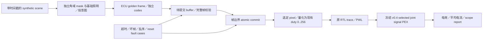

# 车灯 ADB／道路投影：独立复现平台与当前缺口

审查日期：2026-10-06（Asia/Tokyo）。基线 commit：`3a9ca422b78b57ef6cd0b5eea163c68321375660`，单像素研究里程碑 v0.4。本文新增应用方向与退出判据，不改变冻结模型、参数、历史输入 hashes 或成功／失败 evidence。本次查验已有源码、JSON、协议边界及文件 hashes，未重跑大规模波形或物理流程。

**判断：现有仓库适合作为车灯平台的一个独立电气研究后端；还没有车灯控制平台或商业产品兼容实现。第一条路径应先打通“场景／遮光 mask → ECU 帧模型 → 完整帧提交 → 选定单像素 RTL／joint PEX replay”，再补真实 reference、保护关断与供电。** OSRAM EVIYOS 与晶合光电画芯系列用于公开功能／参数 benchmark；产品身份、代际、公开接口和条件以分别核验的一手资料为准。本文没有采用未经确认的商业寄存器、帧格式、工作电流、供应 BOM 或内部架构。

## 1. 已有能力与证据分母

| 已有证据 | 本次确认内容 | 严格适用范围 |
| --- | --- | --- |
| v0.4 文件身份 | 基线 commit 中的 manifest 记录 2504 项入口、输入、文档及证据检查；其 554 个 `current_file_hashes` 在应用增补前查验时全部存在且 SHA-256 一致；[最终 current 索引](../../../evidence/research/current-manifest.json)按最终工作树另行刷新 | 2504 不是电气测试样本数或 safety coverage；554 是基线索引当时覆盖的文件。基线 manifest 保留在基线 commit，入口／roadmap／校验脚本及最终 artifact 索引变化另记，不改旧 run／model／input 身份，不升级工程等级 |
| 单像素 digital | [RTL](../../../rtl/pixel_pwm.v)为同步 reset、注册输出、256-slot PWM；1 MHz 下 256 µs／frame、3906.25 Hz；9-bit threshold 表示 0…256，257…511 clamp 为 256；duty／enable 在 frame boundary 提交 | 不是 9-bit 灰阶、10／12-bit pixel memory、ECU 视频帧或商业协议；尚无串行接收、双 buffer、CRC／watchdog |
| RTL／mapping | [数字证据](../../../evidence/digital/summary.json)为 518 完整 frames、133159 checks；95 mapped standard cells，其中 19 FF；functional trace 与 RTL 一致 | 单 pixel 的逻辑及映射；早期 1 ns placeholder gate delay 与实际 physical/SDF 证据分开，不建立全部 simulator timing checks 支持 |
| Digital physical | [physical 证据](../../../evidence/physical/summary.json)保存 standalone PWM GDS／LEF、9 个 STA 条件与 19 FF endpoints；所执行检查通过 | 1 MHz／配置 load 等已声明约束；不是阵列 timing、全芯片总功耗、pad／ESD 或制造接受；KLayout density／antenna 模式未执行，具体覆盖见[说明](../../digital/physical.md) |
| Joint signal PEX | [nominal summary](../../../evidence/joint-pex/nominal/summary.json)从 raw 5644 MOS／18451 R／36028 C 中选出 12 MOS、45 signal R、77 aggregated C、34 neighbor ports；五种 RC style 均有实际抽取 | 12 MOS = 末级 buf_2 六 MOS + analog pixel 六 MOS；PG／body 串联 R 和 PG-only C 投影到理想 rails，邻居驱动／分布阻抗未包含，非整片 PEX |
| 模型重现身份 | [fresh reproduction](../../../evidence/joint-pex/reproduction.json)的 ordered ports 与 exact geometric multiset 相同；raw/model byte equality 均为 false | 原始／重现 hashes 都保留，内部 rnode 编号／排序可以不同；“重现”指规定的电气图／几何语义一致，不称文件逐字节一致 |
| v0.4 主电气研究 | [main](../../../evidence/robustness/main-summary.json)37 transient／12 circuit DC、146 工程 guards；三 MOS 包络采用 nominal RC，另加 SS×HRHC 与 FF×LRLC 两组 full-on／最低码点 | full-on 100.112984…101.423393 µA；最低码最差面积误差 0.700133%，满足本项目 ±5%／±2% 研究门槛；不是五 RC×三 MOS 完整交叉矩阵，不是车灯额定值 |
| 主研究与边界总数 | [总 summary](../../../evidence/robustness/summary.json)共 66 transient／28 circuit DC，另 3 次 synthetic LED calibration；probe=10／12，main=37／12，boundary=19／4 | `boundary_studies_are_system_qualification=false`；boundary 的 19 transient／4 DC 数值完成不表示全部工程通过，也不应全部记入 146 guards |
| 真实 static LED 数据 | [source-lock](../../../analog/models/measured-led/source-lock.json)：Lin 2026、Zenodo DOI 10.5281/zenodo.20034288，`I-V.xlsx / Sheet1 / A3:B102 / 20μm yellow / Fig.2a`；100 points、1 curve，物理样品数与测量温度未报告；100 µA 插值 Vf=3.767909545 V | 黄色 InGaN-on-diamond 静态负载；[拟合](../../../evidence/led-fit/lin2026-yellow20-fit.json)101 OP replay 是数值实现检查，不是 101 个实测样品；不代表白光车灯 emitter、真实动态、温度或光学 |
| 真实静态耦合 | [measured-load](../../../evidence/characterization/measured-load-summary.json)148 DC，其中 135-point 网格；MOS 固定 27°C，LED 原测量温度未知；98.175014…100.983768 µA | 不对 LED 做温度缩放；10 个 assumed-capacitance transient 均不能使 `dynamic_qualification=false` 升级 |

冻结 post 模型 SHA-256 为 `03813e63e64bf505570dbd1f81e6809366e6b4d31bbee129c28022956e1cc623`。输入切口在末级 buffer 的 `I`，真实 analog M3 入口在 `[119.99,111.52] µm`；pre/post 差异包含入口与表示改变。一次实例化 joint cutout，不能再叠加旧 buffer schematic、analog RC、digital SPEF 和 link RC。[stage contract](../../../evidence/robustness/stage-contract.json)固定该边界；不能将其他仓库的 FPGA optical-link 结果当作本仓库验证。

## 2. 按车灯系统层分解

下表的“可独立搭建”是下一步实现建议，均不是已交付能力。“需要公开证据”决定能否与两类 benchmark 比较；“退出判据”先约束本项目实现，再讨论真实器件或制造升级。

| 层／目标 | 本仓库已实现 | 可独立搭建的最小实现 | 仍需要的一手公开资料／实测证据 | 退出判据与证据升级边界 |
| --- | --- | --- | --- | --- |
| 场景、camera、mask 与道路投影 | 无 camera pipeline、object tracking、ADB mask、投影图形生成或光学 mapping | 先用带时间戳的 synthetic objects／给定 bounding boxes，形成角域 mask、基础照明图与投影图；独立规定优先级、边界裁剪及不可信输入处理；可视化 scene→mask→pixel frame | camera／lamp 坐标定义与标定数据、视场、pixel-to-angle 光学 mapping、公开算法／数据许可；真实识别精度与 worst-case latency 数据；EVIYOS／画芯公开场景是否属于对应代际 | 同输入固定输出，遮光区坐标与预期一致；记录场景有效域、时间戳、端到端模型延迟与负对照。理想角域 mask pass 只建立算法／functional simulation，不建立道路眩光、目标识别或法规符合性 |
| Vehicle E/E 接口与 supervisor | 只有 `clk/rst/duty/enable` research ports；无 CAN、LIN、Ethernet、UDS 或车载收发器 | 先做独立 supervisor message model：模式、帧有效期、时间戳、使能与故障状态；使用软件文件／队列回放；各消息语义由本项目独立定义并明确 transport 尚未实现 | 对应产品公开接口说明、signal/voltage/pin 条件、协议许可；目标 vehicle E/E 拓扑、控制权、故障策略与实际 network timing | 超时、乱序、重复、损坏、重启、模式切换的行为可执行；supervisor 控制链与 pixel payload 链分开建账。通信模拟不建立真实 bus electrical/EMC，也不称兼容商业 register map |
| ECU frame、mapping 与 buffer | 无整帧生成、image plane、双 buffer、完整帧提交、gamma 或标定表 | 软件 ECU golden model：固定 geometry、独立 brightness codes、active/pending double buffer，帧验证后在指定边界 atomic swap；完整帧先行，稀疏／压缩更新后置 | 对应商用型号的实际可控像素数、有效 bit depth、最高 frame update、frame acceptance／commit 条件及许可允许公开的接口；车灯 optical calibration | 分辨率／code ranges／packing 明确；半帧、损坏帧和错序帧不能污染 active frame；update deadline、memory bytes、丢帧行为可复算。软件 buffer pass 不称 ECU hardware bandwidth 或 ASIC memory 已实现 |
| Pixel ASIC digital 与本地状态 | 单像素 256-slot PWM、frame-boundary duty／enable、同步 reset；mapping、standalone physical 与分层 replay 已有证据 | 先在软件层独立 frame receiver／pixel-state model，挑一个 pixel 输出现有 duty；以后再按已验证 requirements 加 receiver、clock-domain crossing、frame commit、diagnostic 与 fault override RTL | 实际 optical grey scale／PWM／update requirements；公开产品数据不能直接当独立 RTL spec；真实 FPGA／ASIC clock、I/O、reset、test／diagnostic 约束 | 先证明端到端同一帧、同一 selected pixel、同一 trace；10／12-bit command 到现有 duty 的量化损失显式输出。新 RTL 要独立功能／timing／负对照，再独立 physical；不会因旧 95-cell 单 pixel 通过而宣布阵列／商业芯片完成 |
| Analog current、reference、PG 与保护 | 100 µA simple mirror、bias pass／gate clamp／inverter；W20/L4 analog layout；signal-path joint PEX；reference 为理想／边界行为源，PG／body 与邻居存在截断 | 继续一个 pixel：可实现 reference、startup／compliance、独立保护关断、power-good／POR；逐步恢复真实 PG／body／neighbor 网络，在新版本与旧 frozen baseline 比较 | 所选可获取 emitter 的 I–V(T)、dynamic／capacitance、current rating 与测量条件；匹配 public full PDK／rule decks；真实 rail／package／reference 电路与误差预算 | 模型改变须 DC calibration 与 coupled regression；电流、最低 pulse、off、startup、rail/compliance、mismatch、故障响应有预声明条件和失败 logs；signal-cutout pass 不建立 full PDN／IR/EM 或车灯额定驱动能力 |
| Optical、thermal、power 与 safety | 没有 optical output、thermal model、board／silicon、sensor feedback、故障检测或 safety process；average branch current 只为 electrical brightness proxy | 用明确标为假设的 point-spread／光通量／thermal plant 做系统敏感度分析；先规划可测量电气＋光学 bench，fault requirements 包括 watchdog、关断与降级；各场景定义允许的功能输出 | 同器件光学、温度、package 与 optics 数据；测量校准／误差；真实车辆需求、相关法规的适用版本、safety lifecycle、fault model／diagnostic coverage 证据 | 使用同一器件／光学系统的 raw 数据校准；光学与 thermal 单独评估；fault injection 含 latency 与独立检测机制。模型动画、电气 µA 或公开 deck pass 均不能升级为 photometry、road homologation、AEC 或 ASIL 声明 |
| 验证 simulation platform 与可重现性 | 真实 RTL trace→PWL→ngspice；synthetic LED 与 traceable static load 分开；layout／synthesis／PEX／guards／negative controls／source locks | 独立 data contract：scene、frame、commit event、pixel trace 与 analog case 用相同 run ID／hash；功能模型跑全 logical plane，重电气仿真仅 selected pixel／必要边界点；保留 raw outputs 在新 build 子目录 | 公开 source／license locators、tool versions、商业产品资料发布日期与型号身份；外部复现 logs；最终 hardware 等级需匹配 hardware 与 measurement reports | 一条命令产生 frame hashes、受检 case 分母、事件时间与 selected-pixel 电荷积分；fault negatives 确实拒绝；源 hash 可核对。仿真完成仅称独立 functional＋selected-pixel electrical platform，未测 hardware 必须保留未执行状态 |

## 3. 现有失效边界会直接影响车灯架构

这些是已有运行发现，不是对商业产品的推断。

- **正常帧更新与故障关断必须分开。** 现有 enable 20 µs 置 0，PWM 258.5 µs 才变低，等待 238.5 µs；300 µs 置 1，到 514.5 µs 才恢复。同步 reset 在 20／30 µs 请求后，于 20.5／30.5 µs 响应。它们只说明这个 clock／phase 下的真实 RTL functional events，不建立紧急关闭、POR 或 voltage-aware FF。未来故障延迟应由系统危险分析／应用 requirement 定义，不能把“下一 PWM frame”默认当足够安全。[control timing](../../../evidence/robustness/summary.json)
- **理想 reference 隐藏启动条件。** LED-first／early ideal-IREF 探针出现 BIAS 高出 live logic rail 1.372421 V，行为源部分时间主动供能 1.093095 nJ；compliant 行为边界不等于真实 generator。应先实现可达到的 bias／compliance 和关断，才能谈共享 reference 与启动。[边界研究](../robustness.md)
- **rail headroom 与真实负载的关系不能从 nominal 外推。** 相同真实 static I–V 下，外部假设 RLED=10 kΩ 时 current=88.265992 µA，超出 ±5% target；它是刻意负对照，不是推荐 PDN／sense 阻抗。真实白光车灯 emitter 的工作点需要独立数据；不能沿用这条黄光 static curve。[boundary DC](../../../evidence/robustness/boundary-dc.csv)
- **功耗组织比像素复制更早需要决定。** TT nominal 最低码 LED 外部 branch rail 约 1.962878 µW，而持续理想 reference rail 为 330 µW；reference rail 包含其源吸收与 BIAS 注入两部分，不能重复相加。它只暴露 reference organization 的研究问题，不能乘 commercial pixel count 推出车灯模块功耗。上游 logic／完整 PG charging／真实 reference 也未包含。[terminal accounting](../../../evidence/robustness/summary.json)
- **电气、几何与光学灰阶是不同问题。** 256 slots 的电荷积分不能代表10／12-bit商用 optical grey scale；305×180 µm 是共同 macro bbox，不能乘 pixel count 当 array die area；synthetic dynamics pass 不代表20 µm yellow LED 的真实 pulse，更不代表车灯光束。

## 4. 第一条可运行的独立平台

这是建议的下一实施包，尚未实现。它保留一 pixel 的物理／电气路径；全 logical plane 只在轻量 functional model 中存在，不新增 4×4 physical、广泛 RTL 或 pad ring。



第一轮可以独立声明 16×16 **logical** plane、60 Hz command update、10 或12-bit command、256-slot electrical PWM；这些都是 prototype assumptions，不是 EVIYOS／画芯参数，也不是已存在16×16 ASIC。场景从固定 boxes／轨迹开始，使 mask 正确性与通信／帧问题可分别定位。先没有真实 camera，不能把 synthetic object boxes 写成 object detection。

用本项目独立 binary payload／frame contract 或直接 file replay，不定义商业寄存器，不宣称兼容。frame ID、时间戳、geometry、code width、payload length、integrity result 作为研究日志与内存结构，后续 transport 有独立 specification 后再编码。与 ASIC 的边界第一次可以是一个 selected pixel 的 replay；全阵列电气同时切换是以后独立研究，不由一个 pixel 结果代替。

将 b-bit command `g∈[0,2^b−1]` 映射到现有 threshold：

```text
duty = round_half_up(256 × g / (2^b − 1))
command_electrical_proxy = g / (2^b − 1)
replay_electrical_proxy = duty / 256
quantization_error = replay_electrical_proxy − command_electrical_proxy
```

这保留 exact off／full-on，舍入后的绝对 normalized duty 误差上界为 `1/512≈0.195313%`，但低码相对误差可能很大，并且多个10／12-bit codes会映射到同一 threshold。该上界只针对数学量化，不含 current accuracy、pulse area、器件动态或光学误差；输出报告必须并列 command code、threshold、量化误差与 actual electrical result，不能将 command bit width 升级成 effective PWM／optical resolution。

最小退出判据：

1. 同输入 seed／scene trace／config 产生相同 mask 和完整帧 hash；保留 domain 与 mapping assumptions。
2. pending frame 只在完整校验通过且所声明 commit 边界到达后成为 active；部分帧、错 length、重复／乱序与丢帧各有 expected state，不产生混合帧。
3. camera/object 输入、frame update 与 PWM 三种时钟／时间戳分账，延迟从 scene timestamp 到 mask、accept、commit、selected PWM edge 分别记录。60 Hz更新与3906.25 Hz PWM不同，不取相同名称“frame rate”。
4. selected pixel 的 threshold 与实际 RTL event trace 一致；off／lowest／mid／full-on／mask transition／reset／timeout 的作用域、cases 与预期先声明。现有 enable 延迟如实保存；新fault override没有实现前，timeout处理只称functional模型行为。
5. electrical replay 使用一份冻结 post 模型、相同 load／条件合同，保存 raw netlist／log／waveform 到新的 `build/` 子目录。新增证据在独立目录发布，失败先保留日志，不覆盖 v0.4。
6. 交付一条可复现入口、至少一个正常场景与一个负对照、frame hash／latency／bandwidth／quantization／charge 表，以及清楚的未验证项。没有 camera、hardware、full array current、真实white emitter或 optics时仍明确标为未执行。

之后才依次进入：real reference／保护控制／PG及邻居 → 同器件dynamic／thermal／optical bench → selected硬件接口与测量 → 有需求驱动的阵列RTL与physical。每步执行[现有 roadmap](../../roadmap.md)和[bench 计划](../bench-validation-plan.md)的对应退出条件；不能因为新方向有更高 pixel count benchmark 就提前跨过 one-pixel gate。

## 5. 逐像素10／12-bit帧带宽与buffer预算

以下是可复算的 **uncompressed full-frame assumptions**，不等于任一商业产品实际 transport。像素数 `N`、command bit width `b`、完整帧更新率 `f_update` 均须来自同一型号／代际的公开条件，或像这里明确列为研究假设。每 pixel 一标量；无 RGB 三通道，无 per-pixel current／diagnostic metadata，无 packet overhead、blanking、line coding、retries或bus arbitration。

```text
payload_bits_per_frame = N × b
packed_payload_bytes = ceil(N × b / 8)
payload_bps = N × b × f_update
two_frame_buffer_bytes = 2 × ceil(N × b / 8)
wire_bps ≥ payload_bps / η                 # 0 < η ≤ 1，η待实际协议确定
```

下表采用 byte-exact bit packing、60 Hz／100 Hz 两种 update。N=25,600 与40,000仅为两个算例尺度，不能据表认定任何产品型号的实际像素数。

| 假设 N | b | 一帧 packed bytes | 两帧 packed bytes | 60 Hz payload Mbps | 100 Hz payload Mbps |
| ---: | ---: | ---: | ---: | ---: | ---: |
| 256（16×16 logical demo） | 10 | 320 | 640 | 0.1536 | 0.2560 |
| 256（16×16 logical demo） | 12 | 384 | 768 | 0.18432 | 0.3072 |
| 25,600（纯预算尺度） | 10 | 32,000 | 64,000 | 15.36 | 25.60 |
| 25,600（纯预算尺度） | 12 | 38,400 | 76,800 | 18.432 | 30.72 |
| 40,000（纯预算尺度） | 10 | 50,000 | 100,000 | 24.00 | 40.00 |
| 40,000（纯预算尺度） | 12 | 60,000 | 120,000 | 28.80 | 48.00 |

例如研究假设 N=25,600、12-bit、60 Hz：raw payload=18.432 Mbps。若再**假设**总体有效效率 `η=0.8`，最低预算 wire rate=23.04 Mbps；这没有指认实际 SPI clock、commercial clock limit或系统 margin。若内存独立选择每 pixel 用16-bit容器，双buffer为 `2×N×2 bytes`，N=25,600 时102,400 bytes；若wire也发送16-bit容器，60 Hz raw payload=24.576 Mbps，与12-bit packed的18.432 Mbps不同。Memory representation与wire representation必须分别确认。

CAN等vehicle supervisor链与ECU→pixel阵列payload链的用途、约束和实际协议应分别确认。上面的算例只属于逐像素payload，不可把“存在CAN接口”推成“CAN能传全部图像”，也不可把“SPI advertised clock”直接替换成有效payload带宽。若选择某个串行接口，须据真实packet／transaction／gap／retries与允许clock复算有效 `η` 并执行完整帧deadline测试；未确定协议前不选择假定商用寄存器或编造SPI事务。

Sparse／tile／compression更新可以作为后续独立设计，但第一轮不用平均压缩比掩盖full-frame worst case。对任意架构，给出 frame deadline、buffer occupancy、最坏accepted update latency与fault／stale-frame策略；仅列 payload Mbps 不能说明整个平台可用。

同样，增加command bit depth不会自动增加现有PWM slots。若未来独立实现 `2^b` uniform slots，保持1 MHz clock时10-bit／12-bit PWM repetition分别为976.5625／244.140625 Hz；若希望保持当前3906.25 Hz，数学预算clock分别为4／16 MHz。它们只是理想计数器关系，尚无新RTL、timing、最短pulse、电气或optical验证；分段PWM、bit-plane、current modulation等不同方案需要各自spec与证据。

## 6. 下一次决策前必须明确的事项

| 决策 | 当前可做的默认推进 | 需要确定的事实／用户要求 |
| --- | --- | --- |
| ADB优先还是投影优先 | 同一frame model保留mask与projection输入，第一正常场景以可确定boxes做mask | 首个要回答的应用问题：遮光区更新／故障行为，或道路图形的空间／灰阶效果；不能两者都默认为已定义 |
| Benchmark型号与代际 | 将EVIYOS与画芯的公开产品事实单独记录，并只使用已确认项 | 名称、料号、代际、像素数／pitch／grey scale／frame condition、裸die或module层级；不同产品系列条件不混填 |
| 真实硬件深度 | 先完成软件functional端到端与现有单pixel electrical replay | 可获取器件、公开datasheet／SDK许可、实际接口和板卡；未得到前不编BOM、不称电测／光学实验完成 |
| Current／light target | 保留100 µA research baseline | 目标emitter、颜色／结构、工作电流／温度、headroom、光学／热需求；公开headline current不自动转为本项目规格 |
| 保护关断与降级 | 明确enable是normal frame commit，记录实际延迟 | Timeout／fault触发条件、允许响应时间、降级输出；成为需求后先实现和注入验证，不用现有同步reset代替全部safety机制 |
| 新版本证据归属 | 新application资料与simulation证据使用独立路径，保留v0.4 | 若改model／parameter／RTL，定义新版本conditions、DC calibration、coupled regression和physical门槛；现有evidence不改写 |

该方向的第一次成功应被命名为“独立ADB／道路投影functional pipeline与selected-pixel electrical simulation”。要声称商业兼容、完整ASIC、车规／ASIL、road approval或真实optical性能，必须分别取得对应协议许可与实际接口、完整芯片／制造证据、安全过程／适用规则以及同器件测量；这些状态目前均没有建立。
