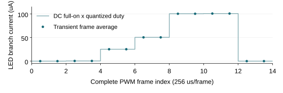

# Open MicroLED Driver ASIC

## 01　目前做到哪里：从一个像素到可复现实验

**进度说明 · 2026-10-07 · 实验性研发方法验证与教学**

这个项目研究一条可以逐层检查的路径：**命令决定点亮时间，电路决定导通电流，真实版图带来寄生，实验检查误差与假设边界。** 先让一个像素的结果有来源、可复算，再决定哪些问题需要更多像素。

现有工程基线为单像素 **v0.4**。已经有 registered PWM、六 MOS 模拟驱动、真实版图和共同 GDS；从共同版图提取了末级数字 buffer 与模拟像素的联合信号寄生模型。新的控制实验围绕完整帧提交、量化和 selected pixel 回放开展。

| 层级 | 当前可以检查的内容 | 怎样阅读结果 |
| --- | --- | --- |
| 数字逻辑 | RTL、自检、标准单元映射与事件记录 | 确认输入何时生效、PWM 是否正确 |
| 物理实现 | layout、GDS、所执行 DRC/LVS、真实金属连接 | 确认声明规则与电路连接是否一致 |
| 电气研究 | selected signal PEX、晶体管仿真、积分与误差复算 | 结论限于所用模型、条件与截断范围 |
| 实物与光学 | 后续测量计划 | 尚需样品、仪器、原始数据及测量不确定度 |

**本轮已实现 frame experiment v0.1：** 独立完整帧、CRC32、partial assembly、原子提交、12-bit量化和单像素回放。正常、错误注入、timeout三组共32个完整PWM帧、8,192个逐槽检查；新增3次transient、2次电路DC、1次独立LED校准。receiver仍是Python功能模型，电气后端沿用单像素v0.4。

初学者先读本说明，电路与版图细节再查[分层研究报告](../research-report.md)；方法背景见[2026-10-06方法快照](../experimental-methods/report.md)。平均支路电流是 electrical brightness proxy，真实亮度、光功率和硅片表现需要各自的测量证据。

<!-- PAGE -->

## 02　已有单像素基础：版图已经做了，范围还要说清

PWM 输出经过数字末级 buffer、金属连线、模拟输入开关与电流镜，最终控制 LED 支路。电流镜目标为 100 µA；gate-pass 传递偏置，gate-clamp 在关闭时释放 gate 电荷。外部 reference 目前仍以声明的源模型表示。

| 已完成研究 | 可核查的结果 | 主要边界 |
| --- | --- | --- |
| RTL 与映射 | 518 帧、133,159 项 slot/value 检查；95 mapped cells、19 FF | 功能检查与物理时序分开记录 |
| 模拟版图 | Magic DRC=0、严格 Netgen LVS、GDS roundtrip | 采用锁定公开 PDK/deck 的已执行检查 |
| 共同 physical top | 305×180 µm bbox、19 ports；Magic DRC=0、KLayout item=0；物理错误对照被拒绝 | bbox 是共同宏跨度，不是可直接复制的 pixel die 面积 |
| v0.4 联合模型 | 12 MOS、nominal 45 signal R、77 显式 C、34 邻居端口；5 种 RC 提取 | selected signal-path cutout，PG/body 仍理想化 |
| v0.4 电气主研究 | 37 transient、12 DC、146 项预设 guards；已测矩阵最低码最大面积误差 0.700133% | 部分 MOS×RC 组合；合成 LED 动态模型 |

**DRC 检查几何规则，LVS 检查连接与器件，PEX 描述真实几何的电阻和电容。** 三者回答不同问题。上述检查支持所声明的物理实现，制造接受、完整芯片性能及光学表现需要进一步证据。

联合模型把 source/body/PG 电阻投影到理想电源；PG-only 电容省略，signal↔PG 电容保留。34 个邻居按明确的 clamp 条件处理，未建立真实活动或浮动状态。五份 RC 模型存在，也不等于五 RC×三 MOS 的全部电气组合已运行。

来源：[数字证据](../../../evidence/digital/summary.json)、[模拟版图证据](../../../evidence/layout/summary.json)、[共同版图证据](../../../evidence/integration/summary.json)、[联合 PEX 范围](../joint-pex.md)、[电气结果](../robustness.md)。

<!-- PAGE -->

## 03　为什么要完整帧提交：先确认数据，再一起生效

一帧是一次希望共同生效的数据集合。假设旧帧的 16 个位置均关闭，新帧准备点亮其中一部分。如果收到一个值就立刻改变 active state，接收过程中便可能出现“部分旧帧＋部分新帧”的状态。实验难以确定一次电气变化到底来自哪一帧。

**Partial assembly** 保存接收中的片段；完整性检查确认长度、身份、顺序与内容满足本项目合同后，**pending buffer** 保存完整有效帧；**atomic commit** 在规定边界把完整状态替换为 active frame。这样可以为每次状态变化记录 frame ID、payload hash、accept time 与 commit time。

```text
独立 pattern / mask
  → 完整 frame
  → pending buffer / 校验
  → atomic commit / active frame
  → selected pixel / 量化
  → 既有 RTL → PWL → 单像素电气回放
```

这是本项目独立定义的实验合同。部分帧、错误长度、乱序、重复、过期和 timeout 如何处理，都应先规定预期，再用错误案例验证。只展示一个正常图案不能证明坏帧不会混入 active state。

整帧 active state 切换与 `pixel_pwm` 的 PWM 帧边界提交是两个事件，分别记录时间。前者确认“使用哪一组数据”，后者决定“哪一帧脉冲开始使用该 duty”。两段延迟应独立测量。

| 本轮证据 | 成功运行结果 |
| --- | --- |
| 代码与运行入口 | `scripts/control/run.py --publish-evidence`；固定pattern seed=0、4×4 logical geometry、selected index=5 |
| 正常帧与错误处理 | 正常7帧命令；注入47笔无效交易，active frame与实际RTL events均与正常路径相同 |
| 命令到输出时序 | accept→functional commit为1–174 µs；functional commit→PWM frame固定0.5 µs |

合同与结果：[帧合同](../../specifications/frame-experiment-v0.1.md)、[成功运行摘要](../../../evidence/control/summary.json)、[独立复算](../../../evidence/control/validation.json)；既有提交行为来源：[pixel_pwm.v](../../../rtl/pixel_pwm.v)。

<!-- PAGE -->

## 04　两种分辨率、两种规模：命令位宽与电气能力分开

**12-bit command 能表达 0…4095，共 4096 个命令值。现有 PWM 每帧只有 256 个时间槽，duty 为 0…256，共 257 个有效状态。** 9-bit duty 端口用于同时表达 exact off 与 exact full-on；它不建立 9-bit 或 12-bit 的实测光学灰阶。

本轮采用最近舍入，并以独立分数算术遍历全部4096个code：

```text
duty = round(256 × command / 4095)
normalized error = duty / 256 − command / 4095
```

这种映射的理论误差界为半个时间槽，即 normalized full-scale 误差不超过 `1/512`，约 0.195313 个百分点。off/full-on 必须保持精确；低码相对误差应另算。例如很小的非零 command 可能量化为 duty=0。实际遍历最大误差为0.1952648个full-scale百分点；最低映射为duty1的code是8。

| 对象 | 可以验证什么 | 还需要什么 |
| --- | --- | --- |
| 16 个 logical positions | 帧结构、位置选择、mask、状态完整性和预算 | 其余位置未因此得到晶体管/物理验证 |
| 1 个 selected pixel | 所选命令到 PWM、电荷及电流的可追溯链路 | 坐标、duty、事件、模型与窗口都须记录 |
| 真正 4×4 电气/ASIC 阵列 | 后续共享 reference、PG、时钟及同时切换研究 | 阵列实现、阵列级物理检查与多通道验证 |

**本轮电气结果：** TT/27°C、3.3V logic、5V LED rail、理想100 µA reference及34个0V邻居下，稳态full-on约100.752788 µA。两个最低码帧为0.392533292／0.392575663 µA，相对同条件full DC分母的面积误差为−0.262290%／−0.251524%；均在预设±2%内。最大步长10→1 ns后电荷改变量小于0.000001%。



图中点为每完整帧积分，线为full DC电流×量化duty预算。第一个最低码帧与后续帧略有差别，应逐帧保留状态影响。

来源：[现有 PWM 实现](../../../rtl/pixel_pwm.v)、[独立预算与规模合同](../experimental-methods/platform-plan.md)。

<!-- PAGE -->

## 05　timeout：模型状态、PWM 与电流响应

Timeout 表示一段时间没有收到满足合同的新数据。功能模型可以定义 hold、blank 或其他实验状态；每一种动作都必须有触发时刻、active state 变化和恢复条件。这样才能判断软件/功能行为是否符合预期。

**功能模型进入 blank，只证明模型状态改变。** 若随后把 duty 或 enable 送到现有 PWM，还要等待其时序合同及电气传播。独立硬件 watchdog、fault pin、立即关断与 power-good/POR 都需要实际需求、实现和验证。

已有 v0.4 实验中，20 µs 输入 enable=0，注册 PWM 在 258.5 µs 变低，等待 238.5 µs；同步 reset 则在下一个上升沿响应。这说明正常帧更新与保护关断是不同研究问题。软件 timeout 的事件记录不能建立硬件立即关闭的能力。

已有边界研究还发现：早启动 ideal IREF 会在电源未建立时主动提供能量；真实静态 LED 曲线在假设 10 kΩ LED 供电串联阻抗下只得到 88.265992 µA，超过 100 µA±5% 的误差门槛。失败记录帮助确定 reference 与 headroom 的后续研究方向。

**本轮timeout对照：** timestamp=0、deadline=400 µs；功能模型在514 µs边界清零，实际PWM在514.5 µs变低。支路首个off帧平均约0.8477 nA，下一off帧约10.20 pA。前者含切换与电荷释放，不能称持续leakage；后者也是模型值。IREF仍持续100 µA；这项动作不表示reference断电。

| timeout分段事件 | 时间 |
| --- | ---: |
| 命令deadline | 400 µs |
| 功能模型clear | 514 µs（等待114 µs） |
| RTL PWM变低 | 514.5 µs |
| PEX PWM下降穿越1.65 V | RTL后1.065 ns |
| 支路电流下降穿越50.3764 µA | RTL后1.922 ns |

最后两项是保存波形的线性插值阈值，支路含位移电流；它们不定义安全off或光学响应。新证据由[独立复算](../../../evidence/control/validation.json)支持。

来源：[控制与供电边界研究](../robustness.md)、[预声明电气条件](../../specifications/electrical-v0.4.md)。

<!-- PAGE -->

## 06　后续优先级：让下一次实验消除一个明确缺口

下一步继续单像素闭环，以具体问题和退出门槛决定开发。控制实验增加数据完整性与可追溯性；reference、真实电源网络及 LED 参数研究增加物理可信度。两类证据应在各自范围内逐步连接。

| 优先级 | 需要解决的问题 | 进入下一步的证据 |
| --- | --- | --- |
| 1　控制实验闭环 | 完整帧、错误更新、量化和 selected pixel 能否一致回放 | 正常/错误案例、source/frame hash、RTL 比对、电气积分与独立复算 |
| 2　reference 与关断 | 可实现 reference 是否有足够 compliance；上电与 fault 如何处理 | 实际电路、工作包络、startup/关断条件及失败对照 |
| 3　真实 PG 与邻居 | 理想 rails/quiet clamp 省略了哪些电压与耦合变化 | 保留实际 PG/body 网络、明确邻居驱动、重新校准与回归 |
| 4　负载与测量 | 同一 LED 的动态、温度、低电流和光学参数是什么 | 有身份的样品、raw 数据、仪器条件、留出点与不确定度 |
| 5　需要时进入 4×4 | 哪个问题必须用多个通道才能检验 | 单像素门槛满足；共享 reference/PG/clock、阵列 physical 与电气证据 |

真实数据目前支持一条可追溯的静态 I–V 曲线。动态探针采用假设电容，测量温度、同器件动态/光学参数仍不完整。拟合残差、数值收敛和仪器测量误差分别记录，避免把计算一致性写成器件准确度。

后续硬件与实物测量先明确仪器、测量 floor、连接负载及 LED 身份。带 pads/ESD 的完整芯片、provider 规则接受、silicon bring-up 和光学验证各有独立进入条件；当前资料没有建立这些阶段的完成状态。

**本轮结论：** 完整命令和错误政策已经与实际PWM、单像素电气结果连接，正常/错误路径的对应关系可复算。下一优先开发项是单像素的可实现reference与独立关断：先声明compliance、startup、最低脉冲及fault响应门槛，再实现电路、校准并比较通过与失败条件。当前控制实验不替代这些物理门槛。

可继续复算的入口：[当前研究索引](../README.md)、[实物验证计划](../bench-validation-plan.md)、[模型/数据研究](../measured-led.md)、[完整路线](../../roadmap.md)。新 raw 输出留在 `build/`，成功的紧凑证据与 source hashes 留在 `evidence/`；旧运行记录保留其原始输入身份。

复现新路径：`uv run python scripts/control/run.py --publish-evidence`，再执行`uv run python scripts/control/validate.py`；本机首次运行需先具备锁定的完整PDK与Icarus/ngspice。报告证据分开记录：全库26项unittest（含15项新增帧模型测试）、765项runner guards、1,113项独立审查；这些计数不等于独立器件样本数。
