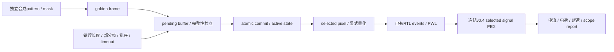

# 实验性研发方法验证：平台计划

修订：2026-10-06。项目以独立假设、可复现实验、可追溯数据和教学解释为核心。工程基线仍为单像素v0.4，本页所列整帧模型与反馈功能尚未实现。

## 研究问题

下一条路径验证：一个完整、带身份和时间戳的命令，能否从功能模型准确映射为单像素PWM事件与电气结果；在数据错误、时序异常和供电边界变化时，结果是否能被解释和复现。



全logical plane是功能模型；重电气计算先保留一个selected pixel。这两种规模分别记录。新的frame代码、receiver RTL、保护控制、实际反馈和实物接口均需单独取得证据。

## 输入与输出合同

| 对象 | 必须记录 | 目的 |
| --- | --- | --- |
| 研究问题 | 假设、自变量、固定条件、观察量与退出门槛 | 先定义怎样反驳假设，再运行实验 |
| Scene／pattern | seed、geometry、坐标域、时间戳、生成器版本 | 复现同一逻辑图案；不视作真实camera或光场 |
| Frame | ID、code width、length、payload hash、完整性结果 | 检查重复／乱序／坏帧及原子提交 |
| Commit | accept time、commit time、active hash、原因 | 区分收到数据与实际生效 |
| Pixel trace | 坐标、原始code、量化duty、PWM边沿 | 把量化误差和时序误差分别定位 |
| Analog case | model／netlist hash、rails、IREF、LED来源、窗口、步长 | 不混用不同条件的电流与电荷结果 |
| 结果 | 通过门槛、case分母、raw位置、失败、未验证项 | 每项结论保留可检查的范围 |

## 第一轮最小案例

先选择一组正常图案，包含off、最低有效duty、中间duty、full-on和一个边界移动；再引入部分帧、坏长度与过期命令。预期行为必须在运行前写入合同。

正常帧只有完整校验通过并达到规定commit边界后才替换active状态。坏帧不得混入active frame；不同错误是保留上一帧、清空还是进入其他实验状态，要由本项目明确定义并逐例验证。

现有enable在frame boundary生效，已观察20→258.5 µs的关断事件；独立fault关断需要新的需求与实现。不能把软件timeout模型动作当作电路已立即关闭。

## 方法检查矩阵

| 实验 | 预期证据 | 限制 |
| --- | --- | --- |
| 功能输入复现 | 相同config／seed产生相同frame hash | 不证明真实感知准确率 |
| 帧状态完整性 | partial／乱序／错误被正确处理，active hash可预测 | 不证明实际bus electrical或EMC |
| 时间对应 | accept→commit→PWM edge分段记录 | 三种时钟／周期不合并成一个frame rate |
| 电气回放 | 一份post模型、声明load、raw积分与独立复算 | 不叠加旧buf／analog RC／SPEF／link重复寄生 |
| 数值敏感度 | 窗口与步长细化、符号／单位／分母一致 | 数值稳定不代替物理参数证据 |
| 假设边界 | supply／reference／neighbor条件改变后的结果可定位 | 当前ideal PG与截断邻居不建立完整芯片功耗 |

## 独立预算

可从N=1、16、256个logical位置选择功能实验规模；这些不建立相应ASIC阵列。对于每pixel一标量、b-bit command、每秒f次完整更新：

```text
raw payload = N * b * f bits/s
one buffer = ceil(N * b / 8) bytes
two buffers = 2 * ceil(N * b / 8) bytes
wire rate >= raw payload / efficiency
```

存储容器padding、frame header、校验、line coding与重传另计。12-bit command映射至现有0…256 duty时保留exact off／full-on，并报告舍入误差；command位宽不升级现有PWM电气分辨率。

## 后续优先级

1. 完成上述最小功能路径与错误对照，建立一个可重放run ID。
2. 继续一个pixel的actual reference、startup／compliance、独立关断和真实PG／neighbor研究。
3. 用可追溯的同器件dynamic／temperature／optical数据校准模型，报告holdout误差和测量不确定度。
4. 只有明确实验问题需要多通道且单像素门槛满足后，再进入4×4的共享reference、PG、clock、同时切换与physical验证。

新证据写入独立目录，raw留在build；旧运行输入hash与结果保持原貌。当前工程条件见[电气spec](../../specifications/electrical-v0.4.md)、[joint PEX合同](../../specifications/joint-pex-v0.4.md)和[bench计划](../bench-validation-plan.md)。
