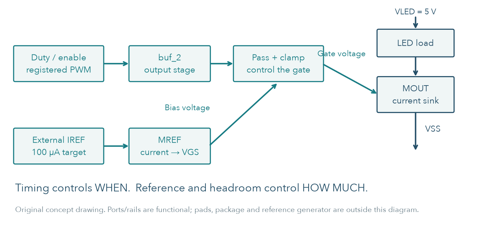
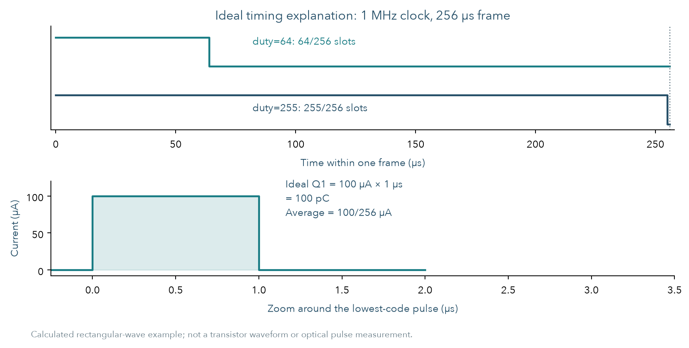
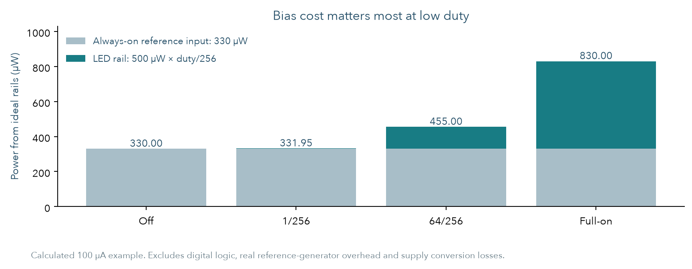

# Open MicroLED Driver ASIC

单像素研究报告 v0.4 · 2026-10-05 · 从半导体基础到工程判断

## 01 从一个像素，学习怎样证明一个设计能工作

本项目希望建立一条公开、可复现的研究路径：数字逻辑决定 LED 点亮多久，模拟电路决定导通电流，版图把电路变成实际几何，验证逐层确认它们是否一致。当前只做一个像素，目标峰值电流为 100 µA。

**方向判断：先把它做成 MicroLED 器件电测与驱动共设计的教学平台。** 它适合解释和比较低电流精度、供电余量、偏置功耗及最短脉冲；商业高密度微显示和高速光通信，需要不同的密度、接口与实测证据。

### 本轮实际推进到哪里

共同GDS的五种RC提取已完成；新联合模型含实际输出buffer及analog共12 MOS，保留真实入口、45个signal R与77个C。主验证37次transient / 12次DC的146项预设检查全部通过，最低码最大电荷误差约−0.7001%。独立复算与故意错误对照见第19–23页。

边界研究发现：早启动的ideal IREF可在供电未建立时主动提供能量；实测静态LED模型加10 kΩ供电串联阻抗后仅约88.27 µA。**参考源与供电条件会改变结论，应先解决，再扩展阵列。** 启动探针省略了实际PG-only充电，不能当完整芯片能耗。

### 不同读者怎样读

| 读者 | 建议阅读路径 | 应该获得的答案 |
| --- | --- | --- |
| 刚入门的工程师 | 02–07，再看 23 | 电流怎样流、六个 MOS 为什么需要、PWM 和验证怎样算 |
| 电路或版图工程师 | 08–22，再看深入资料 | 数据与模型是否适用，精度、寄生和启动有哪些限制 |
| 技术负责人或合作方 | 本页、24–27 | 能解决谁的问题，哪些假设值得投入资源验证 |

所有读者都应保留一个区别：**仿真一致性、制造接受和实物性能是不同问题。** 当前没有 silicon 或 optical measurement；平均电流是电气指标，不能直接当作实测亮度。

本文逐层增加细节。图表旁说明条件和结论边界；链接通向实际网表、数据、规则报告和可执行方法。旧设计失败结果保留，研究目标不会因为出现失败而事后放宽。

<!-- page -->

## 02 先分清三条路径：信号、电流、偏置

**信号路径**传递“什么时候打开”：duty / enable → registered PWM → 输出 buffer → gate-pass / clamp。**电流路径**输送能量：5 V 电源 → LED → MOUT → VSS。**偏置路径**设置“打开后流多少”：外部 IREF → MREF 的 VGS → 输出管 gate。

数字和模拟控制电源 nominal 为 3.3 V；LED 阳极使用独立 nominal 5 V。当前没有 level shifter，PWM 直接进入同一 3.3 V 控制域。把 LED 的 5 V 接到数字 VDD，会改变器件条件和整个验证前提。

| 已在设计内 | 仍在设计外或只用假设表示 |
| --- | --- |
| Registered PWM、实际输出 buffer、六 MOS analog macro、共同物理连线 | 实际 reference generator、pads/ESD、封装、板级电源 |
| 可追溯的静态 LED I–V 模型、synthetic 动态模型 | 同器件动态、温度、光学输出和实物样品测量 |

图是原理示意，不是 layout 图。真实布线、尺寸和物理检查从第 15 页起展开。理解三条路径，可以避免把“数字输出正确”误写成“电流准确”或“真实 LED 已点亮”。

<!-- page -->

## 03 MOS 是开关，也可以控制电流

MOS 有四个端子：gate（G）、drain（D）、source（S）和 body（B）。**VGS 控制通道，VDS 为电流提供电压余量，body 电位会影响阈值和结状态。** 电路图常把 body 省略，实际 ASIC 必须明确连接。

NMOS 并不是“gate 高就流固定电流”。当 VGS 低于阈值时主要是弱导通和漏电；VGS 足够且 VDS 有余量时，可以在一段范围内近似成为电流源。降低 VDS 后，输出电流会下降。

### 一条近似公式帮助理解，不替代 PDK

长沟道、强反型、饱和区的教学近似是：

`ID ≈ ½ μn Cox (W/L) (VGS−VTH)² (1+λVDS)`。

μn是电子迁移率，Cox是单位面积栅氧电容，λ描述电流随VDS的变化。这条公式只用于上述近似区域；不是所有MOS电压下都能使用。

它说明四件事：W/L 影响驱动能力；VGS−VTH 的小变化可能引起明显电流变化；相同器件的 VDS 不同也会产生误差；W、L 和 body 条件都需要检查。真实结果使用锁定 BSIM 模型，而不是用这条公式计算保证值。

参考管的 drain 与 gate 相接，把 IREF 转成 VGS。输出管采用相同 W/L、相近条件时复制这个偏置。但两管的 VDS、温度、随机失配和布局应力并不完全相同，因此 1:1 镜像不是绝对精度保证。

| 名称 | 初学者可以怎样理解 | 工程上需要测什么 |
| --- | --- | --- |
| Headroom / compliance | 电路还剩多少电压可以维持目标电流 | 电流随 VLED、LED Vf 和温度的变化 |
| Mismatch | 名义相同的两管仍有差别 | 受条件限制的随机样本与实物分布 |
| Parasitics / 寄生 | 真实几何额外带来的 R、C | 提取边界、耦合、短脉冲和供电影响 |

模拟 NMOS body 接 VSS，PMOS body 接对应控制电源；数字 VNW/VPW 也需要正确连接。LVS 与实际 body-tie 错误对照检查连接，仿真再检查所选条件下的电气行为。

<!-- page -->

## 04 六个 MOS 各自做什么

LED 阳极接 5 V；阴极接 `led_k`。输出 NMOS 把电流拉向 VSS，因此这是 **current sink**。外部参考电流从 3.3 V 注入 `bias`，二极管连接的参考管将 IREF 转成 VGS；输出管复制这个偏置。

| 器件 | 当前 W/L | 作用 |
| --- | --- | --- |
| MREF | 20/4 µm | drain 与 gate 接 bias；把 IREF 转成偏置 |
| MOUT | 20/4 µm | drain 接 LED 阴极；gate 接可开关的 gate 节点 |
| MPASS | 2/1 µm | PWM 高时把 bias 传给输出 gate |
| MCLAMP | 2/1 µm | PWM 低时把输出 gate 放电到 VSS |
| MINV_N | 2/1 µm | 与 PMOS 组成 CMOS inverter |
| MINV_P | 4/1 µm | 产生互补控制 pwm_b；bulk 接 vlogic |

PWM 高：pass 开、clamp 关、输出管导通。PWM 低：pass 关、clamp 开、输出 gate 放电。clamp 是必要的，因为仅断开 pass 会留下带电的浮动 gate。

选择 simple mirror 是为了让偏置、有限输出电阻、headroom 和失配都容易解释。它没有 cascode、误差放大器或校准反馈；相同 W/L 只给出 nominal 1:1 比例，**IREF=100 µA 不保证 IOUT 恰好 100 µA**。

本项目选用公开 GF180MCU 6 V MOS，参考 [官方器件说明](https://gf180mcu-pdk.readthedocs.io/en/latest/analog/model_parameters/LV/LV_1_4_1.html)；实际模型版本和文件 hash 由仓库 lock 固定。数字采用同工艺标准单元的 3.3 V Liberty 条件，不能把名字中的 5V0 当作当前供电设定。

PASS传递的是bias电压，LED电流由MOUT承受。NMOS pass传高电位时会受到VGS和body effect限制；供电未建立时的状态另见第21页。

详细连接、单位和原理见 [design](../design.md)。`w=20u l=4u` 是 SI 网表中的 20/4 µm；Magic PCell 输入 `w 20 l 4` 使用 µm，二者不能混用。

<!-- page -->

## 05 PWM 用时间调节平均电流

1 MHz clock 表示每个 slot 为 1 µs；256 个 slot 为一帧，所以 `Tframe=256 µs`，`fPWM=1 MHz/256=3906.25 Hz`。duty 表示一帧中有多少个 high slot。

| duty | 导通时间 | 理想 100 µA 下的平均电流 |
| --- | ---: | ---: |
| 0 | 0 | 0 |
| 1 | 1 µs | 0.390625 µA |
| 64 | 64 µs | 25 µA |
| 255 | 255 µs | 99.609375 µA |
| 256 | 持续导通 | 100 µA |

9-bit 输入用来表示 0…256，共 257 个有效状态，**并不表示已经实现 9-bit 光学灰阶**。257…511 会钳位到 full-on。duty 和 enable 在帧边界提交；同步 reset 在下一个 clock rising edge 清零。因此 enable 关断和紧急硬件关断需要分开讨论。

图是理想时间算术。真实边沿有 buffer delay、gate 充放电和 LED 电流的建立过程。最低码只有 1 µs，边沿占用的电荷比例比长脉冲更显著；这正是后续以电荷而不是单个峰值判断最低码的原因。

<!-- page -->

## 06 三种误差，回答三个不同问题

电流波形不能只看“最高点接近 100 µA”。本项目同时检查绝对电流、最低码电荷和版图前后差异，三个分母不相同。

| 指标 | 公式 | 回答什么问题 |
| --- | --- | --- |
| Absolute current error | `(Ifull/100 µA−1)×100%` | 导通电流是否达到目标；当前门槛 ±5% |
| Lowest-code area error | `[Q1/(Ifull×1 µs)−1]×100%` | 最短脉冲是否接近同条件 full-on 的时间缩放；门槛 ±2% |
| Pre/post delta | `(post/pre−1)×100%` | 指定前后网表改变了多少；不能自动归因于所有寄生 |

**算例来自 v0.3 TT / 27°C / 3.3 V / VLED=5 V / ideal IREF / synthetic LED。** Full-on 为 100.695401 µA，因此绝对误差约 +0.6954%。duty=1 平均电流为 0.392355372 µA；每帧电荷约为 `0.392355372×256=100.442975 pC`。同条件理想电荷为 100.695401 pC，所以面积误差约 −0.250683%。

`Q=∫I(t)dt`，`Iavg=Q/T`。仿真数据使用自适应时间步，样本密集不代表这段时间较长。必须沿真实时间积分、插值测量端点；直接对采样值取算术平均可能得到错误结果。

电流与光学输出还隔着 `Popt=f(I,T,器件结构)`、脉冲响应、效率及人眼/探测器响应。没有 L–I、EQE 或光功率数据时，不能把 25% duty 写成“已证明 25% 亮度”。

支路电流还可能包含电容充放电。电气总电荷接近目标，并不保证同样的载流子复合与光pulse；动态模型和光学测量要继续分开。

计算结果的很多小数位只用于复算。数值步长收敛证明计算稳定，不代表器件物理参数有同等精度；插值误差也不等于作者测量的不确定度。

<!-- page -->

## 07 工具各自证明哪一层

GF180MCU 的公开 [MOS model list](https://gf180mcu-pdk.readthedocs.io/en/latest/analog/model_parameters/LV/LV_1_4_1.html)列出 3.3 V 与 6 V MOS families。本项目模拟支路采用 6 V MOS；数字采用 MCU7 标准单元及相应 3.3 V Liberty 条件。库名中的 `5v0` 不能代替实际电源设定或 datasheet 工作范围。

**PDK 是器件、层、模型和规则的共同语言。** `analog/models/pdk-lock.json` 只是仿真模型子集；物理流程另有锁定的完整 variant D PDK。原模型名、wrapper 名、单位及 source notice 都保留，不能随意换成“类似模型”。

| 工具/资料 | 输入 → 输出 | 能支持的结论 |
| --- | --- | --- |
| RTL simulator | Verilog → events/checks | 所写数字时序和边界行为 |
| Synthesis / STA | RTL、Liberty、约束 → cells/时序 | 所选映射及条件下的 setup/hold、slew |
| Place & route | cells、LEF、层规则 → routing/GDS | 真实物理实现和该实现的时序 |
| DRC | 几何、rule deck → 违规报告 | 所开启规则是否满足 |
| LVS | 几何抽取、golden circuit → 比较 | deck 保留的连接与器件参数是否一致 |
| PEX + ngspice | 几何、提取规则、models → 波形 | 声明网表/边界/条件下的电气表现 |
| 实物测量 | 样品、仪器、校准 → 数据 | 该样品与测量条件下的真实表现 |

DRC 不知道设计者希望两根线相连；LVS 通过也没有证明电流精准；GDS 文件存在更没有证明能投片。本报告把这些层级分开记录。

TT/SS/FF 是 MOS 模型条件；RC variants 是连线提取条件；温度、供电和 reference 另需设置。把其中一个标签改成“最差”，不能自动覆盖所有组合。当前数字 STA 与模拟研究的温压条件也不同。

<!-- page -->

## 08 真实 LED 数据改变了什么

来源为 Lin 等人 2026 年的 **20 µm 方形 yellow InGaN MicroLED，transfer-printed 到 diamond**。作者 [Zenodo dataset](https://doi.org/10.5281/zenodo.20034288) 的 `I-V.xlsx / Sheet1 / A3:B102` 提供 100 点数值，覆盖 0.1 µA-32 mA、2.41622-6.40451 V。数值 dataset 为 CC BY 4.0；本图由这些数值独立绘制。

100 µA 夹在 88.55 µA / 3.73408 V 与 100.65 µA / 3.76983 V 之间。线性插值：

`Vf = 3.73408 + (100−88.55)/(100.65−88.55) × (3.76983−3.73408) = 3.767909545 V`。

面积 `(20 µm)² = 4×10⁻⁶ cm²`，因此 `J = 100 µA / area = 25 A/cm²`。这只是 mesa 平均电流密度，未测局部电流分布。

模型最终采用单调 PWL 静态重放。75 点训练、25 点留出时最大电压插值误差 2.953 mV；101 次独立 OP 确认表示方式。全范围简化 diode/log/R 经验式留出最大误差 221.369 mV，故未采用。

温度、扫描时序、重复次数和测量不确定度未报告。**插值误差不等于测量误差**，一条曲线也不等于器件间分布。出处、许可、失败拟合和模型卡完整保存在 [measured LED 研究](measured-led.md)。

<!-- page -->

## 09 用电流误差检查电压余量

100 µA 时真实曲线 Vf≈3.768 V，5 V 电源只留下约 **1.232 V** 给驱动串联路径；旧合成 Vf=2.8 V 留下 2.2 V。不能沿用旧电压余量直接推断新负载可用。

实际 20/4 RC 网表与真实静态 I-V 耦合，共 148 DC：135 点网格，以及 13 点 typical 供电扫描。网格为 5 MOS corners × 3 logic rails × 3 LED rails × 3 IREF，MOS 温度固定 27 °C，LED 曲线温度仍未知。

| 工况 | 实际电流 |
| --- | ---: |
| 网格 VLED=4.5/5/5.5 V，Vlogic=2.97/3.3/3.63 V，IREF=99.5/100/100.5 µA | 98.175-100.984 µA，135/135 在 ±5% 内 |
| Typical，5 V / 3.3 V，IREF=100 µA | 99.788467 µA；相对目标 −0.211533% |
| Typical，VLED=4.2 V | 93.464616 µA，超出目标 |
| Typical，VLED=4.3 V | 97.006693 µA，达到目标 |

±5% 下的 typical 静态边界被扫描夹在 **4.2-4.3 V**，不能把 4.3 V 当作所有温度或批次的最低规格。全部 148 DC 电流在实测正向数据域内。结果与条件见 [耦合证据](../../evidence/characterization/measured-load-summary.json)。

<!-- page -->

## 10 镜像管尺寸为什么改为 20/4

预先设定 full-on absolute current 为 **100 µA±5%**。原 10/2 µm 在最差固定 corner/reference 条件叠加 local mismatch 后，有 **4/256** 个样本超过 105 µA。增加面积前先保留了失败结果，再用相同种子比较尺寸。

W 与 L 都加倍，W/L 仍为 5，镜像管 gate 面积变为 4 倍。较大面积降低模型中的随机失配，较长 L 改善有限输出电阻；代价是面积和充放电负担。最终结果来自重新生成、检查和提取的**真实新几何**，不是只改旧网表上的尺寸。

| 最差条件，256 个模型样本 | 旧 10/2 RC | 实际 20/4 RC |
| --- | ---: | ---: |
| 电流 sample σ | 0.90409 µA | 0.43287 µA |
| 最大观察电流 | 105.40741 µA | 103.21357 µA |
| 超出 ±5% | 4/256 | 0/256 |
| 模拟 cell bbox 面积 | 2532.7 µm² | 3577.7 µm²，增加 41.26% |

新尺寸五组 MC 各 256，共 1280 个 OP；每组均未观察到超限。此处采用 **synthetic LED 温度模型**；最差条件为 FF / 0 °C / Vlogic=3.63 V / VLED=5.5 V，reference 校准 +0.5%、TC=−25 ppm/°C、line=+3000 ppm/V。它们是模型的有限条件样本，不是实测 LED 的失配或 manufacturing yield。详细开关与复算见 [reference / matching 报告](reference-and-matching.md)。

<!-- page -->

## 11 Reference、误差和功耗怎样分账

当前仍采用外部 reference；没有片上 reference generator。行为模型是用于分配误差的工程假设：100 µA@27 °C、校准误差 ±0.5%、TC ±25 ppm/°C、line ±3000 ppm/V、输出电阻 10 MΩ、compliance ≥1 V。它不是已选定器件的 datasheet 保证。

1080 点 deterministic 检查为 5 fixed corners × 3 MOS temperatures（0/27/85 °C）× 3 logic rails × 3 LED rails × 8 reference 边界组合。LED 使用合成温度模型；与第09页真实静态负载的固定温度网格分开计数。

| 指标 | 实际 20/4 RC 结果 |
| --- | --- |
| Reference / fixed-corner 网格 | 99.280257-102.075649 µA，1080/1080 在 ±5% 内 |
| 最低码 1/256 | nominal / low / high 各 50 ns 与 10 ns；6 次 transient |
| 最低码最大面积误差 | 0.768297%，在预设 ±2% 内；只属于当前模型条件 |
| 理想 IREF、合成 LED、nominal full-on | 100.695401 µA；对 100 µA 误差 +0.695401% |
| 同条件 schematic → actual RC | 100.752515 → 100.695401 µA，变化 −0.056688% |

三种误差分别回答不同问题：**absolute error** 对 100 µA 目标；**PWM area error** 对同条件 full-on×导通时间；**pre/post delta** 对同尺寸 schematic。任何一项小都不能代替其他两项。

真实静态负载 nominal 下，LED rail 功耗 **498.942337 µW**，analog-control/reference rail **330.000012 µW**，合计 **828.942349 µW**。这是两个理想电源送入模拟 testbench 的功率，不含数字逻辑、实际 reference generator、封装和外部供电损失。PWM 关闭时 reference 仍约消耗 330 µW；低 off current 不等于低 standby power。

这组reference/匹配验证未覆盖reference noise和系统性布局梯度；第19–21页新增联合RC与启动/供电边界探针，仍非实际reference或完整PG qualification。预算、公开 PDK 公式、每组分母和冻结输入见 [实际 RC summary](../../evidence/characterization/actual-w20-l4-summary.json)。

<!-- page -->

## 12 低灰阶下，偏置功耗可能比 LED 更大

峰值 100 µA、5 V LED rail 的理想导通功率为 500 µW，PWM 后按 duty 缩放。当前 reference 支路却持续从 3.3 V 取 100 µA，即约 330 µW；它不随 LED off 自动消失。

| 理想算例 | LED rail / µW | Reference input / µW | 两者合计 / µW |
| --- | ---: | ---: | ---: |
| Off | 0 | 330 | 330 |
| duty=1 | 1.953125 | 330 | 331.953125 |
| duty=64 | 125 | 330 | 455 |
| Full-on | 500 | 330 | 830 |

这是说明机制的算术预算，不是新一轮 measured power；实际电流、切换充电和网表不同会改变结果。完整功耗还包括 counter、FF、clock tree、buffer、实际 reference generator、pads 和外部电源转换。

LED 本身的电功率约为 `Vf×I`，LED rail 供给为 `VLED×I`；差额主要落在驱动与串联路径。实测静态 nominal 下 Vf≈3.768 V，100 µA 算例中 LED约377 µW、sink约123 µW，另有reference输入330 µW。

这指向一个具体研究问题：低 duty 或长期 off 时，是否需要关闭/共享偏置？关闭会减少耗电，却引入启动时间、首脉冲误差和多像素干扰。应先测量这些代价，再决定电路，而不是只把 standby 标为零。

<!-- page -->

## 13 从 PWM RTL 到标准单元物理实现

输入为 9-bit duty、enable、reset、clock；duty=0 持续低、256 持续高，257-511 saturate 为 256。输入只在帧边界锁存。1 MHz clock 的 slot 为 1 µs，每帧 256 µs，PWM 为 3906.25 Hz。

旧输出直接取 counter/comparator 组合结果，物理路径差异可能产生短暂毛刺。现在使用 **output FF**：普通 slot 注册 next-counter 比较结果，帧边界注册新 duty 的 slot 0。保持原有帧时序，不增加一个 slot 延迟。

| 验证 | 已完成结果 |
| --- | --- |
| RTL exhaustive | 518 frames / 133159 checks / 543 个已知 PWM events |
| Functional mapped gate simulation | 相同 exhaustive 检查通过；10 个 trace 与 RTL 完全相同 |
| Native Yosys synthesis | 95 standard cells，19 个 FF；Liberty cell area 2434.4768 µm² |
| 输出结构 | Native mapping 为 FF.Q；最终 PnR 加入 `buf_2` 输出级 |
| 1 ns timing template | 仅 simulator 模板探针；不代表 PVT 或布线延迟 |

FF（flip-flop）在clock edge保存一个bit，D是输入、Q是输出。这里把比较器结果先存入输出FF，避免组合counter路径直接控制gate。输出FF并不替代setup/hold检查。duty/enable属于同一个clock domain，目前没有异步通信接口的CDC或handshake。

<!-- page -->

## 14 数字布局布线：慢clock仍要检查快边沿

已有数字 macro 实际完成 LibreLane 3.0.14 的76步flow：placement、CTS、routing、SPEF/SDF、GDS/LEF；九个corner组合的setup、hold、max slew、capacitance和fanout违规均为0。最差setup margin 793.656477 ns，hold margin 0.436677 ns。保持3 ns transition约束，通过buffer sizing修正原来的slow-corner slew超限。

STA 使用72.91 fF output load、0.15 ns clock transition、200 ns IO delays与0.25 ns uncertainty；这些是工程约束，不是实测analog输入电容。实际数字Magic DRC、route DRC、LVS以及独立KLayout结果见[physical证据](../../evidence/physical/summary.json)。

九份实际SDF各跑518 frames/133159 checks；关键clock/FF/output路径延迟与CSV边沿独立核对。TT rise/fall delay为2.644/2.360 ns。TT SDF→actual analog RC另跑5组duty配对、共10 transient+3 calibration；最低码相对理想RTL的平均电流变化为−0.00011170 µA。

SDF回放仍有24个XOR/XNOR ModPath未匹配、19项TIMINGCHECK不支持；关键输出路径已单独验证，setup/hold结论来自STA。模拟端仍是理想0/3.3 V、10 ns slew回放；未模拟真实输出级。条件与范围见[数字物理报告](../digital/physical.md)。

该数字 macro 和模拟 macro 的内部实现保持冻结。v0.3 新增共同 routed macro top 与局部输出级研究，见第17–18页；它们没有升级为完整芯片的供电 sign-off 或 joint timing closure。这里没有 SPI、通信协议或像素 memory。

约793.7 ns的setup裕量属于1 µs clock与既定IO约束，不能由此推断GHz运行能力。Hold、slew与边沿负载仍在ns尺度检查；STA、SDF回放和真实晶体管仿真分别提供不同证据。

<!-- page -->

## 15 模拟 layout、规则与交付视图

Contact把器件扩散/栅接到金属，Via把不同金属层相接，body ties固定衬底/阱电位。Guard ring用于收集衬底电流；此处没有由它自动建立完整latch-up或ESD保证。

新尺寸保留相邻、同方向的镜像管；独立 guard rings、bulk ties、contacts 和 M1/M2/M3 接线。器件增大后 bulk via landing 首次出现 4 个 M1 spacing 违规，调整 landing 位置后重新运行完整检查；原失败日志保留在 build 中。

实际 GDS bbox 为 **95×37.66 µm**，面积 3577.7 µm²。横向从左到右为 MREF、MOUT、MPASS、MCLAMP、MINV_N、MINV_P；下方七条 M3 总线对应公开的 macro 接口。图直接来自 GDS polygons，坐标为 µm。

版图保留宽松间距用于教学。相邻同尺寸同方向不等于 common-centroid 或已验证的系统梯度抵消。模型 MC 检查随机器件参数，不能自动反映布局梯度、机械应力或制造后的像素一致性。

<!-- page -->

## 16 检查范围与可集成接口

| 检查或输出 | 实际结果 |
| --- | --- |
| Magic DRC / GDS 回读 DRC | 两者均 0；采用 drc(full) |
| Netgen LVS / 回读 LVS | 唯一匹配，无 property errors；6 MOS / 7 nets |
| RC extraction | 7/7 nets；6 MOS、59 R、43 C |
| 版图前后电气回归 | 36 transient + 3 LED calibration；19 guards 通过 |
| 独立 KLayout | Linux 中运行锁定 GF180 variant D deck，0 违规；范围以报告为准 |
| Macro views | GDS / editable MAG / LVS SPICE / RC SPICE / 实际导出 LEF |

LEF给布局布线工具看边界、pins与禁止穿越区；GDS保存实际几何，SPICE保存电气连接，三者需一致。LEF 由同一个 layout 导出，尺寸与实际 GDS bbox 对齐，七个接口的 direction/use 明确；内部接线作为 routing obstructions。已由锁定 OpenROAD/OpenDB 实际读入，尺寸、ORIGIN、七个 M3 ports 与228个 OBS 检查通过，见[consumer 验证](../../evidence/physical/macro-read.json)。

| Macro 接口 | 含义与使用条件 |
| --- | --- |
| VSS / vlogic | Ground / 3.3 V analog-control rail；共同 top 接 VSS / VDD |
| pwm | Registered digital control input；真实末级与新增连线的研究见第18–21页 |
| bias | 外部 reference current 注入点，需满足 compliance |
| led_k | 外部 LED cathode；LED 阳极电源不在这个 cell 内 |
| gate / pwm_b | 模拟 gate 与反相 PWM monitor；当前作为公开教学端口 |

独立 KLayout 的 FEOL、BEOL、connectivity 和 off-grid 检查默认启用；density 与 antenna 未在该单独模拟运行中启用。不要把此处 0 DRC 写成所有规则零错误。新数字 macro 的检查范围另见数字 physical 报告。

严格 LVS 同时检查连接和 deck 保留的 W/L；deck 的 1% tolerance、D/S 交换和忽略 AD/AS/PD/PS 等限制仍保留。DRC 通过也不能代替 density、antenna、foundry/shuttle acceptance 或完整芯片检查。详细范围与证据见 [layout 报告](../layout/README.md)。

<!-- page -->

## 17 两块 macro 怎样接成一个 physical top

保留两块原 GDS 的器件和内部 routing，在共同 top 中 R0 放置：digital 原点 `(150,25)` µm，analog 原点 `(25,105.52)` µm。模拟的原始 bbox 下缘为 −0.3 µm，不能忽略 LEF ORIGIN。新增 Metal3 接 PWM，Metal4 / Metal5 与正确 Via stack 接 3.3 V / VSS；LED 阳极电源仍在 top 外。

| 共同顶层检查 | 实际证据 |
| --- | --- |
| 几何与接口 | 305×180 µm bbox，19 个外部 pins，含 PWM monitor；不是 die / pad-ring 尺寸 |
| Macro 保留 | 独立逐层 polygon XOR 为零；另核查 36 个原 macro cells 的 shapes / hierarchy |
| DRC | Magic `drc(full)`=0；独立 KLayout 651 categories、XML items=0 |
| 实际抽取 / LVS | 完整 GDS 对官方标准单元晶体管 SPICE 与 golden top；唯一匹配且无 property errors |
| 连通与负对照 | 不依赖 net labels 的 Metal/Via 图确认 PWM / VDD / VSS；实际 PWM 删段与电源桥接均被拒绝 |

此次 LVS 包括 30 类保留 digital leaf 内部 MOS 拓扑和 deck 的 W/L 检查、analog 六 MOS 与共同连接。仍按 deck 忽略 filltie/endcap/fill_*，不比较 AD/AS/PD/PS；另以 buf_2 W 和 body-tie 错误证明检查可拒绝。Density、antenna、IR drop、pads/ESD 与 foundry acceptance 不包含在此结论内。[共同 top](../../evidence/integration/README.md) / [独立审查](integration-review.md)。

<!-- page -->

## 18 v0.3局部接口模型：保留历史结果

这页是冻结v0.3结果，不是本轮完整物理路径。模拟 PWM 连接三个 MOS gate。只加一个固定电容不足以描述切换负载：工作点 AC 为 `Cparallel=Im(Y)/(2πf)`；切换探针则积分端口电流，计算 `Q/ΔV`。Nominal 输入的上升 / 下降电荷等效值约 **36.715 / 36.668 fF**，与旧 STA 假设 72.91 fF 分开记录。

实际末级是 `output12 / buf_2`，六个 canonical MOS，VNW=VDD、VPW=VSS。联合 testbench 包括其晶体管 SPICE、原数字输出网 nominal SPEF、actual analog RC，以及新跨宏 Metal3 span 的实际抽取：30 µm / 0.56 µm，**4.81871 Ω、PWM 相关 C 总计 2.34604 fF**。邻近电源耦合保留；helper 的 pwell 依据完整 top 的 substrate connection 接理想 VSS。

| Synthetic LED / IREF=100 µA；真实末级 + 新连线 | TT 27°C / 3.3 V / VLED 5 V | SS 85°C / 2.97 V / 4.5 V | FF 0°C / 3.63 V / 5.5 V |
| --- | ---: | ---: | ---: |
| Full-on current / µA | 100.695401 | 100.068779 | 101.353805 |
| duty=1 平均电流 / µA | 0.392355 | 0.388219 | 0.395169 |
| 最低码面积误差 | −0.250683% | −0.684259% | −0.188099% |
| 输出 rise / fall，30-70% / ns | 0.25852 / 0.13425 | 0.43990 / 0.21804 | 0.17745 / 0.09608 |

主研究共 54 transient，包含 ideal / 实际 buffer、off / 1 / 64 / 255 / 256、三包络、实测 static+假设 2 pF 探针及步长细化。最低码与 full-on 使用预设 ±2% / ±5%；TT joint 10→1 ns 步长结果一致。这里的 MOS 条件与第14页数字 STA 的温压条件不同。

实际 Liberty 的 slew 阈值是 **30-70%**。主探针采用 1 ns 全坡度；另以 7.5 ns 全坡度对应 3 ns 输入 slew 上界，6 次 stress 均通过，输出最大 rise/fall 为 **0.454954/0.258989 ns**。这里没有前级 FF 波形、完整数字 transient、输出 cell 的 junction/metal PEX 或全顶层多角落 PEX。电源和邻近耦合采用理想/静止边界；小幅 overshoot 是模型结果，不是 pad/ESD 或可靠性实测。[接口方法与结果](interface.md)。

v0.4完整提取发现：真实top从模拟M3总线右端接入，旧standalone analog RC的formal pwm在左端。旧拼接模型没有准确保留这个入口边界；第19–21页用联合12MOS cutout整体替换，避免重复寄生。前后差异包含边界和寄生表示改变，不能全部归因于buffer结电容。

<!-- page -->

## 19 从真实共同GDS提取一条完整信号路径

v0.4从冻结的共同GDS实际提取，而不是给原理图猜几个R/C。独立DEF/LEF/GDS与器件几何对应确认输出单元为`output12/buf_2`；导出包含它的6 MOS和analog的6 MOS、实际diffusion A/P、signal routing与耦合的联合cutout。

**联合模型只有一个实例：12 MOS、45 R、77 C，以及34个明确邻近端口。** 它整体替换旧buf/analog RC/SPEF/link。真实模拟入口位于M3总线右端x120 µm，旧standalone formal pwm在左端x25 µm；新模型保留真实入口和分布路径，不再重复叠加旧网络。

| 实际Magic/PDK RC style | Output drive→analog实际入口 Req / Ω | 联合模型explicit C总和 / fF |
| --- | ---: | ---: |
| nominal | 17.394804 | 86.12439 |
| hrhc | 39.700423 | 98.58589 |
| lrhc | 7.089146 | 98.55779 |
| hrlc | 39.700423 | 81.11626 |
| lrlc | 7.089146 | 81.09498 |

这五次是真实deck提取，**不是把MOS的TT/SS/FF名字换上去**。Req按实际R网络求解；总C分散在多个节点，不是一个可直接加到PWM上的load，也不含MOS intrinsic/junction模型电容。Nominal PWM signal component的incident C为22.8477 fF，同样要按端点使用。

### 边界为什么会改变解释

本模型把PG/source/body电阻设为理想边界，并省略PG-only C，其中包含19个原始负值修正项。动态signal C没有clip；独立multiset与非负两端C的passivity证明通过。固定rails时PG-only C的`IC=C d(V1−V2)/dt=0`；**startup/ripple时不再为零，因此不能用这个投影声称完整PG充电能量。**

34个邻近端口经完整5644 MOS与hierarchy核对，包含floating fillcap和上游FF内部net。Default quiet=0 V是人为钳位假设，不是已证明的真实邻近逻辑状态；另作邻近rail/activity敏感性探针。全数字驱动、PG/substrate阻抗与IR/EM尚未包含。

五style各三个真实端口/C/W错误网表共15次被独立检查拒绝。实际输入、ledger、作用范围见[PEX说明](joint-pex.md)、[独立审查](../../evidence/research/v04-review.json)。

<!-- page -->

## 20 联合寄生后的电流与最短脉冲：预设目标内通过

先规定问题，再运行模型。[预设条件](../specifications/electrical-v0.4.md)固定100 µA IREF、实际RTL事件、1 ns输入完整ramp、synthetic LED的27°C / 100 µA / 2.8 V校准。Pre是冻结v0.3拼接模型，post是联合12MOS模型；两者均先运行2帧，再测2帧。

| MOS / 温度 / logic / LED rail | Pre full / µA | Post full / µA | Pre → Post最低码电荷误差 |
| --- | ---: | ---: | ---: |
| TT / 27°C / 3.3 V / 5 V | 100.6954 | 100.7528 | −0.2507% → −0.2515% |
| SS / 85°C / 2.97 V / 4.5 V | 100.0688 | 100.1130 | −0.6843% → −0.6813% |
| FF / 0°C / 3.63 V / 5.5 V | 101.3538 | 101.4234 | -0.1881% → −0.1888% |

以上post使用nominal RC。还真正运行了SS×HRHC、FF×LRLC，各自duty=1与256；最低码误差分别−0.700133%和−0.186243%，full-on分别100.113096与101.422977 µA。五种模型都完成结构检查，但电气交叉仅覆盖这两个组合，不能写成全PVT×RC穷举。

### 通过的是哪些检查

主批共**37次transient、12次DC、146项预设guard全部通过**：full-on±5%，最低码电荷±2%，off支路<1 nA，30–70% rise / 70–30% fall ≤3 ns，50%脉宽≥950 ns；脉冲case每个测量窗恰有2 rise / 2 fall，不能用缺失边沿代替通过。

Nominal post duty=1的rise为0.1858–0.4635 ns；SS×HRHC为0.5250 ns，high pulse为999.9484 ns。这里检查的是PWM节点电压边沿，不是LED光学rise time；真实电流支路包含位移电流。

三个post nominal最低码case把maxstep从10 ns收紧到1 ns，平均电流变化均<0.000001%，也满足逐帧相对差≤0.2%。仅平均电流<1 nA时允许1 nA绝对容差。自适应求解可在边沿自动使用更小步长，maxstep不是固定采样间隔。

### 为什么pre/post电流不完全相同

TT full变化约+0.0570%。新模型修正真实入口、A/P和寄生表示，同时理想化PG/source/body电阻；不能把DC差异全部归因于buffer结电容。电流前后接近证明这些声明条件下结果稳定，不证明外部供电或真实reference无关。

[完整结果、条件与波形](robustness.md)提供独立复算入口。含short probe与边界探针，共66次transient、28次DC，另有3次synthetic LED校准；重复case有不同目的，不把运行数当额外物理覆盖。

<!-- page -->

## 21 启动、控制与供电：找到下一步真正的缺口

19次边界transient及4次实测静态LED DC均数值完成；这些探索没有完整startup合格门槛，**不等于启动已通过qualification**。使用同一联合模型，但reference、外部阻抗和邻居状态仍是指定假设。

- **理想reference失效：**LED先上电、IREF提前启用时，reference在部分时段主动供能约1.093 nJ，最小吸收功率约−137.24 µW。零headroom下强制100 µA，不代表真实电路。
- **行为约束：**加入1 V headroom / 10 MΩ Rout后，主动供能降至数值零附近；仍需实现实际reference。
- **控制延迟：**20 µs拉低enable，RTL PWM到258.5 µs才关断（238.5 µs）；同步reset则在20.5 µs清零（0.5 µs）。帧边界提交不适合紧急关断。

供电100 ns ramp，logic / LED在1 / 8 µs组合启动；RTL trace乘live logic rail驱动末级输入，没有电压感知FF或POR。20 µs净能量为正，仍可能包含reference瞬时不现实的供能。

### 用真实静态LED负载，主动寻找headroom失效

保持5 V source、TT / MOS 27°C、ideal IREF，LED使用实测静态表，其测量温度未知且未做温度缩放。改变source到LED阳极的串联电阻：

| RLED / Ω | LED阳极 / V | 电流 / µA | 相对100 µA目标 |
| ---: | ---: | ---: | ---: |
| 0 | 5.0000 | 99.8403 | −0.160% |
| 1,000 | 4.9003 | 99.7142 | −0.286% |
| 5,000 | 4.5054 | 98.9203 | −1.080% |
| 10,000 | 4.1173 | 88.2660 | **−11.734%，超出±5%** |

10 kΩ不是实际板级电源实测值，而是寻找失效边界的探针。电阻越大，`ΔV=I×R`越大，输出管失去compliance。数字PWM正确不能补偿这项电流损失。

### 能量账与邻居边界也要明确

能量对分别线性插值的V/I精确积分其二次乘积，分开记录源、load、R损耗和假设1 nF decap储能。TT duty=1：reference输入330 µW包含行为源约192.765 µW和BIAS输入约137.235 µW，不能再次相加；联合VDD输入约0.00394 µW也不是12MOS总功耗。

第19页省略的PG-only充电及PG/body电阻尚未恢复，**启动能量仅属于信号模型及外加元件**。全0 / all-live-high邻居只是敏感性假设，没有完整上游网络，不能保证worst-case。

优先级：实际reference与关断 → 同器件动态/温度测量 → 全PG与封装边界，再决定4×4。[完整边界证据](robustness.md)保留失败及能量分账。

<!-- page -->

## 22 最低灰阶：数值稳定与物理准确分开

真实 I-V 模型没有已测电容，也没有 0.1 µA 以下的测量。为观察敏感性，外加 **0.2/2/20 pF 假设电容**，各跑 duty=1/64/256；20 pF 最低码再用 2 ns 细步长，共 10 次 transient。每次积分预热后四帧。

| 最低码 duty=1/256 | 面积误差 | 域外导电电荷比例 |
| --- | ---: | ---: |
| 0.2 pF 假设 | −0.345617% | 0.563943% |
| 2 pF 假设 | −0.227048% | 4.904857% |
| 20 pF 假设 | +0.135576% | 18.4548% |
| 20 pF / 2 ns fine | +0.135532% | 18.4532% |

所有探针面积误差在 ±2% 内；20 pF 细化的平均电流变化仅约 **0.0000433%**。这支持所设模型的数值积分，但不能证明实物有相同动态表现。

20 pF 最低码约 **90.651% 时间、18.45% 有符号静态导电电荷**落在未测低电流延拓区。0.2 pF 波形甚至短暂出现约 −9.77 mV LED 电压，而 reverse behavior 没有数据。域外比例的分母是 `∫I_static(VLED)dt`，不是 rail displacement current，也不是 `∫|I|dt`。

v0.2 研究沿保存的 V(t) 插入全部 PWL knot crossing 后分区积分，另外报告逐帧均值、同相节点、端点电容电荷和重建残差；未设隐藏的 periodicity “通过”阈值。新接口研究仍保留 **dynamic_qualification=false**。

下一项有价值的数据是同结构器件的低电流/reverse I-V、C-V 或 impedance、pulse response、I-V(T) 和 L-I/EQE。取得前保留 synthetic baseline 与静态数据模型两条路径，不把 average current 写成真实 optical brightness。

<!-- page -->

## 23 怎样读一次验证，而不是只读 PASS

先找四样东西：**冻结输入、测试条件、指标分母、能够发现错误的对照。** 本项目的公开 JSON/CSV 和原始本地运行分别保存这些信息；工具返回码零不总是代表结果合格。

| 可验证的问题 | 正确基线 | 故意错误或边界 | 为什么有用 |
| --- | --- | --- | --- |
| PWM 是否正确 | 所有有效/钳位 duty、帧更新、reset | timing drift / 错误边界被拒绝 | 避免只测 25% 的单一波形 |
| 布线是否连对 | 实际 full-GDS LVS + geometry graph | 删掉 PWM 金属、桥接 VDD/VSS | 两个错误仍可 DRC=0，证明 DRC≠连通性 |
| 器件参数是否检查 | 无 property errors 的严格 LVS | buf_2 的 W 加倍、body 改接 | Netgen 退出码或“unique match”不够 |
| 模型是否会暴露限制 | 电压足够时电流接近目标 | 降低 VLED 后电流明显下降 | 排除一个“永远流100µA”的虚假模型 |
| 数据映射是否准确 | as-run snapshot 与当前 RC graph 对应 | 改 R、删/重复 C、改端点或 ports | 源文件排序不同不应隐藏电气改动 |

复算需要读实际波形和源文件，不能只重新计算 report summary；同一个 helper 生成的两个值也不构成独立验证。数值方法要检查时间窗口、符号、单位与步长，物理研究要再检查输入参数是否有测量依据。

通过意味着“在声明范围和门槛内通过”。当前有限 Monte Carlo 的零超限不是制造良率；公开 deck 的零违规不是 provider 接受；启动的理想源探针也不是实际 reference 电路。

把失败留在研究记录里能指导下一步：旧 10/2 的精度失败推动了实际重新版图；共同 top 的 Via 错误推动了连接修正。下一步优先解决会改变应用判断的缺口。

<!-- page -->

## 24 把技术能力转成明确价值

**优先做可复现的 MicroLED 器件电测与驱动共设计教学平台。** 当前价值是让工程师把一个低电流/灰阶问题，定位到 LED 数据、reference、mirror、数字时序或真实寄生。这个价值已经有公开工程资产支撑；持续使用、合作数据和付费需求仍需要外部验证。

| 候选方向 | 用户真正需要解决的问题 | 当前决定与理由 |
| --- | --- | --- |
| 教学、器件电测、小阵列研究 | 跑通设计链，理解100 µA附近的精度、headroom与短pulse | 优先；一像素工程链可检查，接下来补真实负载与外部复现 |
| 商业矩阵与高密度微显示 | 像素一致性、低灰阶、几µm pitch、存储、总功耗与可靠供货 | 先验证需求；当前cell不能原样进入4 µm site，阵列/封装/光学尚未实现 |
| 高速可见光通信 VLC | 电光带宽、驱动和接收机、SNR/BER与能耗 | 独立spec；1 µs亮度PWM slot不构成Gbps光链路证据 |

技术回答“给定条件能做什么”；价值回答“替谁减少什么问题”；市场回答“谁愿意持续使用、提供数据或采购”。有可用电路并不会自动产生客户。当前没有需求访谈、采购意愿、制造报价或订单。

GF180MCU是公开0.18 µm、3.3 V/6 V MCU process；GF商业BCD是其他平台，不能把本项目等同于所有180BCD能力。GF display/backplane资料另列28/40/55 nm，说明高密度集成是不同取舍。[GF180官方说明](https://github.com/google/gf180mcu-pdk/blob/main/README.rst)、[GF display平台](https://gf.com/technologies/cmos/feature-rich-cmos/)。

访问日原Google仓库标记于2026-09-23 archived，README仍为experimental/alpha preview。锁定输入的既有仿真不会因此自动失效；实际投片仍须确认维护分支、exact PDK/deck与provider接受。[官方仓库状态](https://github.com/google/gf180mcu-pdk/blob/main/README.rst)。

完整判断、12条第一手来源及访问限制见[技术—价值—市场研究](technical-value-market.md)。

<!-- page -->

## 25 比较商业对照，先对齐工作条件

这些对照说明应用要求哪些能力，不构成排名。尤其不能把量产数据手册的保证范围，与少量模拟样本的观察范围直接比较。

| 第一手对照 | 已公布的条件与数值 | 对本项目的启示和边界 |
| --- | --- | --- |
| TI LP5860 Rev A，2021-11 | 18 sinks×11 scan、198 dots；100 µA全开时device error ±7%、channel error ±5.5%；50 mA才是±3% | 低电流精度值得独立研究；matrix扫描、统计对象和量产保证与单像素模型不同 |
| JBD 0.1系列，官方索引，版本日期未标 | 厂商列500×380、4 µm pitch、10 bit、480 Hz、典型50 mW | 商业微显示需要密度、存储与光学；功耗对应图案/亮度未公开，不能除以像素数后排名 |
| Hsiao等，Scientific Reports，2024-03-25 | 作者报告yellow array的NRZ-OOK>1 Gbit/s、OFDM 1.5 Gbit/s | 来自不同器件/驱动/接收条件的光学实验；本项目没有光链路或BER |

来源：[TI datasheet p.7 §7.5](https://www.ti.com/lit/ds/symlink/lp5860.pdf)、[JBD厂商页面](https://www.jb-display.com/product_des/16.html)、[Hsiao原论文](https://doi.org/10.1038/s41598-024-57132-9)。JBD直接打开403，本轮读到公开索引；论文完整页面取读受限，采用作者/出版社摘要级结论，不补造bias、距离和接收条件。

TI低电流行的测试条件为VCC=3.3 V、VLED=3.8 V、VIO=1.8 V、所有channels on/PWM100%；器件温度范围−40…85°C，typical为25°C。**Device error比较芯片平均与设定电流；channel error比较各路与芯片平均。** 本项目±5%比较单支路与100 µA目标，并且仍为模型证据，不能据此宣称优于TI。

同页的shutdown总供电电流为typical 0.1 µA、max 1 µA，条件是VEN=0、CHIP_EN=0。这种关断状态与本项目保持reference的PWM off不同；它提醒我们，低漏电与低系统standby要分别定义。

有意义的价值假设是：用同一真实LED、约100 µA、相同温度/供电和测量方式，公开方法能否解释误差、改善首脉冲或减少偏置成本？这需要bench数据，不需要先增加像素数。

完整版本、locator、company claim与论文结论的区别见[来源ledger](../../evidence/strategy/sources.json)。

<!-- page -->

## 26 扩到4×4之前，先做面积、功耗、数据三本账

以下均为未实现的预算场景，按冻结cell副本、现有静态nominal条件与独立packet提议计算。**305×180 µm共同macro跨度不是pixel pitch或die；不能乘16当作4×4芯片。**

| 4×4预算项 | 计算结果 | 排除项/含义 |
| --- | ---: | --- |
| 16个analog bbox副本面积和 | 0.0572432 mm² | 16×3577.7 µm²；没有数字/协议/供电/pads/routing，不是最终array面积 |
| 16个独立reference持续输入 | 5.28 mW | 16×3.3 V×100 µA；未含实际generator额外功耗 |
| 16路full-on analog+LED | 13.2631 mW | 复制真实静态nominal条件；不含digital/package，不是光功率 |
| 全部最低码的一级功耗近似 | 5.3112 mW | 用static Ifull×duty；真实动态/温漂尚未确认 |
| 16×9-bit命令，double buffer | 36 byte有效数据 | 非已实现memory；enable/地址/状态另加 |
| 提议packet，60 Hz更新 | 17.28 kbit/s | 4 byte头/校验+每pixel2 byte，共288 bit；协议未实现 |
| 同packet每PWM帧更新 | 1.125 Mbit/s | 3906.25 Hz更新；1 MHz serial发送一包288 µs，长于256 µs帧 |

Video/update rate、PWM frame rate和serial link rate是三个速度。60 Hz图案更新不要求每个PWM帧重发；double buffer可支持整帧提交，但其协议、错误处理和CDC还需独立设计。

共享一个100 µA reference的数学floor是0.33 mW，低灰阶有潜在收益；这只是架构假设。fanout、startup、noise、同时切换和mismatch都可能使共享失效，不能直接写成“已节省4.95 mW”。

4 µm方形site只有16 µm²，当前analog bbox是其约223.6倍；MOUT gate几何80 µm²也已超过site。这证明冻结电路不适合原样放入该pitch，不代表所有180 nm架构都不可能缩小。20 µm方形mesa的100 µA密度为25 A/cm²；若假设4 µm方形且电流不变，会变625 A/cm²，不能沿用同一个光学/热模型。

所有分母、精确输入hash和排除项见[可复算预算](../../evidence/strategy/budget.json)。

<!-- page -->

## 27 用几个明确门槛决定下一笔投入

推荐顺序是：**真实负载与供电闭环 → 一位外部初学者复现 → 具体器件/用户需求 → 决定4×4与共享reference → 有测量目的的MPW。** 目前最有价值的下一项实证，是能改变模型或架构判断的数据。

| 决策 | 继续投入所需证据 | 应缩窄或转向的情形 |
| --- | --- | --- |
| 单像素研究平台 | 实际reference、声明负载与温度、首pulse/供电条件；保持或透明重新定义精度目标 | 动态/低电流数据不覆盖目标范围，误差无法定位 |
| 4×4研究阵列 | 单像素闭环；16路current/pulse/power需求；shared bias和同时点亮预算；独立packet/reset/frame定义 | 增加像素不能解决单像素的负载、reference或精度问题 |
| 教学/研究价值 | 建议5名目标用户、2种实际任务；1名外部初学者复现并解释错误；可追溯LED数据合作 | 只有赞同，没有复现、数据或实际实验任务；保持教学作品，停止商业功能扩张 |
| MPW与封装投入 | provider接受exact variant/decks/rails/pins；实际报价、测试责任和bring-up方案；预算≤用户自行确定B | 工艺/5 V/analog访问不匹配，无测量目的或成本超预算 |

访谈重点是用户现在怎样做、哪里耗时或失败、需要多少路/µA、最短pulse、温度和功耗条件，以及愿意怎样实际使用/提供数据。上面的数量只是建议的最小学习目标，不是统计代表性或已获得客户。

当前没有匹配本设计的有效制造报价。成本应按design effort、MPW、package/PCB、measurement、logistics和rework分账；不能把MC零超限当yield，也不能把shuttle费用当量产单价。

Tiny Tapeout公开列GF runs，但analog文档的一些限制/报价明确属于sky130A。开放入口不等于这个GF180D、5 V LED、19-port top已被接受。[官方chips](https://www.tinytapeout.com/chips/)、[analog specs](https://tinytapeout.com/specs/analog/)。

后续实物验证从负载身份、测量不确定度与探针影响开始，详见[bench验证计划](bench-validation-plan.md)。没有硅片时的板级对照，只能作为board-level证据。

<!-- page -->

## 28 复现与深入阅读：每个结论都能找到输入

先按[环境说明](../environment.md)、[模拟layout流程](../layout/README.md)取得锁定模型、工具和完整PDK。模型子集与完整physical PDK分别记录；不要下载一个最新版文件就覆盖现有lock。

| 阅读或复现目的 | 入口与实际成果 |
| --- | --- |
| 数字语义与基本链路 | [PWM说明](../pwm.md)、[design](../design.md)、`make test`、[phase1 evidence](../../evidence/phase1/summary.json) |
| LED数据适用范围 | [测量来源/model card](measured-led.md)、[动态假设边界](../../evidence/characterization/measured-load-summary.json) |
| Reference与匹配 | [预算、失败与实际20/4复验](reference-and-matching.md) |
| Digital physical / STA / SDF | [实际flow与工具/规则覆盖](../digital/physical.md) |
| 冻结共同GDS | [集成流程](../../layout/integration/README.md)、[v0.3退出条件](../specifications/single-pixel-v0.3.md) |
| 新联合PEX与电源边界探针 | [PEX方法](joint-pex.md)、[电气方法和结果](robustness.md)、[v0.4电气条件](../specifications/electrical-v0.4.md) |
| 独立检验 | [v0.4独立审查](../../evidence/research/v04-review.json)、[本次current manifest](../../evidence/research/current-manifest.json) |
| 实物与方向 | [bench验证计划](bench-validation-plan.md)、[技术—价值—市场](technical-value-market.md)、[完整roadmap](../roadmap.md) |

Raw波形、完整抽取及失败日志留在ignored `build/`；公开`evidence/`保留紧凑结果、实际输入/输出hash、作用范围与必要错误对照。As-run hash不因后来文档变化而重写；需重序列化时保留原snapshot和严格电气graph映射。

本轮报告的概念架构、理想PWM和功耗算例是原创说明图；实测LED图从已许可作者数值独立重绘；layout图来自实际GDS。它们的证据等级和来源不同，不能互相替代。

Report source、HTML renderer与真实browser打印方法公开，最终PDF逐页检查；HTML可直接选择入门、工程或方向部分。[v0.3历史版本](https://github.com/Kevin-Kaiyo/open-microled-driver-asic/tree/f4d478707f055cf1015267e14a2a56e28c3e9991/docs/research)与[旧教学PPT](../teaching/open-microled-single-pixel-teaching-v2.pptx)保留当时范围，不当作当前结果。

**仍需外部证据的结论：** actual reference、真实LED动态/温度/光学、完整PG与全芯片多角落电气、pads/ESD/package、provider接受、silicon测量。当前可交付的是可核查的研究链与明确的下一步判据，尚未完成可投片或可售芯片。
