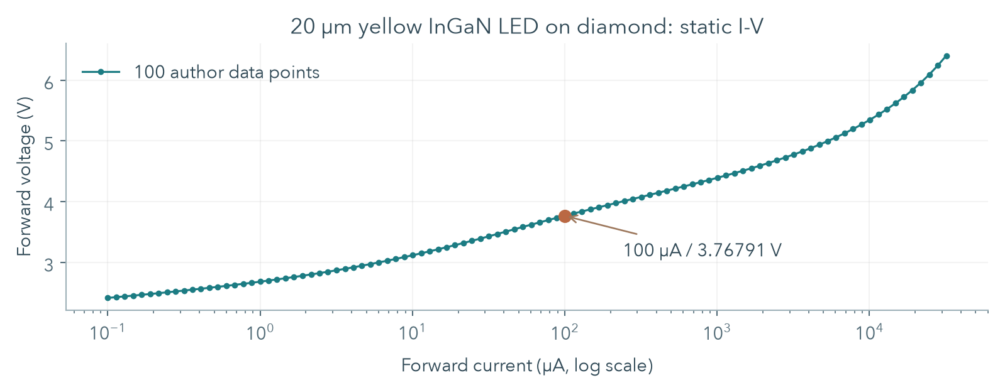
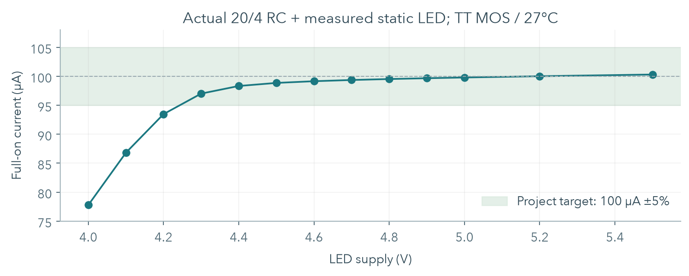
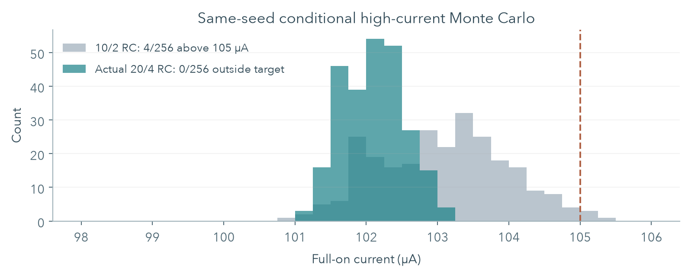
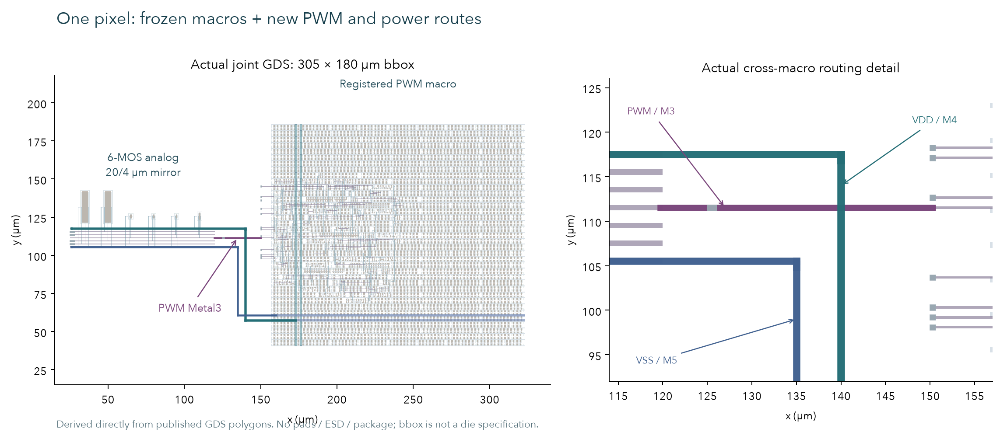

# Open MicroLED Driver ASIC

单像素研究报告 v0.3 · 2026-10-04 · 开源教学项目

## 01 从整体框架开始

当前目标是把**一个像素**的数字控制、晶体管驱动和物理实现逐项做实，再决定阵列怎么扩展。峰值电流目标 100 µA；LED 电源 5 V；数字及模拟控制电源 3.3 V；1 MHz clock 产生 256-slot PWM。

系统路径是：**duty / enable → registered PWM → gate-pass / clamp → NMOS current mirror → LED electrical load**。外部 IREF 决定导通电流，PWM 决定导通时间。两者一起决定每帧的平均电流。

v0.2 已引入真实 LED 静态曲线、把镜像管从 10/2 改为 20/4 µm 并重做版图、注册 PWM 输出并完成标准单元物理流程。**本轮 v0.3 把两块 macro 接成真实共同顶层，并验证末级 buffer、实际模拟 RC 与新增金属连线的电气接口。**

| 证据层级 | 当前成果与边界 |
| --- | --- |
| LED 数据 | 一条公开数值 I-V 曲线；温度、动态、光学模型仍未知 |
| Digital logic | Registered PWM；exhaustive RTL 与 mapped gate simulation |
| Analog physical | 真实六 MOS layout、严格 LVS、DRC、GDS 与 7/7-net RC extraction |
| 电路研究 | 真实静态负载耦合；reference 误差预算；固定 corners 与有限 MC 分开验证 |
| Digital physical | CTS、routing、STA、GDS/LEF；第 07 页列出最终实际结果 |
| 共同 physical top | 真实 PWM / 电源连线、共同 GDS 抽取、DRC/LVS、几何与错误注入检查；第 11-12 页展开 |
| 芯片与实物 | 未包含 pad/ESD、完整供电与多角落 joint PEX；无 silicon 或 optical measurement |

**判断：继续单像素。** 目前可以教清楚一条实际 ASIC 研究流程，但不能把模型通过称为真实 LED 动态或 tape-out readiness。4×4 的通信、寄存器和供电分配在单像素接口与预算稳定后定义。

<!-- page -->

## 02 六个 MOS 各自做什么

LED 阳极接 5 V；阴极接 `led_k`。输出 NMOS 把电流拉向 VSS，因此这是 **current sink**。外部参考电流从 3.3 V 注入 `bias`，二极管连接的参考管将 IREF 转成 VGS；输出管复制这个偏置。

| 器件 | v0.2 W/L | 作用 |
| --- | --- | --- |
| MREF | 20/4 µm | drain 与 gate 接 bias；把 IREF 转成偏置 |
| MOUT | 20/4 µm | drain 接 LED 阴极；gate 接可开关的 gate 节点 |
| MPASS | 2/1 µm | PWM 高时把 bias 传给输出 gate |
| MCLAMP | 2/1 µm | PWM 低时把输出 gate 放电到 VSS |
| MINV_N | 2/1 µm | 与 PMOS 组成 CMOS inverter |
| MINV_P | 4/1 µm | 产生互补控制 pwm_b；bulk 接 vlogic |

PWM 高：pass 开、clamp 关、输出管导通。PWM 低：pass 关、clamp 开、输出 gate 放电。clamp 是必要的，因为仅断开 pass 会留下带电的浮动 gate。

选择 simple mirror 是为了让偏置、有限输出电阻、headroom 和失配都容易解释。它没有 cascode、误差放大器或校准反馈；相同 W/L 只给出 nominal 1:1 比例，**IREF=100 µA 不保证 IOUT 恰好 100 µA**。

本项目选用公开 GF180MCU 6 V MOS，参考 [官方器件说明](https://gf180mcu-pdk.readthedocs.io/en/latest/analog/model_parameters/LV/LV_1_4_1.html)；实际模型版本和文件 hash 由仓库 lock 固定。数字采用同工艺标准单元的 3.3 V Liberty 条件，不能把名字中的 5V0 当作当前供电设定。

详细连接、单位和原理见 [design](../design.md)。`w=20u l=4u` 是 SI 网表中的 20/4 µm；Magic PCell 输入 `w 20 l 4` 使用 µm，二者不能混用。

<!-- page -->

## 03 真实 LED 数据改变了什么

来源为 Lin 等人 2026 年的 **20 µm 方形 yellow InGaN MicroLED，transfer-printed 到 diamond**。作者 [Zenodo dataset](https://doi.org/10.5281/zenodo.20034288) 的 `I-V.xlsx / Sheet1 / A3:B102` 提供 100 点数值，覆盖 0.1 µA-32 mA、2.41622-6.40451 V。数值 dataset 为 CC BY 4.0；本图由这些数值独立绘制。



100 µA 夹在 88.55 µA / 3.73408 V 与 100.65 µA / 3.76983 V 之间。线性插值：

`Vf = 3.73408 + (100−88.55)/(100.65−88.55) × (3.76983−3.73408) = 3.767909545 V`。

面积 `(20 µm)² = 4×10⁻⁶ cm²`，因此 `J = 100 µA / area = 25 A/cm²`。这只是 mesa 平均电流密度，未测局部电流分布。

模型最终采用单调 PWL 静态重放。75 点训练、25 点留出时最大电压插值误差 2.953 mV；101 次独立 OP 确认表示方式。全范围简化 diode/log/R 经验式留出最大误差 221.369 mV，故未采用。

温度、扫描时序、重复次数和测量不确定度未报告。**插值误差不等于测量误差**，一条曲线也不等于器件间分布。出处、许可、失败拟合和模型卡完整保存在 [measured LED 研究](measured-led.md)。

<!-- page -->

## 04 用电流误差检查电压余量

100 µA 时真实曲线 Vf≈3.768 V，5 V 电源只留下约 **1.232 V** 给驱动串联路径；旧合成 Vf=2.8 V 留下 2.2 V。不能沿用旧电压余量直接推断新负载可用。

实际 20/4 RC 网表与真实静态 I-V 耦合，共 148 DC：135 点网格，以及 13 点 typical 供电扫描。网格为 5 MOS corners × 3 logic rails × 3 LED rails × 3 IREF，MOS 温度固定 27 °C，LED 曲线温度仍未知。



| 工况 | 实际电流 |
| --- | ---: |
| 网格 VLED=4.5/5/5.5 V，Vlogic=2.97/3.3/3.63 V，IREF=99.5/100/100.5 µA | 98.175-100.984 µA，135/135 在 ±5% 内 |
| Typical，5 V / 3.3 V，IREF=100 µA | 99.788467 µA；相对目标 −0.211533% |
| Typical，VLED=4.2 V | 93.464616 µA，超出目标 |
| Typical，VLED=4.3 V | 97.006693 µA，达到目标 |

±5% 下的 typical 静态边界被扫描夹在 **4.2-4.3 V**，不能把 4.3 V 当作所有温度或批次的最低规格。全部 148 DC 电流在实测正向数据域内。结果与条件见 [耦合证据](../../evidence/characterization/measured-load-summary.json)。

<!-- page -->

## 05 镜像管尺寸为什么改为 20/4

预先设定 full-on absolute current 为 **100 µA±5%**。原 10/2 µm 在最差固定 corner/reference 条件叠加 local mismatch 后，有 **4/256** 个样本超过 105 µA。增加面积前先保留了失败结果，再用相同种子比较尺寸。

W 与 L 都加倍，W/L 仍为 5，镜像管 gate 面积变为 4 倍。较大面积降低模型中的随机失配，较长 L 改善有限输出电阻；代价是面积和充放电负担。最终结果来自重新生成、检查和提取的**真实新几何**，不是只改旧网表上的尺寸。



| 最差条件，256 个模型样本 | 旧 10/2 RC | 实际 20/4 RC |
| --- | ---: | ---: |
| 电流 sample σ | 0.90409 µA | 0.43287 µA |
| 最大观察电流 | 105.40741 µA | 103.21357 µA |
| 超出 ±5% | 4/256 | 0/256 |
| 模拟 cell bbox 面积 | 2532.7 µm² | 3577.7 µm²，增加 41.26% |

新尺寸五组 MC 各 256，共 1280 个 OP；每组均未观察到超限。此处采用 **synthetic LED 温度模型**；最差条件为 FF / 0 °C / Vlogic=3.63 V / VLED=5.5 V，reference 校准 +0.5%、TC=−25 ppm/°C、line=+3000 ppm/V。它们是模型的有限条件样本，不是实测 LED 的失配或 manufacturing yield。详细开关与复算见 [reference / matching 报告](reference-and-matching.md)。

<!-- page -->

## 06 Reference、误差和功耗怎样分账

当前仍采用外部 reference；没有片上 reference generator。行为模型是用于分配误差的工程假设：100 µA@27 °C、校准误差 ±0.5%、TC ±25 ppm/°C、line ±3000 ppm/V、输出电阻 10 MΩ、compliance ≥1 V。它不是已选定器件的 datasheet 保证。

1080 点 deterministic 检查为 5 fixed corners × 3 MOS temperatures（0/27/85 °C）× 3 logic rails × 3 LED rails × 8 reference 边界组合。LED 使用合成温度模型；与第04页真实静态负载的固定温度网格分开计数。

| 指标 | 实际 20/4 RC 结果 |
| --- | --- |
| Reference / fixed-corner 网格 | 99.280257-102.075649 µA，1080/1080 在 ±5% 内 |
| 最低码 1/256 | nominal / low / high 各 50 ns 与 10 ns；6 次 transient |
| 最低码最大面积误差 | 0.768297%，在预设 ±2% 内；只属于当前模型条件 |
| 理想 IREF、合成 LED、nominal full-on | 100.695401 µA；对 100 µA 误差 +0.695401% |
| 同条件 schematic → actual RC | 100.752515 → 100.695401 µA，变化 −0.056688% |

三种误差分别回答不同问题：**absolute error** 对 100 µA 目标；**PWM area error** 对同条件 full-on×导通时间；**pre/post delta** 对同尺寸 schematic。任何一项小都不能代替其他两项。

真实静态负载 nominal 下，LED rail 功耗 **498.942337 µW**，analog-control/reference rail **330.000012 µW**，合计 **828.942349 µW**。这是两个理想电源送入模拟 testbench 的功率，不含数字逻辑、实际 reference generator、封装和外部供电损失。PWM 关闭时 reference 仍约消耗 330 µW；低 off current 不等于低 standby power。

尚未覆盖 reference noise、startup、power sequencing、系统性布局梯度和独立 RC corners。预算、公开 PDK 公式、每组分母和冻结输入见 [实际 RC summary](../../evidence/characterization/actual-w20-l4-summary.json)。

<!-- page -->

## 07 从 PWM RTL 到标准单元物理实现

输入为 9-bit duty、enable、reset、clock；duty=0 持续低、256 持续高，257-511 saturate 为 256。输入只在帧边界锁存。1 MHz clock 的 slot 为 1 µs，每帧 256 µs，PWM 为 3906.25 Hz。

旧输出直接取 counter/comparator 组合结果，物理路径差异可能产生短暂毛刺。现在使用 **output FF**：普通 slot 注册 next-counter 比较结果，帧边界注册新 duty 的 slot 0。保持原有帧时序，不增加一个 slot 延迟。

| 验证 | 已完成结果 |
| --- | --- |
| RTL exhaustive | 518 frames / 133159 checks / 543 个已知 PWM events |
| Functional mapped gate simulation | 相同 exhaustive 检查通过；10 个 trace 与 RTL 完全相同 |
| Native Yosys synthesis | 95 standard cells，19 个 FF；Liberty cell area 2434.4768 µm² |
| 输出结构 | Native mapping 为 FF.Q；最终 PnR 加入 `buf_2` 输出级 |
| 1 ns timing template | 仅 simulator 模板探针；不代表 PVT 或布线延迟 |

已有数字 macro 实际完成 LibreLane 3.0.14 的76步flow：placement、CTS、routing、SPEF/SDF、GDS/LEF；九个corner组合的setup、hold、max slew、capacitance和fanout违规均为0。最差setup margin 793.656477 ns，hold margin 0.436677 ns。保持3 ns transition约束，通过buffer sizing修正原来的slow-corner slew超限。

STA 使用72.91 fF output load、0.15 ns clock transition、200 ns IO delays与0.25 ns uncertainty；这些是工程约束，不是实测analog输入电容。实际数字Magic DRC、route DRC、LVS以及独立KLayout结果见[physical证据](../../evidence/physical/summary.json)。

九份实际SDF各跑518 frames/133159 checks；关键clock/FF/output路径延迟与CSV边沿独立核对。TT rise/fall delay为2.644/2.360 ns。TT SDF→actual analog RC另跑5组duty配对、共10 transient+3 calibration；最低码相对理想RTL的平均电流变化为−0.00011170 µA。

SDF回放仍有24个XOR/XNOR ModPath未匹配、19项TIMINGCHECK不支持；关键输出路径已单独验证，setup/hold结论来自STA。模拟端仍是理想0/3.3 V、10 ns slew回放；未模拟真实输出级。条件与范围见[数字物理报告](../digital/physical.md)。

该数字 macro 和模拟 macro 的内部实现保持冻结。v0.3 新增共同 routed macro top 与实际输出级研究，见第 11-12 页；它们没有升级为完整芯片的供电 sign-off 或 joint timing closure。这里没有 SPI、通信协议或像素 memory。

<!-- page -->

## 08 模拟 layout、规则与交付视图

新尺寸保留相邻、同方向的镜像管；独立 guard rings、bulk ties、contacts 和 M1/M2/M3 接线。器件增大后 bulk via landing 首次出现 4 个 M1 spacing 违规，调整 landing 位置后重新运行完整检查；原失败日志保留在 build 中。


实际 GDS bbox 为 **95×37.66 µm**，面积 3577.7 µm²。横向从左到右为 MREF、MOUT、MPASS、MCLAMP、MINV_N、MINV_P；下方七条 M3 总线对应公开的 macro 接口。图直接来自 GDS polygons，坐标为 µm。

版图保留宽松间距用于教学。相邻同尺寸同方向不等于 common-centroid 或已验证的系统梯度抵消。模型 MC 检查随机器件参数，不能自动反映布局梯度、机械应力或制造后的像素一致性。

<!-- page -->

## 09 检查范围与可集成接口

| 检查或输出 | 实际结果 |
| --- | --- |
| Magic DRC / GDS 回读 DRC | 两者均 0；采用 drc(full) |
| Netgen LVS / 回读 LVS | 唯一匹配，无 property errors；6 MOS / 7 nets |
| RC extraction | 7/7 nets；6 MOS、59 R、43 C |
| 版图前后电气回归 | 36 transient + 3 LED calibration；19 guards 通过 |
| 独立 KLayout | Linux 中运行锁定 GF180 variant D deck，0 违规；范围以报告为准 |
| Macro views | GDS / editable MAG / LVS SPICE / RC SPICE / 实际导出 LEF |

LEF 由同一个 layout 导出，尺寸与实际 GDS bbox 对齐，七个接口的 direction/use 明确；内部接线作为 routing obstructions。已由锁定 OpenROAD/OpenDB 实际读入，尺寸、ORIGIN、七个 M3 ports 与228个 OBS 检查通过，见[consumer 验证](../../evidence/physical/macro-read.json)。

| Macro 接口 | 含义与使用条件 |
| --- | --- |
| VSS / vlogic | Ground / 3.3 V analog-control rail；共同 top 接 VSS / VDD |
| pwm | Registered digital control input；真实末级与新增连线的研究见第 12 页 |
| bias | 外部 reference current 注入点，需满足 compliance |
| led_k | 外部 LED cathode；LED 阳极电源不在这个 cell 内 |
| gate / pwm_b | 模拟 gate 与反相 PWM monitor；当前作为公开教学端口 |

独立 KLayout 的 FEOL、BEOL、connectivity 和 off-grid 检查默认启用；density 与 antenna 未在该单独模拟运行中启用。不要把此处 0 DRC 写成所有规则零错误。新数字 macro 的检查范围另见数字 physical 报告。

严格 LVS 同时检查连接和 deck 保留的 W/L；deck 的 1% tolerance、D/S 交换和忽略 AD/AS/PD/PS 等限制仍保留。DRC 通过也不能代替 density、antenna、foundry/shuttle acceptance 或完整芯片检查。详细范围与证据见 [layout 报告](../layout/README.md)。

<!-- page -->

## 10 最低灰阶：数值稳定与物理准确分开

真实 I-V 模型没有已测电容，也没有 0.1 µA 以下的测量。为观察敏感性，外加 **0.2/2/20 pF 假设电容**，各跑 duty=1/64/256；20 pF 最低码再用 2 ns 细步长，共 10 次 transient。每次积分预热后四帧。

| 最低码 duty=1/256 | 面积误差 | 域外导电电荷比例 |
| --- | ---: | ---: |
| 0.2 pF 假设 | −0.345617% | 0.563943% |
| 2 pF 假设 | −0.227048% | 4.904857% |
| 20 pF 假设 | +0.135576% | 18.4548% |
| 20 pF / 2 ns fine | +0.135532% | 18.4532% |

所有探针面积误差在 ±2% 内；20 pF 细化的平均电流变化仅约 **0.0000433%**。这支持所设模型的数值积分，但不能证明实物有相同动态表现。

20 pF 最低码约 **90.651% 时间、18.45% 有符号静态导电电荷**落在未测低电流延拓区。0.2 pF 波形甚至短暂出现约 −9.77 mV LED 电压，而 reverse behavior 没有数据。域外比例的分母是 `∫I_static(VLED)dt`，不是 rail displacement current，也不是 `∫|I|dt`。

v0.2 研究沿保存的 V(t) 插入全部 PWL knot crossing 后分区积分，另外报告逐帧均值、同相节点、端点电容电荷和重建残差；未设隐藏的 periodicity “通过”阈值。新接口研究仍保留 **dynamic_qualification=false**。

下一项有价值的数据是同结构器件的低电流/reverse I-V、C-V 或 impedance、pulse response、I-V(T) 和 L-I/EQE。取得前保留 synthetic baseline 与静态数据模型两条路径，不把 average current 写成真实 optical brightness。

<!-- page -->

## 11 两块 macro 怎样接成一个 physical top

保留两块原 GDS 的器件和内部 routing，在共同 top 中 R0 放置：digital 原点 `(150,25)` µm，analog 原点 `(25,105.52)` µm。模拟的原始 bbox 下缘为 −0.3 µm，不能忽略 LEF ORIGIN。新增 Metal3 接 PWM，Metal4 / Metal5 与正确 Via stack 接 3.3 V / VSS；LED 阳极电源仍在 top 外。



| 共同顶层检查 | 实际证据 |
| --- | --- |
| 几何与接口 | 305×180 µm bbox，19 个外部 pins，含 PWM monitor；不是 die / pad-ring 尺寸 |
| Macro 保留 | 独立逐层 polygon XOR 为零；另核查 36 个原 macro cells 的 shapes / hierarchy |
| DRC | Magic `drc(full)`=0；独立 KLayout 651 categories、XML items=0 |
| 实际抽取 / LVS | 完整 GDS 对官方标准单元晶体管 SPICE 与 golden top；唯一匹配且无 property errors |
| 连通与负对照 | 不依赖 net labels 的 Metal/Via 图确认 PWM / VDD / VSS；实际 PWM 删段与电源桥接均被拒绝 |

此次 LVS 包括 30 类保留 digital leaf 内部 MOS 拓扑和 deck 的 W/L 检查、analog 六 MOS 与共同连接。仍按 deck 忽略 filltie/endcap/fill_*，不比较 AD/AS/PD/PS；另以 buf_2 W 和 body-tie 错误证明检查可拒绝。Density、antenna、IR drop、pads/ESD 与 foundry acceptance 不包含在此结论内。[共同 top](../../evidence/integration/README.md) / [独立审查](integration-review.md)。

<!-- page -->

## 12 输出级、输入负载与最短 pulse

模拟 PWM 连接三个 MOS gate。只加一个固定电容不足以描述切换负载：工作点 AC 为 `Cparallel=Im(Y)/(2πf)`；切换探针则积分端口电流，计算 `Q/ΔV`。Nominal 输入的上升 / 下降电荷等效值约 **36.715 / 36.668 fF**，与旧 STA 假设 72.91 fF 分开记录。

实际末级是 `output12 / buf_2`，六个 canonical MOS，VNW=VDD、VPW=VSS。联合 testbench 包括其晶体管 SPICE、原数字输出网 nominal SPEF、actual analog RC，以及新跨宏 Metal3 span 的实际抽取：30 µm / 0.56 µm，**4.81871 Ω、PWM 相关 C 总计 2.34604 fF**。邻近电源耦合保留；helper 的 pwell 依据完整 top 的 substrate connection 接理想 VSS。

| Synthetic LED / IREF=100 µA；真实末级 + 新连线 | TT 27°C / 3.3 V / VLED 5 V | SS 85°C / 2.97 V / 4.5 V | FF 0°C / 3.63 V / 5.5 V |
| --- | ---: | ---: | ---: |
| Full-on current / µA | 100.695401 | 100.068779 | 101.353805 |
| duty=1 平均电流 / µA | 0.392355 | 0.388219 | 0.395169 |
| 最低码面积误差 | −0.250683% | −0.684259% | −0.188099% |
| 输出 rise / fall，30-70% / ns | 0.25852 / 0.13425 | 0.43990 / 0.21804 | 0.17745 / 0.09608 |

主研究共 54 transient，包含 ideal / 实际 buffer、off / 1 / 64 / 255 / 256、三包络、实测 static+假设 2 pF 探针及步长细化。最低码与 full-on 使用预设 ±2% / ±5%；TT joint 10→1 ns 步长结果一致。这里的 MOS 条件与第 07 页数字 STA 的温压条件不同。

实际 Liberty 的 slew 阈值是 **30-70%**。主探针采用 1 ns 全坡度；另以 7.5 ns 全坡度对应 3 ns 输入 slew 上界，6 次 stress 均通过，输出最大 rise/fall 为 **0.454954/0.258989 ns**。这里没有前级 FF 波形、完整数字 transient、输出 cell 的 junction/metal PEX 或全顶层多角落 PEX。电源和邻近耦合采用理想/静止边界；小幅 overshoot 是模型结果，不是 pad/ESD 或可靠性实测。[接口方法与结果](interface.md)。

<!-- page -->

## 13 复现、阅读与下一阶段

先按 [environment](../environment.md) / [layout 安装](../layout/README.md)取得锁定依赖和完整 PDK。命令必须实际成功后才更新公开 evidence：

```sh
make test
make evidence
build/layout/venv/bin/python scripts/layout/run_layout.py --publish-evidence
build/layout/venv/bin/python scripts/layout/export_macro.py
.venv/bin/python scripts/led/fit_lin2026.py
.venv/bin/python scripts/led/probe_boundaries.py
build/layout/venv/bin/python scripts/characterization/run_actual_mirror.py
build/layout/venv/bin/python scripts/characterization/measured_load.py
build/layout/venv/bin/python scripts/digital/run.py --publish-evidence
```

数字 physical 与独立 DRC 使用锁定 LibreLane container；完整安装、调用和检查范围见 [physical 流程](../digital/physical.md)。全 PDK、VM、raw waveforms 和失败日志留在 `build/`；仓库只保留可核查的小型证据与 source hashes。[输入映射](../../evidence/research/README.md)保存实际旧 TB 快照，22 次新旧 RTL 执行确认10组默认trace相同；旧run hash保留原样，可选实时日志变化单独记录。

新共同 top 和接口 probe 的运行命令、固定输入与失败日志分别见[集成说明](../../evidence/integration/README.md)和[接口报告](interface.md)。报告 HTML / PDF 的实际 browser 打印脚本已公开；每一页均渲染检查。v0.2 报告保留于[公开历史版本](https://github.com/Kevin-Kaiyo/open-microled-driver-asic/tree/7ad33e16cfc26a8e785061ef1713156d36d97259/docs/research)。

### 下一阶段按证据推进

1. 从本次共同 top 推进完整输出 cell / 邻近导体 / 供电的 joint PEX，验证 startup / power sequencing、probe loading 与总数字功耗；保持本轮 partial extraction 和边界条件的独立记录。
2. 取得真实 LED 动态、温度和光学数据；确认最短有效 pulse 与亮度指标。
3. 选择可实现的 reference source，验证 noise、compliance、startup、sequencing 和总功耗；若需要低 standby，重新评估偏置关断与启动成本。
4. 单像素预算和接口稳定后，再定义 4×4 独立协议、register map、frame buffer、共享 reference 和供电分配。

MPW 是后续可行性工作：pads/ESD、package、density/fill、antenna、provider 接受规则及测试责任均需实际资料和检查。当前成果没有升级为可投片芯片。

[当前资料入口](README.md) · [旧教学 PPT](../teaching/open-microled-single-pixel-teaching-v2.pptx) · [2026-10-03 检阅快照](../review/README.md) · [完整 roadmap](../roadmap.md)。旧报告和 manifest 保留当时的设计与输入；当前 20/4、registered PWM、共同 top 和声明的接口模型以本报告及新 evidence 为准。
