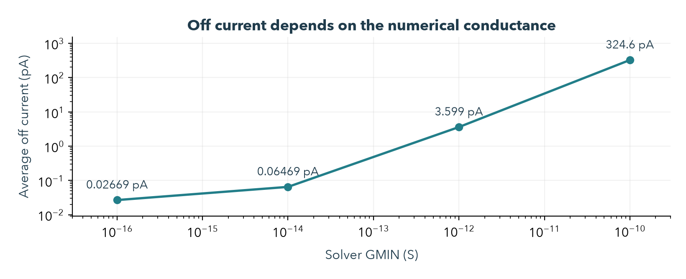
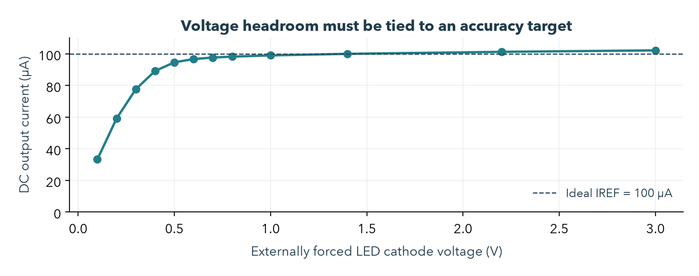
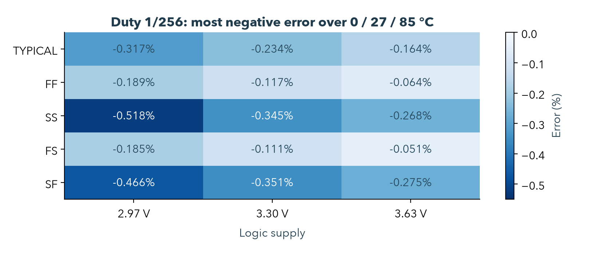
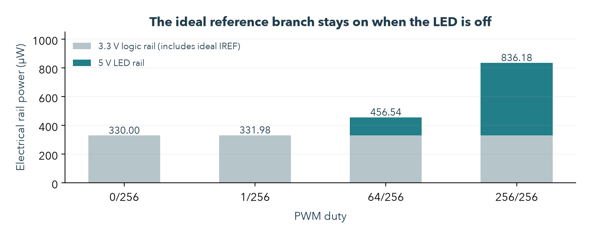

# 单像素研究前提与正确性检阅

**Open MicroLED Driver ASIC · 2026-10-03**  
审阅基线：`e26e2f6`；范围：器件物理、参数、计算、数值求解、版图验证与下一步方向。

## 01 / 先给判断

**当前链路适合作为单像素教学和电路机制研究的基线。平均电流的计算可信，MOS 型号、单位与基本偏置成立；真实 MicroLED 性能、绝对电流精度和制造后一致性尚未确立。**

这次检阅发现并修复了一项真实的自动验证漏洞，也补出了会改变研究判断的模型边界。因此，下一步应继续完善同一个像素，先建立真实负载与误差预算，再决定是否升级电流镜、参考源和版图。暂不以扩到 4×4 作为进度目标。

| 优先级 | 发现 | 本次处理 |
|---|---|---|
| 已修复 | LVS 连接匹配时，尺寸错误仍可能被旧脚本放行 | 加入 property-error 拒绝条件、故意改错对照；原版图重验通过 |
| 必须限定 | 100 µA / 2.8 V / 2 pF 未绑定真实 LED | 保留教学假设，建立真实 model card 为下一阶段入口 |
| 必须纠正解释 | 约 3.6 pA 关断电流受 GMIN 主导 | 撤除物理 leakage / 黑电平推论 |
| 必须分开验收 | 平均值稳定，不代表纹波、峰值和带宽可靠 | 补 solver 对照；动态性能仍待专门验证 |
| 必须补指标 | 版图前后相近，不代表相对 100 µA 准确 | 名义误差 +1.2365%；更广 DC 矩阵最高 +2.3854% |

**保留的成果：** RTL → PWL → 六 MOS → synthetic LED 的仿真链路，以及 standalone 模拟 cell 的实际版图、公开工具 DRC/LVS/RC 抽取。**未获得的证据：** 实物 LED 拟合、完整数字物理集成、foundry signoff、硅片和光学测量。

阅读文件：[PDF 总报告](single-pixel-audit.pdf) · [HTML](review.html) · [MOS/PDK 专项](mos-pdk-audit.md) · [MicroLED 专项](microled-physics-audit.md) · [数值专项](numeric-audit.md)。旧教学 PPT/PDF 保留为审阅前快照；涉及漏电、纹波、误差和下一步门槛时，以本报告为准。

<!-- page -->

## 02 / 我们究竟在验证什么

整条路径是：**数字 PWM 决定何时导通 → MOS 电流镜决定导通电流 → LED 电学负载决定所需电压与充放电行为 → 对完整周期积分得到平均支路电流。** 每一层成立，都有独立的前提。

| 层次 | 当前设定 | 已确认 / 尚未确认 |
|---|---|---|
| 数字时间 | 1 MHz；256 slots；9-bit duty 0…256，越界钳位 | RTL 行为通过；未综合、未验证门级毛刺或实际输出驱动 |
| 接口 | 执行 RTL 后生成 0/3.3 V、10 ns ramp 的 PWL | 事件和转换正确；理想电压源没有输出阻抗与反馈 |
| 电流设定 | 外部理想 IREF=100 µA；1:1 simple mirror | 支路电流可求解；未实现真实 reference、启动与温漂 |
| MOS | GF180MCU 6 V 家族；MREF/MOUT=10/2 µm | 锁定模型与单位正确；随机失配关闭，未证明 yield |
| LED | 合成 diode + RS + charge model | 单点校准正确；颜色、几何、I–V/C–V/光学数据缺失 |
| 版图 | 95.00 × 26.66 µm，6 MOS，59 R，43 C | 公开 Magic/Netgen 流程通过；不是完整芯片签核 |

这里的 **100 µA 是教学工作点**。如果不知道发光面积，就不能判断电流密度、局部发热或工作寿命；如果没有 reference 精度要求，就不能判断 simple mirror 是否已经足够。

模型来源分为两套：Phase 1 用原始 GF180 模型子集；physical flow 用锁定的完整 `gf180mcuD`。二者有不同的版本和器件别名。版图前后配对比较使用同一完整 PDK，未混用两套别名或尺寸单位。

复核了完整 PDK lock 的 **9 个文件哈希**。模型文件、Magic/Netgen deck 与记录一致，但“哈希一致”仅证明使用了指定文件，并不证明 synthetic LED 或应用场景已经得到物理验证。

来源：[模型子集 lock](../../analog/models/pdk-lock.json)、[完整 PDK lock](../../layout/pdk-lock.json)、[六管 schematic](../../layout/pixel_driver_schematic.spice)。

<!-- page -->

## 03 / 数据和计算：平均值通过，极小量须降级

独立实现重新读取 **55 份原始 transient 波形**，检查时间单调、有限值、积分窗口与单位。平均电流最大差仅 **1.42×10⁻¹⁴ µA**。6 份原始 LED 校准结果与既有报告一致。

计算采用时间加权积分：`Iavg = ∫I(t)dt / Δt`。窗口为 514.5–1538.5 µs，覆盖预热后的 4 个完整 frame。自适应时间点不能简单平均：原 duty=1 波形的正确值为 0.394943 µA，简单平均采样点却为 4.901972 µA；原流程没有犯这个错误。



**关断电流没有形成物理性能依据。** 同一 RC 电路仅改变数值电导 GMIN，紧容差 Gear2 的关断结果从 324.6 pA 降到 0.02669 pA。默认设置下约 3.6 pA 不能用于推导实物漏电或对比度；较小 GMIN 下的数值也不能直接升级为真实漏电。

**稳态纹波也需要重新验收。** 全开 RC 波形的峰峰变化由默认 trap 的 0.08665 µA，降到紧容差、20 ns 步长 trap 的 0.0003224 µA；Gear2 接近数值噪声。三者平均值差不足 0.08 pA。平均值稳定支持电流积分结论，但不能证明物理纹波、峰值或带宽。

证据：[独立数值结果](../../evidence/review/numeric-summary.json)、[GMIN 对照](../../evidence/review/numeric-gmin-probes.json)。算法解释：[ngspice transient options](https://nmg.gitlab.io/ngspice-manual/analysesandoutputcontrol_batchmode/simulatorvariables__options/transientanalysisoptions.html)。

<!-- page -->

## 04 / LED：数学锚点正确，物理参数尚未识别

模型反算公式为 `IS = I0 / expm1[(Vf0 − I0·RS)/(N·VT)]`，其中 `VT=kT/q`。27 °C 时 VT=25.86493 mV。对 2.4、2.8、3.2 V 三个 100 µA 锚点，独立 ngspice 结果与目标相差约 0.81–1.09 µV，代数和单位正确。

**一个锚点不能确定一条真实 I–V 曲线。** 令 N=2.2、3、4，各自重新计算 IS，都经过 100 µA / 2.8 V；在 1 µA 时却分别得到 2.5330、2.4377、2.3186 V。这会改变低电流区和开关过程中所需的电压。

| 参数 | 审查结果 | 对下一步的意义 |
|---|---|---|
| N=3、RS=50 Ω | 未从实物拟合；RS 在 100 µA 仅贡献 5 mV | 不能称为已完成器件选型 |
| CJO=2 pF | 是零偏参数；100 µA 工作点结电容约 **4.828 pF** | 不能把 2 pF 当作工作时恒定电容 |
| TT=1 ns | SPICE diffusion-charge 参数 | 不等于光学 rise time 或已测 carrier lifetime |
| EG=2.6 eV | 用于温度模型；未拟合 | 不能据此指定颜色或用 1240/EG 宣布波长 |
| FC=0.5、XTI=3 | 来自 ngspice 默认值，也参与物理方程 | 参数账本必须包括默认设置和 simulator 版本 |

模型在固定 100 µA 时，Vf 从 0 °C 的 2.78911 V 升至 85 °C 的 2.82132 V；27 °C 附近约 **+0.391 mV/°C**。这只是当前参数产生的正温漂，尚无样品支持。不能因 sweep 成功就认定真实 LED 也有这种温度规律。

同样 100 µA，若发光区为 5、10、20 µm 正方形，对应电流密度分别是 **400、100、25 A/cm²**。这些是单位换算示例，尚未选定实际 LED。必须先记录颜色、材料、发光面积、封装、温度与数据出处，再讨论工作电流是否合适。

来源：[36 次独立 LED 实验](../../evidence/review/led-independent-checks.json)、[ngspice 47 手册 §7.2](https://ngspice.sourceforge.io/docs/ngspice-47-manual.pdf)。实际测量候选见 [Wolter 等 2021](https://doi.org/10.3390/nano11040836)；其原始 dataset 尚未取得或拟合，本项目没有借用其参数作默认值。

<!-- page -->

## 05 / MOS：结构成立，饱和不等于规定精度

名义条件下，RC 输出 MOS 的内部 VDS=**2.19546 V**、VGS=**1.38217 V**，模型 VDSAT≈**0.48942 V**，工作点有合理饱和余量。需要看内部端子差值；抽取后的 global ground 与内部 source 之间存在电阻压降。



图中暂时用理想电压源固定 LED cathode，独立检查 driver。0.5 V 时虽然已接近模型 VDSAT，输出仅 **94.6167 µA**；0.8 V 时为 **98.2128 µA**；2.2 V 时约 101.2378 µA。因此，compliance 应按允许误差定义，而不是只看是否进入 saturation。

名义 RC full-on 为 **101.236512 µA**：相对于 IREF=100 µA 的偏差为 **+1.23651%**；相对于 schematic 的变化约 **−0.06227%**。这两个百分比回答不同问题，不能互相替代。

5 corners × 3 temperatures（−40/27/125 °C）× 3 logic rails × 3 LED rails × on/off，共 270 个 DC 组合，得到 full-on **100.0788–102.3854 µA**。最大任意端子差为 4.36761 V。另 3 个代表瞬态条件最大为 4.36768 V；这些结果不覆盖上电顺序、开路 LED、ESD 或封装寄生。

固定 corners 不等于制造后一致性。当前 mismatch 关闭；按 PDK 局部阈值项及 gm/ID 做一阶估算，电流比 1σ 量级约 0.75%，尚非 Monte Carlo 或 yield 结果。它提示 matching 与 reference 误差可能比名义 RC 差异更值得优先研究。

来源：[288 个 DC 解与条件](../../evidence/review/mos-audit.json)、[官方模型限制](https://gf180mcu-pdk.readthedocs.io/en/latest/analog/model_parameters/LV/LV_2_2.html)、[可靠性规则 §14.1](https://gf180mcu-pdk.readthedocs.io/en/latest/physical_verification/design_manual/drm_14_1.html)。

<!-- page -->

## 06 / 最低灰阶：补查组合条件和输入边沿

新增 RC 矩阵覆盖 5 corners × 0/27/85 °C × 2.97/3.3/3.63 V logic × duty 1/64/256，共 **135 次 transient**，VLED=5 V、IREF=100 µA 固定。它是合成负载的敏感性研究，温度和供电范围并非产品保证范围。



最低码误差按 `Iavg / (同条件 Ifull × 1/256) − 1` 计算，体现 PWM 积分线性度，不包括 full-on 对 100 µA 的绝对偏差。图中每格是三个温度中的最负值；整个矩阵最负约 **−0.5181%**。

名义 duty=1 的 RC 平均值约 **0.394573 µA**，相对同条件 full-on/256 的误差约 −0.2230%。输入 ramp 从 10 ns 改为 100 ns 时，误差变为 **−1.6352%**；1 ns 时约 −0.1048%。因此短脉冲精度与实际数字输出 slew 有关。

另外独立改变 CJO（0.2/20 pF）、TT（0/10 ns）及 slew（1/100 ns），每组检查三种 duty；所有 CJO/TT 组合均重新校准 DC 锚点。这里的变化范围只是敏感性探针，不代表真实 LED 参数分布。平均值不敏感，也不证明动态模型正确。

合计 **159 次 transient + 5 次 DC 校准**；3 个最低码条件另用 20 ns 最大步长检查平均值，变化远低于 0.001%。逐帧平均与端点状态检查支持所测窗口接近周期稳态；全矩阵最大四帧平均差约 0.94 pA。峰值与带宽仍未形成专门验收。

证据：[条件、每帧平均、功耗和源哈希](../../evidence/review/sensitivity-summary.json)。

<!-- page -->

## 07 / 功耗：调暗 LED 不会关闭参考支路



在当前 testbench 中，IREF 从 3.3 V logic rail 持续取 100 µA。因此即使 PWM=0，参考支路仍使该 rail 输出约 **330 µW**。这是现有理想测试电路的功率核算，不是已实现 reference generator 的实测功耗。

| Duty | 5 V LED rail | 3.3 V logic rail | 两电源合计 |
|---|---:|---:|---:|
| 0/256 | 近零，数值相关 | 330.00 µW | 约 330.00 µW |
| 1/256 | 1.97 µW | 330.00 µW | 约 331.98 µW |
| 64/256 | 126.54 µW | 330.00 µW | 约 456.54 µW |
| 256/256 | 506.18 µW | 330.00 µW | 约 836.18 µW |

条件：typical、27 °C、合成 Vf=2.8 V、完整 PDK RC。合计按未取整值计算。图和表未计入实际数字逻辑、时钟、reference generator、封装或外围电源损耗。理想 PWM 电压源功率单独记录，量级远小于表中取整精度。

全开时 LED 端口平均电功率约 **283.56 µW**，它与 5 V rail 的 506.18 µW 不同，后者还覆盖 driver 与连线压降；两者都不是光功率。不能把电端口功率比例叫作 EQE 或发光效率。

若未来机械复制 16 份六管电路与各自 IREF，光是当前理想参考支路就对应 16×330 µW=**5.28 mW**。共享 reference 可以改变结构和功耗，但会引入 bias 分布、失配和互扰问题，尚未设计。因此 4×4 的功耗不能只按 LED 平均电流估算。

下一阶段应分别预算 LED branch、reference、数字逻辑和供电损失，并规定关断时哪些支路仍需工作。

<!-- page -->

## 08 / 版图与数字接口：门禁已经修正，范围仍有限

**本次发现的实际 bug：** Netgen 在连接唯一匹配但器件 W 错误时，可以同时输出 `Circuits match uniquely.` 和 `Property errors were found.`，exit code 仍为 0。旧流程只看第一句，会把错误尺寸放行。

修复后，流程要求唯一的成功 final result，并拒绝 property/connectivity error。三组真实对照中：原版通过、MOUT 宽度 10→20 µm 被拒绝、故意改 gate 连接被拒绝。加入 4 项测试后，本地共 **11 项单元检查通过**。

原实际版图本身没有发现尺寸或连接错误。重新运行 physical flow 后，Magic DRC=0、Netgen LVS、GDS 回读 DRC/LVS 和 7/7 nets RC 抽取仍通过；36 次 paired/fine transient、3 次 LED 校准、19 项 guards 通过。

| 已通过的检查 | 仍需保留的边界 |
|---|---|
| LVS 连接、类别与指定属性 | 当前 deck 的 W/L tolerance=1%；AD/AS/PD/PS 等被忽略 |
| Magic `drc(full)` | `full` 是 style 名称；未编码规则和独立 foundry-deck 检查仍需补齐 |
| schematic / RC 配对 | transient 差异包含 diffusion geometry 与 wiring RC，不应全部归因于布线 |
| 同尺寸、相邻同向 mirror | 未做 common-centroid/dummy；未量化系统梯度与随机 matching |
| 518 frames / 133159 RTL 检查 | 零延时 RTL 不证明门级毛刺、STA、CDC 或实际 slew |

PWM 当前由多位 counter 与比较器组合产生。真实门延时可能造成边界毛刺，这是结构上需要验证的风险，并非本次已观察到的失败。进入数字物理集成前，应评估 registered output，并验证时序、复位、输入更新与电平驱动。

所有仿真从正常 DC operating point 开始；reference 与电源已存在。这不能替代 power-on、掉电顺序和异常负载验证。当前 95×26.66 µm 是教学模拟宏尺寸，不是显示像素 pitch 或完整芯片面积。

证据：[LVS 修复对照](../../evidence/review/lvs-guard-checks.json)、[最新 physical summary](../../evidence/layout/summary.json)、[官方未编码规则](https://gf180mcu-pdk.readthedocs.io/en/latest/physical_verification/design_manual/drm_16.html)。

<!-- page -->

## 09 / 下一步的判断与退出条件

**继续研究这个单像素。优先把负载和指标变成可检验的约束，再根据误差来源决定电路复杂度。** 暂不默认升级 cascode，也不直接扩阵列；更复杂的电路会消耗 headroom、面积和功耗，须有明确收益。

| 顺序 | 应完成的具体成果 | 到达什么条件才能推进 |
|---|---|---|
| 1. 真实负载与需求 | 一张 LED model card：颜色/材料、发光面积、样品 ID、封装、温度、目标电流及来源许可 | 定义用途、允许电流误差、功耗、最短 pulse 和供电范围 |
| 2. 电学拟合 | 带来源的 I–V/温度数据；拟合 N/IS/RS 或替代模型；报告残差和留出验证 | 数据覆盖目标工作区；模型适用范围与误差可说明 |
| 3. reference 与短脉冲 | 非理想 IREF 误差/启动模型；C–V/动态依据；minimum-code 与 slew 检查 | 按预先写下的阈值分别通过精度、compliance、settling 和功耗检查 |
| 4. 单像素物理闭环 | mismatch、跨 PVT、matching/routing 优化、数字驱动、独立物理规则与异常条件 | 实际电气指标达成，保留未覆盖的测量/签核边界 |
| 5. 再到 4×4 | 共享 bias、IR drop、像素一致性、通信/寄存器、更新时序和互扰 | 在已验证单像素上增加系统问题，不重新猜测基础参数 |

研究指标不应从已通过的测试倒推。例如若需求最终是 ±1% absolute current，当前 nominal +1.2365% 已经不满足；若容许更大偏差，简单镜可能仍然合适。应先给误差预算，再选择加长 L、校准、反馈或 cascode。

公开实验数据可以先用于电学拟合。Wolter 等论文提供蓝光 InGaN/GaN、0.65–20 µm 器件的测量，并声明原始数据 DOI。该数据站点本次返回 Security Check，尚未取得 dataset，文件许可与可用列还需核实。没有 C–V 或光学动态数据时，可推进静态电学，动态与光学结论继续保持未验证。

**本轮未修改 baseline 的 MOS/LED 参数来“调好结果”。** 修正的是错误门禁、证据解释与研究顺序。这样既保留可复现的教学路径，也避免用尚未确认的物理假设引导后续电路选型。

<!-- page -->

## 10 / 证据分母、来源与复现

以下是不同问题的独立分母，不能合并成“所有物理项目通过”。新仿真使用 ngspice 47；数值审阅先冻结原提交，LVS 修复后另行重跑 physical flow。

| 检查组 | 分母 / 内容 | 结果与边界 |
|---|---|---|
| 原始数据独立重算 | 55 transient、6 DC 输出、24 条旧源哈希 | 算术和基线溯源一致；哈希对应审阅起点 |
| 数值敏感性 | 8 solver/tolerance + 4 GMIN probes | 平均值稳定；泄漏与小纹波需降级 |
| LED 独立检查 | 36 次 DC/AC/数值实验 | 校准、非唯一性、电容和温度方程得到验证 |
| MOS / PDK | 288 DC + 3 端子 transient + 3 LVS 对照 | 单位、工作点和覆盖范围内的应力；未做 yield |
| RC 假设敏感性 | 159 transient + 5 LED DC 校准 | 组合条件、短码、功耗、周期稳定性；非 qualification |
| 修复后物理回归 | 36 transient + 3 LED DC；19 guards | DRC/LVS/GDS/RC 流程通过；非 tape-out signoff |

专项报告包含原始来源定位、条件与参数账本：

- [MicroLED 物理模型](microled-physics-audit.md)：ngspice 47 参数/源码、独立方程、实验论文。
- [MOS、PDK 与版图](mos-pdk-audit.md)：锁定 GF180 文件、器件与电压条件、matching 和规则范围。
- [数据与数值](numeric-audit.md)：独立积分、PWL、单位、GMIN 与积分方法对照。
- [敏感性脚本](../../scripts/review/sensitivity_audit.py)：冻结输入副本与 SHA-256，全部条件和结果公开。

原始大波形和故障日志留在本地 `build/`，精简成功证据及哈希位于 `evidence/review/`。仓库不包含完整 PDK；先按[环境说明](../environment.md)与[版图说明](../layout/README.md)准备依赖。

```sh
build/layout/venv/bin/python scripts/review/mos_audit.py
.venv/bin/python scripts/review/led_audit.py
.venv/bin/python scripts/review/numeric_audit.py --solver-probes
build/layout/venv/bin/python scripts/review/sensitivity_audit.py --publish-evidence
```

数值审计依赖先运行 Phase 1 和 physical flow 产生 raw waveform；若要重算本次旧基线，可使用专项报告列出的原始 run。新运行可以改变最后几位数值或抽取元件次序，应比较电路、条件和误差标准，同时保留新的哈希。报告图直接读取审阅 JSON，没有手工描画曲线。

报告与图的再生成见 [render_review.py](../../scripts/review/render_review.py) 和 [plot_review.py](../../scripts/review/plot_review.py)。全部结论截至 2026-10-03，不包含硅片、光学测量或完整芯片签核。
