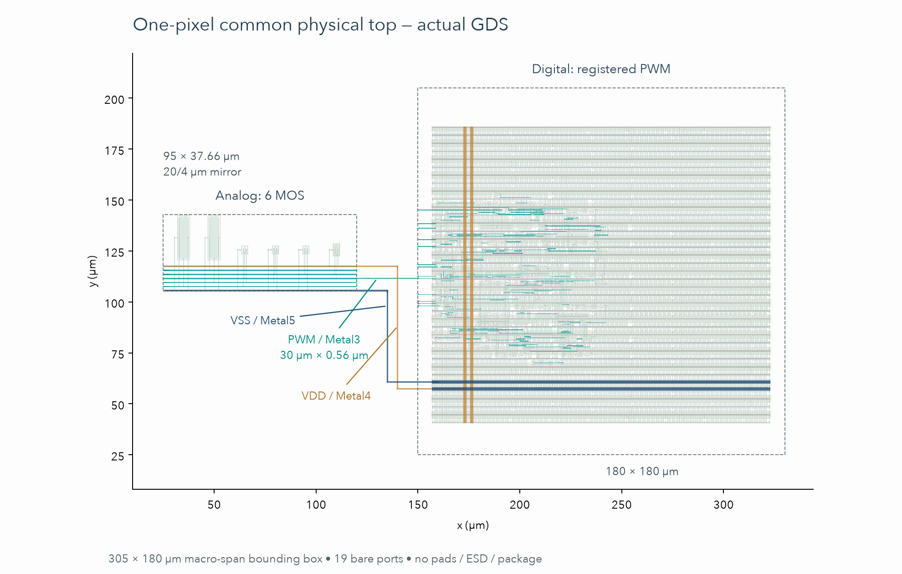

# 单像素共同 physical top（v0.3）

共同顶层现在有实际跨宏 Metal/Via 连线：数字 registered PWM → 六 MOS 模拟输入，数字 VDD → 模拟 vlogic，以及共同 VSS。冻结的宏分别来自 v0.2 已发布 GDS/LEF；不修改它们的内部 geometry。该顶层有 19 个裸端口，供电为 nominal 3.3 V；5 V LED 阳极电源仍在片外，不接逻辑电源。



实际 GDS origin translations 是 `digital=(150,25) µm`、`analog=(25,105.52) µm`，R0。模拟局部 GDS bbox 为 `(0,-.3)…(95,37.36) µm`，因此放置后 bbox 下边为 `105.22 µm`。这与 LEF `ORIGIN=(0,.3)` 兼容。两个宏的整体占用跨度为 `305×180 µm`；这不是包含 pads/ESD 的芯片 die。

## 物理接口

数字 clk、rst、enable 和 duty[0:8] 保留原来的 Metal3 pin。bias、led_k、gate、pwm_b 暴露为模拟端口；pwm_monitor 公开跨宏 PWM net，以支持教学观察，不代表设计了测试 pad。

PWM 新增专属区间为 x=120…150 µm，宽 .56 µm 的 Metal3。VDD 通过 Metal4 接数字已存在的 VDD Metal4 strap，并在模拟 vlogic 总线增加 Via3。VSS 通过 Metal5，模拟端增加 Via4/Metal4/Via3 到 VSS Metal3。不同层的交叉没有连接。数字 VNW=VDD、VPW=VSS 和模拟 MOS body ties 由实际完整 GDS extraction/netlist 共同复核；另有完全不使用 net labels 的金属连通性检查。

## 实际验收及范围

- Magic 8.3.623：whole-hierarchy `drc(full)=0`。
- KLayout 0.30.7：GF180 D main deck 651 categories，0 XML items；FEOL、BEOL、connectivity、offgrid 开启；可选 density/antenna 模式未开启。
- Netgen 1.5.316：完整 GDS extraction 对 analog schematic + final digital PNL + 官方 SC transistor SPICE，unique match，strict guard 未发现 property/connectivity errors。
- 30 类保留的数字 leaf 内部 MOS、模拟 6 MOS、两宏 top-level join 都在本次比较中。MOS primitive 模型本身以四端 placeholder 处理，W/L 仍按 locked deck 比较；AD/AS/PD/PS 等删除属性不比较。`endcap/filltie/fill_[digits]` 被 deck 忽略。
- 实际删除 PWM 金属中央 2 µm，以及实际桥接 VDD/VSS，两项对照均保持 DRC=0，但被 LVS 和 label-free geometry 独立拒绝。

首次 r1 的 Via3/Via4 尺寸 .28 µm 不符合 D deck 精确 .26 µm；r2 修正尺寸后 KLayout 清零，Magic 仍发现新增 Via4 与宏已有 Via4 的层次化重叠。r3 直接接已存在的数字 Metal4 VDD pin，删除重复 cut，两项 DRC 均清零。真实失败日志保留在 `build/integration/r1`、`r2`。

## 新增 routing 寄生

`evidence/integration/pwm_link_rc.spice` 是实际专属 30 µm Metal3 区间的 PDK Magic metal-only extraction，排除宏内已有 R/C。端口 A=模拟边界、Y=数字边界，另外保留 VDD/VSS 耦合：提取串联 R 为 4.81871 Ω，与 A/Y 相关的全部电容为 2.34604 fF。PG-to-PG 电容不计入 PWM 总电容。

Raw helper 的 `w_5130_11396#` 是 `pw` substrate，helper 本身没有 substrate contacts。完整共同 top `.ext` 的实际 merge graph 证明 common VSUBS、数字 VPW/VSS 与模拟 VSS 相连，见 `substrate-proof.json`。接口用的 normalized 四端子电路据此设置 ideal substrate=VSS；原始 node/电容和值保留在 `.raw.spice`，归一过程中只去掉两端相同的 self-cap。该边界不包含 substrate impedance、PG transient 或完整 joint PEX。

Magic 的默认 random seed 可能改变电容元件名字或顺序，重跑的字节哈希可以不同；原始每次输出不覆盖为历史输入。下游接口仿真保留实际 as-run snapshot，并用端点、类型、数值与重数完全一致的 graph-equivalence 映射当前 netlist。

## 重现

使用现有 pinned GF180 physical PDK 和项目独立 Lima VM。新脚本不会重置用户 Docker，也不改 v0.2 runner/evidence。

```sh
build/layout/venv/bin/python scripts/integration/generate.py --run new-run
build/layout/venv/bin/python scripts/integration/run.py magic --run new-run
build/layout/venv/bin/python scripts/integration/run.py lvs --run new-run
build/layout/venv/bin/python scripts/integration/run.py klayout --run new-run
build/layout/venv/bin/python scripts/integration/check_geometry.py --run new-run
build/layout/venv/bin/python scripts/integration/characterize_link.py --run new-run
build/layout/venv/bin/python scripts/integration/negative_controls.py --baseline new-run
```

随后对两个物理负对照运行相同抽取与电气检查，再发布：

```sh
build/layout/venv/bin/python scripts/integration/run.py magic --run new-run-pwm-open
build/layout/venv/bin/python scripts/integration/run.py lvs --run new-run-pwm-open --allow-invalid
build/layout/venv/bin/python scripts/integration/check_geometry.py --run new-run-pwm-open
build/layout/venv/bin/python scripts/integration/run.py magic --run new-run-pg-short
build/layout/venv/bin/python scripts/integration/run.py lvs --run new-run-pg-short --allow-invalid
build/layout/venv/bin/python scripts/integration/check_geometry.py --run new-run-pg-short
build/layout/venv/bin/python scripts/integration/render_top.py --run new-run
build/layout/venv/bin/python scripts/integration/publish.py --run new-run
```

`characterize_link.py` 先实际生成 helper GDS/Tcl、调用 native Magic、检验 full-top substrate merge graph，并归一/校验四端 netlist；全部结果写入私有 `build/integration/new-run/link-characterization/`。本次新脚本使用固定 random seed 20261004，减轻元件排序漂移。`publish.py` 从同一个 run 的 private link 目录取成果并核对 GDS/输出哈希；正确基线和错误对照全部满足后才写公开证据。旧 `extract_link.py` 保持原来 as-run 字节，只作为历史脚本保留；其直接发布行为不用于这条安全复现路径。

可在不同私有目录复核冻结 raw 而不调用 Magic；此模式会明确记录为复算，不升级为一次新 extraction：

```sh
build/layout/venv/bin/python scripts/integration/characterize_link.py --run r3 --output build/integration/my-frozen-link-check --reuse-raw build/integration/r3
```

输出目录必须位于 `build/integration/` 且为新目录；脚本拒绝覆盖已存在的输出及原始 run。

[黄金 top Verilog](pixel_integrated.v)只表达宏连接；[实际证据](../../evidence/integration/summary.json)包含 input/output hashes、源版本、结果范围及负对照。标准单元 GDS 的来源与 Apache 2.0 许可沿用[原 notices](../../evidence/physical/NOTICE.md)。这些结果尚不代表完整芯片制造接受、全芯片多角落 PEX、IR/EM、pads/ESD 或硅片/光学测量。
